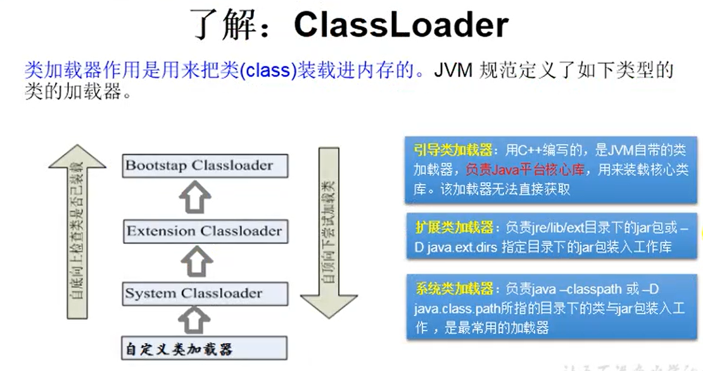

[TOC]

## Java 8

### 常用写法

- 将 int 数组转为 List-Integer

```java
int[] a = {4, 6, 3, 9, 2};
List<Integer> aList = IntStream.of(a).boxed().collect(Collectors.toList());
```

- 数组 a 不能直接索引元素，如6，但 List 可以

```java
aList.indexOf(6)	// 返回1
```

- 将 int[] 转为 Integer[]

```java
int a[] = {1,2,3,4,5};
Integer[] aa = IntStream.of(a).boxed().toArray(Integer[]::new);
Integer[] aa1 = Arrays.stream(a).boxed().toArray(Integer[]::new);
```

- 初始化 ArrayList

```java
new ArrayList<>(Arrays.asList("tag1", "tag2", "tag3"))
```

- 获取当前时间戳

```java
// 时间戳不分时区
new Timestamp(new Date().getTime())
long milli = LocalDateTime.now().toInstant(ZoneOffset.of("+8")).toEpochMilli();
long milli = Instant.now().toEpochMilli();
long milli = System.currentTimeMillis();
```

- 关于 Arrays.asList()

1. **不能将基本类型数组（如 int）作为 asList 的参数**，因为 Arrays.ArrayList 参数为可变长泛型，而基本类型是无法泛型化的，所以它把int[] arr数组当成了一个泛型对象，所以集合中最终只有一个元素arr
2. **将数组作为 asList 参数后，修改数组或 List，会导致出错**，由于 asList 产生的集合元素是直接引用作为参数的数组，所以当外部数组或集合改变时，数组和集合会同步变化，这在平时我们编码时可能产生莫名的问题
3. **将数组转为集合后，不能用 add 和 remove 方法**，因为 asList 产生的集合并没有重写 add, remove 等方法

- 在 Map 中，根据 value 的最大值找到对应的 key

```java
public static <K, V extends Comparable<V>> Map.Entry<K, V> getMaxEntry(Map<K, V> map) {
        Map.Entry<K, V> maxEntry = null;
        for (Map.Entry<K, V> entry : map.entrySet()) {
            if (maxEntry == null || entry.getValue().compareTo(maxEntry.getValue()) > 0) {
                maxEntry = entry;
            }
        }
        return maxEntry;
    }
```

- 在 map 中，根据 value 找到对应的一组 keys

```java
public static <K, V extends Comparable<V>> K[] getKeys(Map<K, V> map, V value) {
        List<K> ret = new ArrayList<>();
        for (Map.Entry<K, V> entry : map.entrySet()) {
            if (value.compareTo(entry.getValue()) == 0) {
                ret.add(entry.getKey());
            }
        }
        return (K[])ret.toArray();
    }
```

- 官方文档对 hashCode 方法的解释

```markdown
1. If two objects are equal according to the equals(Object) method, then calling the hashCode method on each of the two objects must produce the same integer result.
翻译：如果两个对象通过equals判断相等，则这两个对象调用hashCode方法的返回值也应该相等。
注：对象调用hashCode方法的返回值就是该对象的哈希值。
2. It is not required that if two objects are unequal according to the equals(Object) method, then calling the hashCode method on each of the two objects must produce distinct integer results. However, the programmer should be aware that producing distinct integer results for unequal objects may improve the performance of hash tables.
翻译：若两个对象通过equals判断不相等，则这两个对象的hash值可以相等也可以不相等，但不相等可以提升哈希表的性能。
```

------

#### System.exit(-1)

- 退出正在运行的应用，而且是以异常的状态退出（-1，只要非0都视为异常）
  - 正常退出时系统提示：Process finished with exit code 0
  - 异常退出时系统提示：Process finished with exit code -1

### Java 反射机制

#### Class 类对象

- 概念：所有的类，都存在一个类对象，这个类对象用于提供类本身的信息，比如有几种构造方法， 有多少属性，有哪些普通方法。
- 获取类对象：（假如在 hero 包下有一个 Hero 类）
  1. `Class.forName("hero.Hero");`
  2. `Hero.class;`
  3. `new Hero().getClass();`
- 若 Hero 类有静态初始化块，那么获取类对象时，会执行静态初始化块的代码，且只执行一次，也就是说每个类有且仅有一个类对象。

```java
package 反射;

import java.lang.reflect.Constructor;
import java.lang.reflect.Field;
import java.lang.reflect.InvocationTargetException;
import java.lang.reflect.Method;

/**
 * @author xieziwei99
 * 2020-07-10
 */
public class Demo {

    public static void main(String[] args) throws NoSuchMethodException, IllegalAccessException, InvocationTargetException, InstantiationException, NoSuchFieldException {
        Class<Person> personClass = Person.class;
        /*
        getConstructor:
            1. 只得到 public
         */
        Constructor<Person> constructor = personClass.getConstructor(String.class, int.class);
        Person san = constructor.newInstance("san", 18);
        System.out.println(san);

        Field age = personClass.getDeclaredField("age");
        age.set(san, 20);
        System.out.println(san);

        Method sayHello = personClass.getDeclaredMethod("sayHello");
        sayHello.invoke(san);
        System.out.println("========================");

        // 使用反射调用私有的构造器、成员变量、方法
        Constructor<Person> constructor1 = personClass.getDeclaredConstructor(String.class);
        constructor1.setAccessible(true);
        Person si = constructor1.newInstance("si");
        System.out.println(si);

        Field name = personClass.getDeclaredField("name");
        name.setAccessible(true);
        name.set(si, "LiSi");
        System.out.println(si);

        Method say = personClass.getDeclaredMethod("say", String.class);
        say.setAccessible(true);
        String hello = (String) say.invoke(si, "hello");
        System.out.println(hello);
    }
}

class Person {
    public int age;
    private String name;

    public Person() {
    }

    private Person(String name) {
        this.name = name;
    }

    public Person(String name, int age) {
        this.name = name;
        this.age = age;
    }

    public String getName() {
        return name;
    }

    public void setName(String name) {
        this.name = name;
    }

    public int getAge() {
        return age;
    }

    public void setAge(int age) {
        this.age = age;
    }

    @Override
    public String toString() {
        return "Person{" +
                "name='" + name + '\'' +
                ", age=" + age +
                '}';
    }

    public void sayHello() {
        System.out.println("Hello, my name is " + name);
    }

    private String say(String text) {
        System.out.println(name + " says: " + text);
        return text;
    }
}
```

#### ClassLoader 类加载器




### HashMap 的方法

#### merge

```java
HashMap<Integer, Integer> ret = new HashMap<>();
int i = 2;
// 有3个参数，param1：键key，param2：新值value，param3：lambda函数
// 如果ret中不存在i，则将新值1关联给i，若存在i，则将旧值与新值计算后关联给i
ret.merge(i, 1, (oldV, newV) -> oldV + newV);

ret.merge(i, 1, Integer::sum);	// 与上面等价
```


### Arrays 方法

#### Arrays.toString()

```java
// 输出数组a
System.out.println(Arrays.toString(a));
```


### 文件 IO

1. 文件路径允许使用 Unix 的分隔符 `/` 
2. IO 流
   1. 字节流：8 bit ，0 1
      1. 适于处理图片，视频等
      2. 抽象基类：InputStream OutputStream
   2. 字符流：16 bit ， 'a' 'b'
      1. 适于处理文本（不能处理**二进制**的字节流的图片）
      2. 抽象基类：Reader Writer


#### java.io.File

##### createNewFile()

1. 当文件的上级路径不存在时，会抛出异常

   

```java
// 允许使用 Unix 的分隔符 `/`
File file = new File("javacore/src/文件IO123/hello.txt");
boolean newFile = file.createNewFile();
if (newFile) {
    System.out.println("创建成功");
} else {
    System.out.println("文件已存在");
}
```

#### java.io.FileWriter

##### write()

1. 当文件的上级路径不存在时，会抛出异常

   

```java
public static void main(String[] args) throws IOException {
    writeStringToFile("javacore/src/文件IO123/hello.txt", "解放军拉萨空间爱多久撒");
}

public static void writeStringToFile(String fileName, String msg) throws IOException {
    try (FileWriter fileWriter = new FileWriter(fileName)) {
        fileWriter.write(msg);
    }
}
```

#### 对象流 & 序列化机制

序列化
    1. 实现 Serializable 接口的类必须提供 serialVersionUID
        - 没有提供 serialVersionUID 的类也会根据类的成员变量自动生成
        - 所以不提供会存在一个问题：类的成员变量发生修改后，serialVersionUID 就变了，之前序列化过的对象无法再被反序列化
      2. 可序列化的类要求其成员变量也都可以序列化

在未提供 serialVersionUID 的前提下修改类的定义，反序列化出错：

> java.io.InvalidClassException: 文件IO.Person; local class incompatible: stream classdesc serialVersionUID = 20171017, local class serialVersionUID = -2860299281169574019

在提供 serialVersionUID 的前提下修改类的定义，如果是增加了成员变量，则反序列化时该成员变量为默认值，如果是删除了成员变量，则反序列化时没有该成员变量的值，其他正常。

```java
package 文件IO;

import java.io.*;

/**
 * @author xieziwei99
 * 2020-07-08
 */
public class 对象流使用 {

    public static void main(String[] args) {
        try (ObjectOutputStream oos = new ObjectOutputStream(new FileOutputStream("data.dat"))) {
            oos.writeObject(new Person("san", 18, new Pet("hong", 3)));
            oos.flush();
        } catch (IOException e) {
            e.printStackTrace();
        }

        try (ObjectInputStream ois = new ObjectInputStream(new FileInputStream("data.dat"))) {
            Person o = (Person) ois.readObject();
            System.out.println(o);
        } catch (IOException | ClassNotFoundException e) {
            e.printStackTrace();
        }
    }
}
/*
序列化
    1. 实现 Serializable 接口的类必须提供 serialVersionUID
        - 没有提供 serialVersionUID 的类也会根据类的成员变量自动生成
        - 所以不提供会存在一个问题：类的成员变量发生修改后，serialVersionUID 就变了，
          之前序列化过的对象无法再被反序列化
    2. 可序列化的类要求其成员变量也都可以序列化
 */
class Person implements Serializable {
    public static final long serialVersionUID = 20171017L;

    public String name;
    public int age;
    public Pet pet;

    public Person(String name, int age, Pet pet) {
        this.name = name;
        this.age = age;
        this.pet = pet;
    }

    @Override
    public String toString() {
        return "Person{" +
                "name='" + name + '\'' +
                ", age=" + age +
                ", pet=" + pet +
                '}';
    }
}

class Pet implements Serializable {
    public static final long serialVersionUID = 20171016L;

    public String name;
    public int age;

    public Pet(String name, int age) {
        this.name = name;
        this.age = age;
    }

    @Override
    public String toString() {
        return "Pet{" +
                "name='" + name + '\'' +
                ", age=" + age +
                '}';
    }
}
```

### 日期

#### System.currentTimeMillis();

#### java.util.Date

```java
public static void main(String[] args) {
    long currentTimeMillis = System.currentTimeMillis();
    System.out.println(currentTimeMillis);  // 1592909870652

    Date date = new Date();     // 无参构造：获取当前时间
    System.out.println(date);   // Tue Jun 23 18:58:35 GMT+08:00 2020

    Date date1 = new Date(currentTimeMillis);   // 使用毫秒数作为构造器参数
    System.out.println(date1);

    long time = date.getTime();     // Date对象 -> 时间戳
    System.out.println(time);
}
```

#### java.sql.Date

继承自 java.util.Date，与数据库中的 date 类型对应

#### SimpleDateFormat

```java
class DateUtil {
    private static final SimpleDateFormat sdf = new SimpleDateFormat("yyyy-MM-dd HH:mm:ss");

    public static String format(Date date) {
        return sdf.format(date);
    }

    public static Date parse(String dateStr) throws ParseException {
        return sdf.parse(dateStr);
    }
}
```

#### Calendar

```java
Calendar calendar = Calendar.getInstance();
System.out.println("当月的第几天，即几月几号的号 " + calendar.get(Calendar.DAY_OF_MONTH));
calendar.add(Calendar.DAY_OF_MONTH, 1);
System.out.println(calendar.getTime());
calendar.setTime(DateUtil.parse("2020-7-27 17:55:14"));
System.out.println(calendar.getTime());
```

#### LocalDateTime

```java
public static void main(String[] args) {
    System.out.println(LocalDate.now());
    System.out.println(LocalTime.now());
    System.out.println(LocalDateTime.now());

    LocalDateTime localDateTime = LocalDateTime.of(2020, 5, 7, 13, 14);
    System.out.println(localDateTime);
    System.out.println(localDateTime.getYear());
    System.out.println(localDateTime.getMonth());
    System.out.println(localDateTime.getDayOfMonth());
    System.out.println(localDateTime.getDayOfWeek());

    LocalDateTime localDateTime1 = localDateTime.withHour(5).withMinute(20);
    System.out.println(localDateTime);
    System.out.println(localDateTime1);

    localDateTime1 = localDateTime.plusSeconds(12);
    System.out.println(localDateTime1);
    localDateTime1 = localDateTime.minusSeconds(-10);
    System.out.println(localDateTime1);
}
```

#### Instant

```java
Instant instant = Instant.now();    // 比北京时间慢8小时
System.out.println(instant);
System.out.println(instant.toEpochMilli());
System.out.println(instant.getEpochSecond());

OffsetDateTime offsetDateTime = instant.atOffset(ZoneOffset.ofHours(8));
System.out.println(offsetDateTime);
System.out.println(offsetDateTime.toInstant());		// 和上面获得的 instant 一样
```

#### DateTimeFormatter

```java
class LocalDateUtil {
    private static final DateTimeFormatter formatter = DateTimeFormatter.ofPattern("yyyy-MM-dd HH:mm:ss");

    public static String format(LocalDateTime localDateTime) {
        return formatter.format(localDateTime);
    }

    public static LocalDateTime parse(String dateStr) {
        return LocalDateTime.parse(dateStr, formatter);
    }

    public static long strToMilli(String dateStr) {
        LocalDateTime localDateTime = LocalDateTime.parse(dateStr, formatter);
        return localDateTime.atZone(ZoneId.systemDefault()).toInstant().toEpochMilli();
    }

    public static String milliToStr(long milli) {
        Instant instant = Instant.ofEpochMilli(milli);
        LocalDateTime localDateTime = LocalDateTime.ofInstant(instant, ZoneId.systemDefault());
        return format(localDateTime);
    }
}
```

### 枚举

枚举基本使用

```java
package 枚举;

enum Season {
    春天, 夏天, 秋天, 冬天
}

public class Demo {

    public static void main(String[] args) {
        System.out.println(Season.春天);
        System.out.println(Season.夏天);
        System.out.println(Season.秋天);
        System.out.println(Season.冬天);
        System.out.println(Season.class.getSuperclass());   // class java.lang.Enum

        /*
        春天 春天 0
        夏天 夏天 1
        秋天 秋天 2
        冬天 冬天 3
         */
        for (Season season : Season.values()) {
            System.out.print(season + " ");
            System.out.print(season.name() + " ");
            System.out.print(season.ordinal() + " ");
            System.out.println();
        }
    }
}
```

定义枚举类并实现接口，并让枚举属性分别实现抽象方法


### 注解

#### 类型注解

@Target({TYPE_PARAMETER, TYPE_USE})


### 字符集与编码

例如，Unicode 字符集，UTF-8 编码


### 类的加载过程


### 概念

#### native 关键字

native 关键字说明其修饰的方法是一个原生态方法，方法对应的实现不是在当前文件，而是在用其他语言（如C和C++）实现的文件中。


------

## Java 11

1. 一个命令编译运行源代码：`java aloha.java`

### 类型推断

- var javastack = "javastack";  

### 集合方法

#### List.of() & List.copyof()

```java
var list = List.of("Java", "Python", "C");  	// 属于不可变 AbstractImmutableList 类的子类
var copy = List.copyOf(list);  
System.out.println(list == copy);   // true 

var list = new ArrayList<String>();  	// 不属于不可变 AbstractImmutableList 类的子类
var copy = List.copyOf(list);  
System.out.println(list == copy);   // false 
```

### Stream方法

#### takeWhile & dropWhile

```
// 从开始计算，当 n <= 3 不成立时就截止。
Stream.of(1, 2, 3, 4, 5).takeWhile(i -> i <= 3).collect(Collectors.toList())
$30 ==> [1, 2, 3]

// 一旦 n < 3 不成立就开始计算
Stream.of(1, 2, 3, 4, 5).dropWhile(i -> i < 3).collect(Collectors.toList());
$31 ==> [3, 4, 5]
```

### HttpClient API

```java
public static void main(String[] args) {
    HttpRequest request = HttpRequest.newBuilder()
        .uri(URI.create("http://101.37.172.100:8081/api/city"))
        .build();
    HttpClient client = HttpClient.newHttpClient();
    client.sendAsync(request, HttpResponse.BodyHandlers.ofString())
        .thenApply(HttpResponse::body)
        .thenAccept(System.out::println)
        .join();
}
```


------

## SpringBoot

### 概念

2. 微服务时代-对比单体应用（All in one）

#### 优点

1. 快速
2. 内嵌 Servlet 容器
3. 起步依赖 starter
4. 大量的自动配置（也有缺点）
5. 没有代码生成

### cloud toolkit 插件，重启 springboot 应用脚本：

```sh
source /etc/profile
/etc/init.d/weup stop

rm /etc/init.d/weup

ln -s /root/weup/*.jar /etc/init.d/weup
chmod 755 /etc/init.d/weup
service weup start
```


### application.properties 文件

```properties
### 通用设置
    spring.datasource.url=jdbc:mysql://localhost:3306/test?serverTimezone=UTC
    spring.datasource.username=xzw
    spring.datasource.password=12345678
    spring.datasource.driver-class-name=com.mysql.cj.jdbc.Driver
    spring.jpa.properties.hibernate.hbm2ddl.auto=update
    # springboot2.0 更改默认引擎为innodb，本来是MyISAM
    spring.jpa.database-platform=org.hibernate.dialect.MySQL5InnoDBDialect
    # 允许在更新视图的过程中进行JPA查询，默认为true，显示指出可以消除启动时的warn
	spring.jpa.open-in-view=true
	
	spring.jackson.time-zone=GMT+8
	spring.jpa.show-sql=true
	spring.jpa.properties.hibernate.format_sql=true

spring.profiles.active=dev

# 不明白
spring.jpa.properties.hibernate.enable_lazy_load_no_trans=true

# thymeleaf 缓存
spring.thymeleaf.cache=false

# 国际化，多语言
spring.messages.basename=static.multi_language.login
```


### 参数校验

- 详情参考[这里](https://mp.weixin.qq.com/s?__biz=MzAxODcyNjEzNQ==&mid=2247489098&idx=3&sn=ad1883447baa53c663c0da1347ff6514&chksm=9bd0bbd2aca732c49505ecd9256d3b41964413dc092bcd37ddb97a332b2fa9b489ffdd282223&mpshare=1&scene=1&srcid=1227sLd0GB0NDwmzb73pMO4h&sharer_sharetime=1577418505245&sharer_shareid=d8ccde79b2f8a1eb1ce62f41199143e3&key=1d4db1e975a7701b76d425ed43b0f783cb208ef71323d417f481118896228d8459361111508049db90630ef631d6596d16a8a044d7746e94ee7727e4e9aaa42897e67945b5278d46858ea8608dfb4e6c&ascene=1&uin=MzM0MDQzOTAyMg%3D%3D&devicetype=Windows+10&version=62070158&lang=zh_CN&exportkey=A93NSGikgUrL3xVrf3o9fnI%3D&pass_ticket=Pcj%2FjW5IvvyzxOMrYEzY1KUJZ2xzvLaxT6YV51fEUh8Xq7mxvrp8HJ497M0ptReH)


### mybatis plus 使用

#### 简单使用步骤

1. 添加 mybatis plus 依赖

   ```xml
   <dependency>
       <groupId>com.baomidou</groupId>
       <artifactId>mybatis-plus-boot-starter</artifactId>
       <version>3.3.0</version>
   </dependency>
   ```

2. 在 springboot 主类中添加 @MapperScan 注解

   ```java
   @SpringBootApplication
   @MapperScan("com.xzw.mybatisdemo2.mapper")
   public class MybatisDemo2Application {
       public static void main(String[] args) {
           SpringApplication.run(MybatisDemo2Application.class, args);
       }
   }
   ```

3. 编写 model 类，和 mapper 类，即可实现简单的 CRUD

### 注解

#### @JoinColumn

1. 例如

   ```java
   @OneToOne
   @JoinColumn(name = "content_id")	// 可以不填，他只决定外键字段的名字是什么，不填则采用默认的
   private BugContent bugContent;
   ```

#### @ConfigurationProperties

给 javaBean 注入配置文件中的属性值

#### @Value

给属性注入配置文件中的值

#### @PropertySource

加载指定的配置文件，只对 properties 文件生效

#### @ImportSource

1. （不常用）导入 Spring 的配置文件，使其生效
2. 推荐使用 @Bean 来配置组件

#### @Bean

1. 为 IOC 容器中加入组件，例如

   ```java
   @Configuration
   public class MyConfiguration {
   
       /*
       方法名，即作为 bean 的 name
        */
       @Bean
       public Person person111() {
           Person person = new Person();
           System.out.println(person);
           person.setLastName("Jack");
           return person;
       }
   }
   ```

#### @Configuration

标明一个类是配置类，就相当于 Spring 中的一个配置文件

### 自动配置

#### 指定激活配置文件

```sh
--spring.profiles.active=dev
```

#### [可用配置](https://www.springcloud.cc/spring-boot.html#common-application-properties)


### Web 开发

#### Thymeleaf

```xml
xmlns:th="http://www.thymeleaf.org"
```

1. 设置缓存为 false

   ```properties
   spring.thymeleaf.cache=false
   ```

2. 

#### 配置国际化

1. 编写国际化语言文件

   

   ```properties
   # login.properties
   login.button_login=登录
   login.password=密码
   login.title=首页
   login.username=用户名
   
   # login_zh_CN.properties
   login.button_login=登录
   login.password=密码
   login.title=首页
   login.username=用户名
   
   # login_en_US.properties
   login.button_login=Login
   login.password=Password
   login.title=Home
   login.username=User Name
   ```

2. 编写配置

   ```properties
   # application.properties
   spring.messages.basename=static.multi_language.login
   ```

3. 在 html 中使用

   使用 Thymeleaf 中的 #{...} 和 @{...}

   ```html
   <!DOCTYPE html>
   <html lang="zh" xmlns:th="http://www.thymeleaf.org">
   <head>
       <meta charset="UTF-8">
       <title th:text="#{login.title}">首页</title>
   </head>
   <body>
   <div>
       <form action="/" method="post">
           <div>
               <label for="username" th:text="#{login.username}">用户名</label>
               <input id="username" name="username" type="text">
           </div>
           <div>
               <label for="password" th:text="#{login.password}">密码</label>
               <input id="password" name="password" type="password">
           </div>
           <button th:text="#{login.button_login}">登录</button>
       </form>
   </div>
   <div>
       <a th:href="@{/login(l='zh_CN')}">中文</a>
       <a th:href="@{/login(l='en_US')}">English</a>
   </div>
   </body>
   </html>
   ```

4. 编写 LocaleResolver 组件，处理逻辑

   ```java
   public class MyLocaleResolver implements LocaleResolver {
   
       @Override
       public Locale resolveLocale(HttpServletRequest request) {
           String l = request.getParameter("l");
           Locale locale = Locale.getDefault();
           if (!l.isEmpty()) {
               String[] split = l.split("_");
               locale = new Locale(split[0], split[1]);
           }
           return locale;
       }
   
       @Override
       public void setLocale(HttpServletRequest request, HttpServletResponse response, Locale locale) {
   
       }
   }
   ```

5. 添加组件

   ```java
   @Configuration
   public class MyMvcConfig implements WebMvcConfigurer {
   
       @Bean
       public LocaleResolver localeResolver() {
           return new MyLocaleResolver();
       }
   }
   ```

#### 登录

1. 重复提交表单问题，重定向的使用

   ```java
   @PostMapping("/user/login")
   public String login(@RequestParam String username, @RequestParam String password, Map<String, String> map) {
       if (!username.isEmpty() && "123456".equals(password)) {
           // 当前 url 还是 /user/login，刷新页面会重复提交表单，应该使用重定向跳转页面
           return "main";
       } else {
           map.put("login_msg", "用户名密码错误");
           return "login";
       }
   }
   ```

   ```java
   @PostMapping("/user/login")
   public String login(@RequestParam String username, @RequestParam String password, Map<String, String> map) {
       if (!username.isEmpty() && "123456".equals(password)) {
           return "redirect:/main";
       } else {
           map.put("login_msg", "用户名密码错误");
           return "login";
       }
   }
   ```

##### 拦截器进行登录检查

1. 编写拦截器代码，已登录则放行请求，未登录则返回登录页面

   ```java
   public class LoginHandlerInterceptor implements HandlerInterceptor {
   
       @Override
       public boolean preHandle(HttpServletRequest request, HttpServletResponse response, Object handler) throws Exception {
           Object user = request.getSession().getAttribute(SessionConstant.login_user);
           if (user == null) {
               // 未登录，返回登录页
               request.setAttribute(LoginConstant.login_msg, "没有权限，请先登录");
               request.getRequestDispatcher("/login").forward(request, response);
               return false;
           } else {
               return true;
           }
       }
   
       @Override
       public void postHandle(HttpServletRequest request, HttpServletResponse response, Object handler, ModelAndView modelAndView) throws Exception {
   
       }
   
       @Override
       public void afterCompletion(HttpServletRequest request, HttpServletResponse response, Object handler, Exception ex) throws Exception {
   
       }
   }
   ```

2. 将已登录用户名放入 session 中

   session.setAttribute(SessionConstant.login_user, username);

   ```java
   @PostMapping("/user/login")
   public String login(@RequestParam String username, @RequestParam String password, Map<String, String> map,
                       HttpSession session) {
       if (!username.isEmpty() && "123456".equals(password)) {
           session.setAttribute(SessionConstant.login_user, username);
           return "redirect:/main";
       } else {
           map.put(LoginConstant.login_msg, "用户名密码错误");
           return "login";
       }
   }
   ```

3. 注册拦截器到容器中

   ```java
   // 添加拦截器
   @Override
   public void addInterceptors(InterceptorRegistry registry) {
       registry.addInterceptor(new LoginHandlerInterceptor()).addPathPatterns("/**")
               .excludePathPatterns("/login", "/", "index", "index.html", "/user/login");
   }
   ```

------

## Spring

### 概念

#### Spring的特性

1. Spring是非侵入性的
2. 依赖注入
3. 面向切面编程
4. 容器：包含并管理应用对象的生命周期
5. 一站式框架

#### IOC(DI)

1. IOC：控制反转
2. DI：依赖注入
3. IOC和DI是一回事

#### AOP

1. AOP：面向切面编程

#### Spring模块


#### bean的配置方式

##### 全类名（反射）

```xml
<!-- 
	配置 bean 
	class: bean的全类名，通过反射的方式在IOC容器中创建Bean，所以要求Bean中必须有无参数的构造器
	id：标识容器中的bean.id，唯一
-->
<bean id="helloWorld" class="com.xzw.helloworld.HelloWorld">
    <property name="name2" value="Jack"/>
</bean>
```

##### 通过工厂方法

###### 静态工厂方法

###### 实例工厂方法

##### FactoryBean

#### 依赖注入的方式

##### 属性注入

```xml
<bean id="helloWorld" class="com.xzw.helloworld.HelloWorld">
    <property name="name2" value="Jack"/>
</bean>
```

###### 特殊字符的使用

```xml
<!-- 特殊字符的使用 -->
<bean id="car3" class="com.xzw.helloworld.Car">
    <constructor-arg index="1">
        <value><![CDATA[<"bei&jing'>]]></value>
    </constructor-arg>
    <constructor-arg value="&lt;&quot;ao&amp;di&apos;&gt;" index="0" />
    <constructor-arg value="200"  type="int" />
</bean>
```

###### bean之间的引用-ref引用，内部bean，级联属性

``` xml
<beans>
    <bean id="car" class="com.xzw.helloworld.Car">
        <constructor-arg value="dongfeng" />
        <constructor-arg value="shenzhen" />
        <constructor-arg value="300000" />
    </bean>
    
    <!-- 用ref指定bean之间的引用 -->
    <bean id="person" class="com.xzw.helloworld.Person">
        <property name="name" value="zhangsan" />
        <property name="age" value="24" />
        <property name="car" ref="car" />
        <!-- 级联属性，需要person类提供Car的getter方法，而且car必须首先存在，不能为NULL -->
        <property name="car.speed" value="34" />
    </bean>

    <bean id="person2" class="com.xzw.helloworld.Person">
        <constructor-arg value="lisi" />
        <constructor-arg value="18" />
        <!-- 内部bean只能在内部使用，不能被外部引用 -->
        <constructor-arg>
            <bean class="com.xzw.helloworld.Car">
                <property name="brand" value="lingmu" />
                <!-- 使用null值 -->
                <property name="corp"><null /></property>
                <property name="price" value="250000" />
            </bean>
        </constructor-arg>
    </bean>
</beans>
```

###### 集合属性的注入-list，map，properties

```xml
<beans>
    <!-- 集合list的配置 -->
    <!-- 需要引入 p 命名空间，可以简化bean的配置 -->
    <bean id="person3" class="com.xzw.helloworld.Person" p:name="wangwu" p:age="18">
        <property name="knownCars">
            <list>
                <ref bean="car"/>
                <ref bean="car2"/>
                <ref bean="car3"/>
            </list>
        </property>
    </bean>
    
    <!-- 集合Map的配置 -->
    <bean id="person5" class="com.xzw.helloworld.Person" p:name="sunqi" p:age="19">
        <property name="drivingCars">
            <map>
                <entry key="Monday" value-ref="car"/>
                <entry key="Friday" value-ref="car2"/>
                <entry key="Sunday" value-ref="car3"/>
            </map>
        </property>
    </bean>
    
    <!-- Properties的配置 -->
    <bean id="dataSource" class="com.xzw.helloworld.DataSource">
        <property name="properties">
            <props>
                <prop key="user">xzw</prop>
                <prop key="password">12345678</prop>
                <prop key="url">jdbc:mysql://test</prop>
                <prop key="driver">com.mysql.cj.jdbc.driver</prop>
            </props>
        </property>
    </bean>
    
    <!-- 需要引入util命名空间，可以配置出一个集合bean -->
    <util:list id="knownCars1">
        <ref bean="car"/>
        <ref bean="car2"/>
    </util:list>
    <bean id="person4" class="com.xzw.helloworld.Person" p:name="liuliu" p:age="13" p:knownCars-ref="knownCars1"/>
</beans>
```

###### 命名空间 p

```xml
<bean id="person4" class="com.xzw.helloworld.Person" p:name="liuliu" p:age="13" p:knownCars-ref="knownCars1"/>
```

##### 构造器注入

```java
public class Car {

    private String brand;
    private String corp;
    private double price;
    private int speed;

    public Car(String brand, String corp, double price) {
        this.brand = brand;
        this.corp = corp;
        this.price = price;
    }

    public Car(String brand, String corp, int speed) {
        this.brand = brand;
        this.corp = corp;
        this.speed = speed;
    }

    @Override
    public String toString() {
        return "Car{" +
                "brand='" + brand + '\'' +
                ", corp='" + corp + '\'' +
                ", price=" + price +
                ", speed=" + speed +
                '}';
    }
}
```

```xml
<!-- 依赖注入的方式之构造器注入-->
<!-- 按照顺序 -->
<bean id="car" class="com.xzw.helloworld.Car">
    <constructor-arg value="dongfeng" />
    <constructor-arg value="shenzhen" />
    <constructor-arg value="300000" />
</bean>

<!-- 通过指定类型或name判断使用那个构造器 -->
<bean id="car2" class="com.xzw.helloworld.Car">
    <constructor-arg value="shanghai" name="corp" />
    <constructor-arg value="baoma" name="brand" />
    <constructor-arg value="300000" type="double" />
</bean>

<!-- 通过指定类型或index判断使用那个构造器 -->
<bean id="car3" class="com.xzw.helloworld.Car">
    <constructor-arg value="beijing" index="1" />
    <constructor-arg value="aodi" index="0" />
    <constructor-arg value="200"  type="int" />
</bean>
```

##### 工厂方法注入

1. 很少使用，不推荐

#### bean 的作用域

```xml
<!--
	bean 的作用域：
		默认为 singleton：bean在初始化容器时被创建，每次请求获得同一个bean
		prototype：bean在初始化容器时不创建，每次请求时再创建一个新的bean
-->	
<bean id="car2" class="com.xzw.helloworld2.Car" p:brand="Baoma" p:price="200000"/>
<bean id="car3" class="com.xzw.helloworld2.Car" p:price="300000" p:brand="jinlin" scope="prototype"/>
```

#### 使用SpEL

```xml
<beans>
	<!-- 使用SpEL -->
    <bean id="address" class="com.xzw.helloworld3.Address" p:city="Beijing" p:street="WuDaoKou"/>
    <!-- 使用SpEL引用类的静态属性 -->
    <bean id="car" class="com.xzw.helloworld3.Car" p:brand="Audi" p:price="300000"
          p:tyrePerimeter="#{T(java.lang.Math).PI * 20}"/>
    <!-- 使用SpEL引用其他的bean -->
    <!-- 使用SpEL引用其他bean的属性 -->
    <!-- 使用SpEL三目运算符 -->
    <bean id="person" class="com.xzw.helloworld3.Person" p:name="ZhangSan" p:car="#{car}" p:city="#{address.city}" p:info="#{car.price >= 250000 ? '金领' : '白领'}"/>
</beans>
```

### 注解

1. 标识组件

   @Component @Service @Repository @Controller

   这四个可以混用，但建议按照名字意义使用

2. 注入

   @Autowired @Resource @Inject

   这三个类似，建议使用 @Autowired

#### @Qualifier

```java
final UserRepo userRepo;

// 当用 @Autowired 注入 bean 时，如果容器中有两个匹配的 bean，则会抛出异常
// 使用 @Qualifier 注解可以指明注入哪个 bean
public UserService(@Qualifier("userRepoImpl2") UserRepo userRepo) {
    this.userRepo = userRepo;
}
```

#### @Aspect

声明一个切面

#### @Order

指定切面的优先级，值越小，优先级越高

#### @Pointcut

声明切点表达式


## SpringMVC

### 配置

#### 创建 springmvc 应用的四步配置

##### 1、配置 SpringMVC 的 DispatcherServlet

```xml
<!-- web.xml 文件 -->
<?xml version="1.0" encoding="UTF-8"?>
<web-app xmlns:xsi="http://www.w3.org/2001/XMLSchema-instance"
	xmlns="http://xmlns.jcp.org/xml/ns/javaee"
	xsi:schemaLocation="http://xmlns.jcp.org/xml/ns/javaee http://xmlns.jcp.org/xml/ns/javaee/web-app_4_0.xsd"
	id="WebApp_ID" version="4.0">

	<servlet>
		<servlet-name>dispatcherServlet</servlet-name>
		<servlet-class>org.springframework.web.servlet.DispatcherServlet</servlet-class>
		<init-param>
			<param-name>contextConfigLocation</param-name>
			<param-value>classpath:springmvc.xml</param-value>
		</init-param>
		<load-on-startup>1</load-on-startup>
	</servlet>
	<!-- 映射全部路径请求到 dispatcherServlet -->
	<servlet-mapping>
	   <servlet-name>dispatcherServlet</servlet-name>
	   <url-pattern>/</url-pattern>
	</servlet-mapping>
</web-app>
```

##### 2、配置 HiddenHttpMethodFilter，使得 POST 请求可以转换成 DELETE 和 PUT 请求

```xml
<!-- web.xml 文件 -->
<?xml version="1.0" encoding="UTF-8"?>
<web-app xmlns:xsi="http://www.w3.org/2001/XMLSchema-instance"
	xmlns="http://xmlns.jcp.org/xml/ns/javaee"
	xsi:schemaLocation="http://xmlns.jcp.org/xml/ns/javaee http://xmlns.jcp.org/xml/ns/javaee/web-app_4_0.xsd"
	id="WebApp_ID" version="4.0">
	
	<filter>
	   <filter-name>hiddenHttpMethodFilter</filter-name>
	   <filter-class>org.springframework.web.filter.HiddenHttpMethodFilter</filter-class>
	</filter>
	<filter-mapping>
	   <filter-name>hiddenHttpMethodFilter</filter-name>
	   <url-pattern>/*</url-pattern>
	</filter-mapping>
</web-app>
```

##### 3、配置自动扫描的包

```xml
<!-- springmvc.xml 文件 -->
<?xml version="1.0" encoding="UTF-8"?>
<beans xmlns="http://www.springframework.org/schema/beans"
	xmlns:xsi="http://www.w3.org/2001/XMLSchema-instance"
	xmlns:context="http://www.springframework.org/schema/context"
	xsi:schemaLocation="http://www.springframework.org/schema/beans http://www.springframework.org/schema/beans/spring-beans.xsd http://www.springframework.org/schema/context http://www.springframework.org/schema/context/spring-context.xsd">
    
    <context:component-scan base-package="com.xzw.springmvc.crud"></context:component-scan>
</beans>
```

##### 4、配置视图解析器

```xml
<!-- springmvc.xml 文件 -->
<?xml version="1.0" encoding="UTF-8"?>
<beans xmlns="http://www.springframework.org/schema/beans"
	xmlns:xsi="http://www.w3.org/2001/XMLSchema-instance"
	xmlns:context="http://www.springframework.org/schema/context"
	xsi:schemaLocation="http://www.springframework.org/schema/beans http://www.springframework.org/schema/beans/spring-beans.xsd http://www.springframework.org/schema/context http://www.springframework.org/schema/context/spring-context.xsd">
    
    <bean class="org.springframework.web.servlet.view.InternalResourceViewResolver">
        <property name="prefix" value="/WEB-INF/views/"></property>
        <property name="suffix" value=".jsp"></property>    
    </bean>
</beans>
```


### 注解

#### @RequestMapping

请求参数和请求头


通配符


#### @PathVariable

#### @RequestParam

#### @RequestHeader

获取请求头信息

#### @CookieValue

获取 Cookie 信息


#### @SessionAttributes

将指定的 key 放入 RequestScope 的同时，放入 SessionScope 中


#### @ModelAttribute

```java
@ModelAttribute
public void 被ModelAttribute标记在所有方法前运行(
        @RequestParam(value = "id", required = false) Integer id, Model model) {
    System.out.println("enter 被ModelAttribute标记在所有方法前运行()...");
    if (id != null) {
        Person person = new Person();
        person.setId(id);
        person.setName("Queen");
        person.setIdCardNumber("433325200001010001");
        model.addAttribute("person", person);
    }
}

@RequestMapping("/testModelAttribute")
public String testModelAttribute(@ModelAttribute("person") Person person) {
    System.out.println("testModelAttribute: " + person);
    return "success";
}
```


### HiddenHttpMethodFilter


浏览器 form 表单发送 put & delete 请求的方式

```jsp
<a href="product/1">get product</a>
<form action="product" method="post">
  <button type="submit">add product</button>
</form>
<form action="product/2" method="post">
  <input type="hidden" name="_method" value="PUT" />		<!-- 重点是这一行 -->
  <button type="submit">update product</button>
</form>
<form action="product/3" method="post">
  <input type="hidden" name="_method" value="DELETE" />
  <button type="submit">delete product</button>
</form>
```

需要在 web.xml 中配置过滤器 HiddenHttpMethodFilter

```xml
<!--  配置 HiddenHttpMethodFilter，使得可以将 POST 请求转换成 DELETE or PUT 请求-->
    <filter>
        <filter-name>HiddenHttpMethodFilter</filter-name>
        <filter-class>org.springframework.web.filter.HiddenHttpMethodFilter</filter-class>
    </filter>
    <filter-mapping>
        <filter-name>HiddenHttpMethodFilter</filter-name>
        <url-pattern>/*</url-pattern>
    </filter-mapping>
```

下面就可以处理 put 和 delete 请求了。

>  Tomcat 8 及以上也许会有问题：[HTTP 405 的错误提示：消息 JSP 只允许 GET、POST 或 HEAD。Jasper 还允许 OPTIONS 的解决方法](https://www.cnblogs.com/lemon-coke-pudding/p/12727981.html)

### 使用 pojo 作为表单提交参数

提交表单

```jsp
<form action="testPojo" method="post">
    <div>
        <label for="product_name">
            product name:
            <input type="text" name="name" id="product_name">
        </label>
    </div>
    <div>
        <label for="product_price">
            product price:
            <input type="text" name="price" id="product_price">
        </label>
    </div>
    <div>
        <label for="category_name">
            category name:
            <input type="text" name="category.name" id="category_name">		
            注意 name 属性，应该与定义的 pojo 一致，且允许级联
        </label>
    </div>
    <div>
        <button>submit</button>
    </div>
</form>
```

controller 方法，接受参数

```java
@RequestMapping("/testPojo")
public String testPojo(Product product) {		// 此处参数没有用注解修饰，理由还不知道
    System.out.println(product);
    return "success";
}
```

### mvc:view-controller 标签


### 转发和重定向

```java
/*
转发和重定向
    - 转发：服务器行为，地址栏的请求 url 不会改变，仍为 /testRedirect
    - 重定向：客户端行为，重定向后，浏览器显示新的 url 地址。服务端回应 302 响应码，客户浏览器发现是302响应，
        则自动再发送一个新的http请求，请求url是新的 location 地址，如下 /index.jsp ，重定向行为是浏览器做了至少两次的访问请求。
 */
@RequestMapping("/testRedirect")
public String testRedirect() {
    System.out.println("testRedirect");
    return "redirect:/index.jsp";
}
```


## Util

### FileUtil

```java
public class FileUtil {

    public static String readFileToString(File file) throws IOException {
        StringBuilder stringBuilder = new StringBuilder();
        try (FileReader reader = new FileReader(file);
             BufferedReader br = new BufferedReader(reader)) {
            String line;
            while ((line = br.readLine()) != null) {
                // 一次读入一行数据
                stringBuilder.append(line);
            }
        }
        return stringBuilder.toString();
    }
}
```


### JacksonUtil

```java
public class JacksonUtil {
    private static final ObjectMapper objectMapper = new ObjectMapper();

    // 不提供构造函数
    private JacksonUtil() {
    }

    public static ObjectMapper getInstance() {
        return objectMapper;
    }

    /**
     * 将对象转换成json串，也可以将list和array转换成json串
     *
     * @param o 对象，list or array
     * @return json串
     * @throws JsonProcessingException 抛出由上层处理
     */
    public static String otoj(Object o) throws JsonProcessingException {
        return objectMapper.writeValueAsString(o);
    }

    /**
     * 将 json 串转换成 pojo
     *
     * @param jsonStr json 串
     * @param clazz   类的类型
     * @param <T>     泛型
     * @return pojo
     * @throws IOException 抛出由上层处理
     */
    public static <T> T jtoo(String jsonStr, Class<T> clazz) throws IOException {
        return objectMapper.readValue(jsonStr, clazz);
    }
}
```


### ReturnVO

```java
@Getter
@Setter
@Accessors(chain = true)
public class ReturnVO<T> {
    public static final int OK = 200;
    public static final int ERROR = 500;

    private Integer code;

    private String message;

    private T data;
}
```

