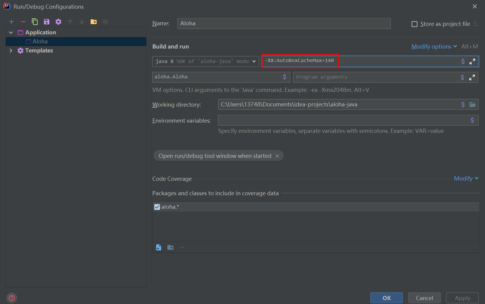

一般来讲，Java 8 中设置有 int 的缓存池，范围默认为 -128 ~ 127

看代码

```java
Integer integer = 123;
Integer integer2 = 123;
System.out.println(integer == integer2);    // true

Integer integer3 = Integer.valueOf(123);
Integer integer4 = Integer.valueOf(123);
System.out.println(integer3 == integer4);    // true

Integer integer5 = new Integer(123);
Integer integer6 = new Integer(123);
System.out.println(integer5 == integer6);    // false
```

关于 Integer.valueOf(int) 它的实现如下，可以解释 integer3 == integer4 为 true

```java
public static Integer valueOf(int i) {
    if (i >= IntegerCache.low && i <= IntegerCache.high)
        return IntegerCache.cache[i + (-IntegerCache.low)];
    return new Integer(i);
}
```


但是，在 jdk 1.8 所有的数值类缓冲池中，Integer 的缓冲池 IntegerCache 很特殊，这个缓冲池的下界是 - 128，上界默认是 127，但是这个上界是可调的，在启动 jvm 的时候，通过 -XX:AutoBoxCacheMax=<size> 来指定这个缓冲池的大小，该选项在 JVM 初始化的时候会设定一个名为 java.lang.IntegerCache.high 系统属性，然后 IntegerCache 初始化的时候就会读取该系统属性来决定上界。

看如下代码

```java
Integer integer = Integer.valueOf(130);
Integer integer2 = Integer.valueOf(130);
System.out.println(integer == integer2);    // false

Integer integer3 = 141;
Integer integer4 = 141;
System.out.println(integer3 == integer4);    // false
```

符合预期

这时我们打开 IDEA 中项目配置的地方，找到 vm options，配置如下参数：`-XX:AutoBoxCacheMax=140`



再次运行上述程序

```java
Integer integer = Integer.valueOf(130);
Integer integer2 = Integer.valueOf(130);
System.out.println(integer == integer2);    // true，此处变为了 true

Integer integer3 = 141;
Integer integer4 = 141;
System.out.println(integer3 == integer4);    // false
```


很有意思

完

2021-3-5