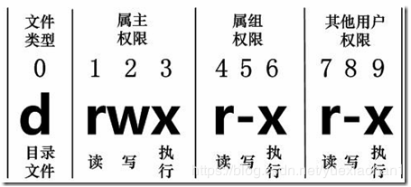

[TOC]

#### Linux文件基本属性

- `-rwxr-xr-x 1 root root 37464685 Jun 28 20:06 springboot.jar`
  

#### Linux命令
- chgrp：更改文件属组

- chown：更改文件属主

- **chmod**：更改文件属性
  - Linux文件的基本权限有九个，分别是user/group/others三种身份各自的read/write/execute权限
  - 可以使用数字来代表各个权限：r - 4，w - 2，x - 1
  - 或者：chmod u=rwx,g=rx,o=r 文件名         （a代表all）

- touch：创建文件

- cat  由第一行开始显示文件内容

- tac  从最后一行开始显示，可以看出 tac 是 cat 的倒著写！

- nl   显示的时候，顺道输出行号！

- more 一页一页的显示文件内容

- less 与 more 类似，但是比 more 更好的是，他可以往前翻页！

- head 只看头几行

- tail 只看尾巴几行

- df：检查文件系统的磁盘空间占用情况

  - df -h：将容量结果以易读的容量格式显示出来

- yum：Yellow dog Updater, Modified是一个在Fedora和RedHat以及SUSE中的Shell前端软件包管理器。

- vim

  - /word：向下搜索

  - ?word：向上搜索

  - n（或N）：下一个搜索

  - `:1,$s/word1/word2/gc` 或 `:%s/word1/word2/gc`：从第一行到最后一行寻找 word1 字符串，并将该字符串取代为 word2 ！且在取代前显示提示字符给用户确认 (confirm) 是否需要取代！(常用)

  - x（或X）：删除字符

  - dd：删除整行

  - d$：删除游标所在处，到该行的最后一个字符

  - d0：那个是数字的 0 ，删除游标所在处，到该行的最前面一个字符

  - yy：复制游标所在的那一行

  - p（或P）：粘贴

  - J：将光标所在行与下一行的数据结合成同一行

  - u：复原前一个动作

  - [Ctrl]+r：重做上一个动作

  - .	不要怀疑！这就是小数点！意思是重复前一个动作的意思。 如果你想要重复删除、重复贴上等等动作，按下小数点『.』就好了

  - ZZ	这是大写的 Z 喔！若档案没有更动，则不储存离开，若档案已经被更动过，则储存后离开！

  - :w [filename]	将编辑的数据储存成另一个档案（类似另存新档）

  - :r [filename]	在编辑的数据中，读入另一个档案的数据。亦即将 『filename』 这个档案内容加到游标所在行后面

  - :n1,n2 w [filename]	将 n1 到 n2 的内容储存成 filename 这个档案。

  - :! command	暂时离开 vi 到指令行模式下执行 command 的显示结果！例如
    『:! ls /home』即可在 vi 当中察看 /home 底下以 ls 输出的档案信息！

  - :set nu	显示行号，设定之后，会在每一行的前缀显示该行的行号

  - :set nonu	与 set nu 相反，为取消行号！

  - G	移动到这个档案的最后一行

  - nG	n 为数字。移动到这个档案的第 n 行。例如 20G 则会移动到这个档案的第 20 行(可配合 :set nu)

  - gg	移动到这个档案的第一行，相当于 1G 啊！ (常用)

  - 在 10 - 20 行添加 // 注释

    :10,20s#^#//#g

  - 在 10 - 20 行删除 // 注释

    :10,20s#^//##g

  - 在 10 - 20 行添加 # 注释

    :10,20s/^/#/g

  - 在 10 - 20 行删除 # 注释

    :10,20s/#//g

  - 批量注释：

    Ctrl + v 进入块选择模式，然后移动光标选中你要注释的行，再按大写的 I 进入行首插入模式输入注释符号如 // 或 #，输入完毕之后，按两下 ESC，Vim 会自动将你选中的所有行首都加上注释，保存退出完成注释。

    取消注释：

    Ctrl + v 进入块选择模式，选中你要删除的行首的注释符号，注意 // 要选中两个，选好之后按 d 即可删除注释，ESC 保存退出。

------

#### Shell 编程

##### 要点

- **声明变量时，变量名和等号之间不能有空格**

- **使用变量时，要在变量名前加`$**`

- **原生bash不支持简单的数学运算**

  ```sh
  val=`expr 2 + 2`	# 通过expr完成运算
  # 表达式和运算符之间要有空格，例如 2+2 是不对的，必须写成 2 + 2
  # 完整的表达式要被 ` ` 包含
  ```

  或者：用**$[]**，其中各处空格有无都行

  [root@izuf683wve4fbnchjdcklsz a]# echo $[a+b]
  4
  [root@izuf683wve4fbnchjdcklsz a]# echo $[ a+b ]
  4
  [root@izuf683wve4fbnchjdcklsz a]# echo $[ a + b ]
  4

  [root@izuf683wve4fbnchjdcklsz a]# echo $[ a * b ]
  8

  **再或者：用c=$(($a+$b))，或 c=$((a+b))**

- readonly a：声明 a 为只读变量

- unset a：删除变量 a ，unset 命令不能删除只读变量

- read：命令从标准输入中读取一行

- **字符串长度**：`${#string}`

- **截取子串**：`${string:5:2}`    => 从第5号开始，截取2个

- 判断字符串是否相等：[ $a = $b ] （也可以用 == ）

- 判断字符串长度是0吗：[ -z $a ] 

- 判断字符串长度不是0吗：[ -n $a ] 

- if条件判断：

  - 要放在方括号之间，并且要有空格，例如: **[$a==$b]** 是错误的，必须写成 **[ $a == $b ]**
  - 或者用 test 命令
  - 或者用 (())，如`if((a==2)); then echo $a; else echo no; fi`  其中空格有无都行（此时没有$，有也可以）

- 条件语句：if then else fi

- 循环语句：

  - for ... in ... do done
  - for((i=1;i<=5;i++))      （此时没有$，有也可以）
  - while do done
  - until do done

- 乘法：

  ```sh
  val=`expr $a \* $b`
  ```

- 关系运算符：只支持数字，不支持字符串，除非字符串的值是数字

  -eq -ne -gt -lt -ge -le

- 布尔运算符：!    -o    -a（也可以是 ||    &&）

- 当前日期：

  ```sh
  echo `date`
  a=`date`
  ```

- bash 支持一维数组（不支持多维数组），并且没有限定数组的大小

  - table=(1 1 2 3 5 8 13)    =>  用()定义数组，（用空格分隔）
  - echo ${table[@]}      =>  @可以获取数组所有元素（用空格分隔）
  - echo ${table[*]}       与@一样
  - echo ${#table[*]}       **获取数组长度**

- **shell** **传参**：$0为文件名，$1 及以后为传入参数，当n>=10时，需要使用${n}来获取参数

  - $#：传递到脚本的参数个数
  - $*：以空格顺序列出的所有参数（相当于一个值）
  - $$：脚本运行的当前进程ID号
  - $!：后台运行的最后一个进程的ID号
  - $@：与$*相同，但是使用时加引号，并在引号中返回每个参数。（相当于n个值）
    如"$@"用「"」括起来的情况、以"$1" "$2" … "$n" 的形式输出所有参数
  - $?：显示最后命令的退出状态。0表示没有错误，其他任何值表明有错误。

- 多行注释

  ```sh
  :<<EOF
  注释内容...
  注释内容...
  注释内容...
  EOF
  
  :<<'
  注释内容...
  注释内容...
  注释内容...
  '
  
  :<<!
  注释内容...
  注释内容...
  注释内容...
  !
  ```

- let 命令：let 命令是 BASH 中用于计算的工具，用于执行一个或多个表达式，变量计算中不需要加上 $ 来表示变量，且运算符间不能包含空格，如，let c=a+b

##### 字符串 - 单引号和双引号

- 单引号里的任何字符都会原样输出，单引号字符串中的变量是无效的

- 双引号中可以出现变量，可以有转义

- 单双引号都可以拼接字符串

  ```sh
  greeting="hello, "$your_name" !"	# 等价于greeting_1="hello, ${your_name} !"
  greeting_2='hello, '$your_name' !'
  ```


##### case 语句

```sh
# 取值后面必须为单词in，每一模式必须以右括号结束。取值可以为变量或常数。匹配发现取值符合某一模式后，其间所有命令开始执行直至 ;;。
# 取值将检测匹配的每一个模式。一旦模式匹配，则执行完匹配模式相应命令后不再继续其他模式。如果无一匹配模式，使用星号 * 捕获该值，再执行后面的命令。
case $aNum in
    1)  echo '你选择了 1'
    ;;
    2)  echo '你选择了 2'
    ;;
    3)  echo '你选择了 3'
    ;;
    4)  echo '你选择了 4'
    ;;
    *)  echo '你没有输入 1 到 4 之间的数字'
    ;;
esac
```

##### 函数

- 返回值由 $? 获得

##### 文件描述符0 1 2

- 文件描述符 0 通常是标准输入（STDIN），1 是标准输出（STDOUT），2 是标准错误输出（STDERR）

##### /dev/null 文件

- /dev/null 是一个特殊的文件，写入到它的内容都会被丢弃；如果尝试从该文件读取内容，那么什么也读不到。但是 /dev/null 文件非常有用，将命令的输出重定向到它，会起到"禁止输出"的效果。

  如果希望屏蔽 stdout 和 stderr，可以这样写：

  ```sh
  $ command > /dev/null 2>&1
  ```

##### 文件包含

- 被包含文件不需要可执行权限

```sh
. filename   # 注意点号(.)和文件名中间有一空格
source filename
```

