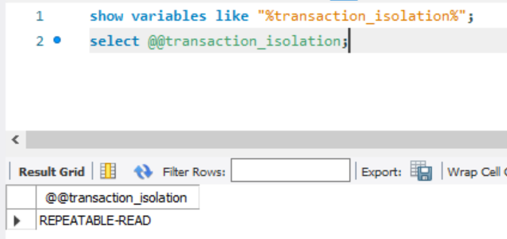

[TOC]

## MySQL

### 常规

1. int(11) 字节数：int 占 4 个字节，32 位。bigint 占 8 个字节。11 表示的意思是显示 11 个数字。当然超出 11 个数字的也能显示。

#### 时间戳

```mysql
now()	// 当前时间
date_add(now(), interval 1 day)	// 当前时间后一天
insert into buginfo values (2, date_add(now(), interval 1 day), 60.0, 60.0, false, false, 10, "xzw", now(), 0, 0);
```

#### 占位符

- 原生 SQL 语句占位符是 `?`，且是基1的

#### 导入 MySQL 文件提示：ERROR: ASCII '\0' appeared in the statement

- 错误：ERROR: ASCII '\0' appeared in the statement, but this is not allowed unless option --binary-mode is enabled and mysql is run in non-interactive mode. Set --binary-mode to 1 if ASCII '\0' is expected. Query: '?
- 原因：.sql 文件是在 powershell 中导出的（坑爹啊）
- 解决：在 cmd 中导出


### SQL 语句

```sql
/* 查询，倒序，限制行数 */
select bugid, content_id, start_time from bug_property order by bugid desc limit 20;

/* 数据库导入导出 */
mysqldump -uroot -p dreamhom > ./backup1.sq1
mysql -uroot -p dreamhom < ./backup1.sql
/* 只导出数据 忽略某个表 */
mysqldump -t -uroot -p goldbug --ignore-table=goldbug.user_caught_bugs > ./temp.sql
/* 只导出表结构 */
mysqldump --opt -d -uroot -p goldbug --ignore-table=goldbug.user_caught_bugs > ./temp1.sql

/* 创建用户，删除用户，授权，回收 */
create user "xieziwei4"@"localhost" identified by "2017211937";
drop user "xieziwei4"@"localhost";
grant select, insert, update on *.* to "xieziwei4"@"localhost";
revoke select on *.* from "xieziwei4"@"localhost";

/* 查看建表语句 */
show create table user;

/* 查看用户 */
select host, user from mysql.`user`;
```


#### 查看事务隔离级别

```sh
# 方法1
show variables like "%transaction_isolation%";
# 方法2
select @@transaction_isolation;
```




### 本地连接服务器端 MySQL

1. 配置服务器端 MySQL 配置文件（vim /etc/my.cnf），添加一行`bind-address = 0.0.0.0`

2. 在服务器端设置一个用户，让其可访问的HOST为`%` ，如 

   ```sql
   update mysql.`user` set host = '%' where user = 'xzw';
   ```

3. 在本地连接：`mysql -u xxx -h xxx.xxx.xxx.xxx -p`


## Redis

### 命令

- mset：同时为多个键设置值。（若给定键已经存在， 那么 `MSET` 将使用新值去覆盖旧值， 如果这不是你所希望的效果， 请使用 `MSETNX` 命令）

- hset：为哈希表赋值

  不存在表则新建

  存在键则用新值覆盖旧值

  ```sh
  # HSET 表 键 值
  redis 127.0.0.1:6379> HSET myhash field1 "foo"
  OK
  redis 127.0.0.1:6379> HGET myhash field1
  "foo"
  ```

- 

