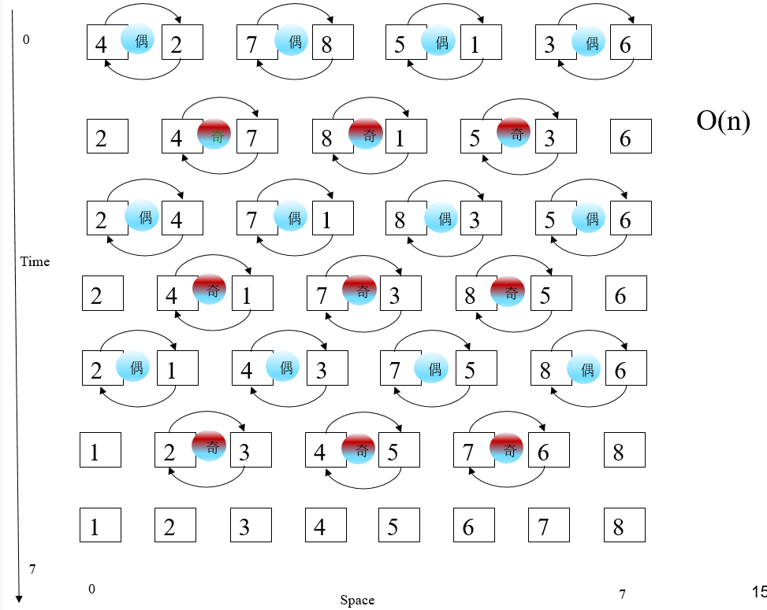

## 基础和概念

- 并行计算：又叫高性能计算、超级计算，将大任务分解为多个子任务，分给各个处理器协同运算，达到快速求解的目的
- 第一台计算机 ENIAC：1946年
- 共享存储的多处理器（如 SMP）的瓶颈：存储访问
- 对称多处理器（SMP）特点：在一个计算机上汇集一组处理器，各处理器对称共享内存及计算机的其他资源，由单一操作系统管理，极大提高整个系统的数据处理能力
  - 扩展性较差
  - 可靠性较差
  - 内存访问瓶颈
  - 编程容易
- DSM：分布式共享存储多处理机
- 目前并行处理的主流：机群系统（简称 NOW，或 COW）。理由：具有投资风险小、可扩展性好、可继承现有软硬件资源和开发周期短、可编程性好等特点
- 利用 n 个处理器对 n 个数求和，最快的算法复杂度为：log(n)

### 并行计算的条件

- 硬件（并行机）：一般指 SIMD 类型的并行计算机，即单指令流多数据流计算机
  - SIMD 型计算机又分为
    - 阵列处理机
      - 同时支持标量指令和向量指令
    - 向量处理机
- 并行编程环境
- 并行算法设计

### 并行计算应用

- 数值天气预报
- 数学命题验证：黎曼猜想数字验证
- 数学定理证明：四色问题
- 核武器数值模拟
- 人工智能计算：例如围棋
- 搜索引擎
- 商业应用：金融证券交易
- 人工神经网络计算
- 天体物理
- 生物信息处理

### 并行软件环境

- 基于**消息传递**的并行编程环境
  - **MPI**：Message Passing Interface
  - PVM：Parallel Virtual Machine
- 基于共享存储的
  - OpenMP：Open Multi-Processing
- 数据并行
  - HPF：High Performance Forthan

###  加速比

- 加速比的定义：度量了使用多处理器后提高速度的倍数

  

- 一般而言，p 个处理器，加速比 S(p) 最大为 p，且通常达不到

- 若加速比为 p，则称为线性加速比

- 也有可能出现超线性加速比：例如空间搜索，找到物品则表示算法结束

#### 加速比定律 Amdahl’s law

- 假设串行执行的时间是 ts ，必须串行计算的部分比例为 f，则

  

- 加速比的极限：固定 f，当处理器数目 p 趋于无穷大时，S(p) 的极限为 `1 / f`。如 f=5%，则 s 的极限为20

## MPI

- 通信器（通信子 or 通信域）：MPI_COMM_WORLD
- 多个进程使用同一个标准输出。只有一个进程能得到标准输入。

### MPI 消息组成

- 一个消息由通信器、源地址、目的地址、消息标签、和数据构成，可分为两个部分
  - 消息缓冲 (Message Buffer) ：由（起始地址，数据个数，数据类型）标识
  - 消息封装 (Message Envelop)：由（目标进程，消息标签，通信域）标识
- 

## 简单并行计算

- 主从模型
- 图像的几何转换
- 工作池、处理器农庄：动态任务分配

### 伪随机数生成

- 线性同余生成器（LCG）

  - x[i+1] = (a x[i] + c ) mod m     
  - m 为素数，常用的取值：a = 16807 、c=0、  m= 2^32 - 1

- 下一个随机数的计算依赖于前一个随机数，属于难以并行的算法，其如何并行的方法为：

  

## 划分和分治策略

### 桶排序

- 前置条件：n 个数在范围内**均匀分布**

- n 个数，m 个桶，复杂度为：n log(n/m)

  

### N 体问题

- Barnes-Hut 算法：O(n logn)

## 流水线计算

### 并行插入排序

- 串行复杂度：O(n ^ 2)
- n 个数排序，若有 n 个处理器：线性复杂度
- 处理器数 p 远小于待排序数 n：O(n/p log(n/p) + n)

### 求解线性方程组

- 流水线方式，计算**上三角型**方程组：O(n)

- 用迭代法求解**一般的**线性方程组：适合于**稀疏**的方程组

  - Jacobi 迭代法

    - 需要满足收敛条件：对角占优，即每行对角线的系数比其他系数都打

    - 复杂度分析

      

  - 对比 雅可比迭代 和 高斯-塞得尔迭代

    - 雅可比迭代
      - 用上一次的结果作为下一次计算的输入
      - 结果与起始计算顺序的选取**无关**
    - 高斯-塞得尔迭代
      - 结果跟计算的顺序**有关**系

## 同步计算

### 同步栅栏

- 普通方式：线性

- 树形栅栏：O(logn)

  - 分为 checkin 和 checkout 两个阶段
  - 有时有的节点处于闲置状态

  

- 蝶形栅栏：O(logn)

  - 只要一个阶段
  - 每个步骤所有的节点均处于工作状态

  

### forall 写法

## 负载均衡

### 集中式动态负载均衡

- 内容
  - 任务由一个中心点分发，满足**主从结构**
  - 任务由主进程发送给从进程
  - 从进程结束后向主进程申请新任务
  - 工作池，处理器农庄
- 问题
  - 主进程是任务分配的瓶颈
  - 适合于进程个数少，计算密集型

### 分散式动态负载均衡

- 优点
  - 适合于进程个数较多，计算任务颗粒较细
  - 一组进程来完成任务的分配
  - 工作进程可以把任务分配给其他进程，也能从其他进程得到任务

### 线性结构复杂均衡

- 全分布式工作池：

  - 所有的进程都参与任务分配
  - 全分布式存在于理论，不容易实现

- 线性结构

  

  

## 排序

### 线性复杂度

- 并行冒泡（奇偶交换排序）

  

- 并行归并

- 并行快排

  - 极端情况下是 O(n^2)

- 并行插入

### 对数平方复杂度

- 奇偶归并排序

  

- 双调归并排序

  

### 交换操作实现

- 
- 

## 数值计算

### 矩阵乘法

- 串行：O(n^3)
- 并行：
  - n 个处理器：O(n^2)
  - n^2 个处理器：O(n)
  - n^3 个处理器：O(logn)
  - 进一步增加处理器的数目不能提高其效率。 O(logn)是下界

### 求解线性方程组

- 稠密方程
  - 高斯消元法
    - 串行：O(n^3)
    - 并行：O(n^2)

## FFT

- 卷积的傅立叶变换等于傅立叶变换的乘积。F(f(x)*g(x)) = F(f(x)) F(g(x))
- 多项式表示法：
  - 系数法
    - 求和：O(n)
    - 乘积：O(n^2)
  - 点值法
    - 求和：O(n)
    - 乘积：O(n)
  - 系数转点值
    - 计算 n 个点，horner 法则：O(n^2)
  - 点值转系数
    - 高斯列主元消除法、或LU分解法：O(n^3)
    - 拉格朗日插值公式：O(n^2)
- 
- FFT：O(nlogn)
- 如果使用 n 个处理器，理想的并行复杂度为 logn

