[TOC]

## 词法分析

### 概念

1. 编译：将高级语言 => 目标程序的 软件

   解释：模拟器，直接将程序解释成结果

2. JIT技术：just-in-time compilation 即时编译技术

3. 编译的阶段：

   - 分析阶段：静态分析

   - - 词法分析
     - 语法分析
     - 语义分析

   - 综合阶段

   - - 中间代码生成
     - 代码优化
     - 目标代码生成：之后还可以进一步优化

### 编译程序的前端和后端

- 前端：由与源语言有关而与目标机器无关的部分组成，包括
  - 词法分析
  - 语法分析
  - 语义分析
  - 中间代码生成
  - 符号表的建立
  - 中间代码优化
  - 相应的错误处理和符号表操作
- 后端：由与目标机器有关的部分组成，包括
  - 目标代码的生成
  - 目标代码的优化
  - 相应的错误处理和符号表操作

### 输入输出

- 词法分析的输入输出
  - 输入：源程序（字符串表示的源程序）
  - 输出：记号流（记号序列表示的源程序）

## 语法分析

### 错误处理

- 语法错误的处理

  属于批量处理，尽可能找出所有错误。

  在发现一个错误后，语法分析器并不终止。

- 错误恢复策略
  - 紧急恢复：一旦出现错误则放弃一段输入记号；很简单，但不够好
  - 短语级恢复：一种局部纠正策略，如删除多余分号，插入遗漏分号等；有可能造成死循环
  - 出错产生式：增加产生错误结构的产生式，扩充源语言的文法
  - 全局纠正策略：做尽可能少的修改；仅处于理论阶段

### 输入输出

- 语法分析程序的输入输出
  - 输入：记号流
  - 输出：语法分析树

### 语法分析的方法

#### 自顶向下的分析方法

##### 递归下降分析方法

- 通过试探，即反复使用不同的产生式谋求匹配输入符号串的过程
- 是一个**最左推导**的过程
- 是一种穷尽一切可能的方法，线性 -> 指数
- 要消除文法中的左递归（A->Ad），否则可能陷入死循环（A=>Ad=>Add=>Addd）

##### 递归调用预测分析

- 关键在于克服回溯，即A根据当前输入符号a可以**唯一指派**候选式α[i]
- **文法不能含有左递归**
- 对于任意的 α[i] 和 α[j]，有 FIRST(ai) ∩ FIRST(aj) = 空集  ( i != j )
- 要求实现预测分析程序的语言支持递归调用

##### 非递归的预测分析

- 建立预测分析程序的模型，包含5个部分

  - 输入缓冲区
  - 输出：采用的产生式序列，形成语法树
  - 分析栈：符号栈
  - 分析表：存放产生式
  - 预测分析控制程序：核心，根据栈顶符号和当前输入符号行动

  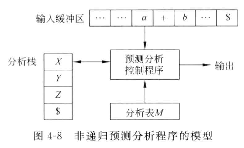

- 构造预测分析表的过程

  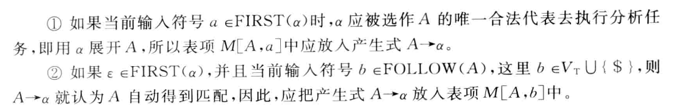
  
  - 若得到的分析表不含多重定义的表项，则称它为 LL(1) 分析表，文法称作 LL(1) 文法
  
  - 同时 LL(1) 文法满足下列性质：
  
    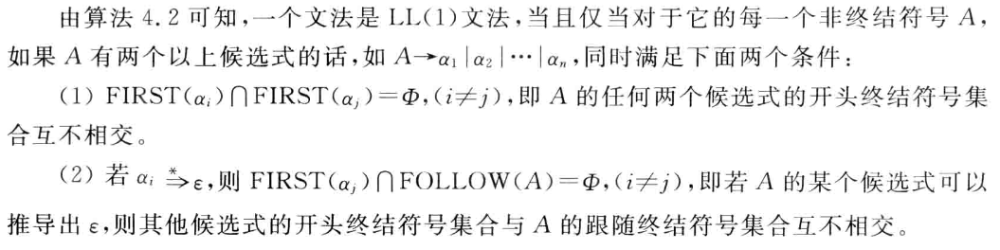

#### 自底向上的分析方法

##### LR 分析方法

- 可以分析左递归文法，因此在使用时，第一步不再是消除左递归

- 可以分析所有能用**上下文无关**文法书写的程序设计语言的结构

- LR分析程序的模型，包含5个部分
  - 输入：记号流
  - 输出：归约的顺序，形成分析树
  - 栈：
    - 状态栈
    - 符号栈：可以没有
  - 分析表
    - action 表
    - goto 表
  - LR 分析控制程序：核心，根据栈顶**状态符号**和当前输入符号采取行动
  
  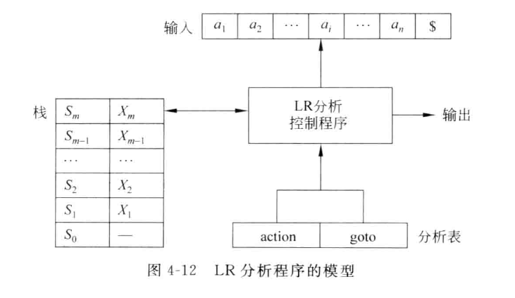
  
- 常用的 LR 分析表

  - SLR(1) 分析表，构造步骤如下：

    - 构造可以识别给定文法G的所有活前缀的DFA
    - 构造SLR(1)分析表，算法如下：

    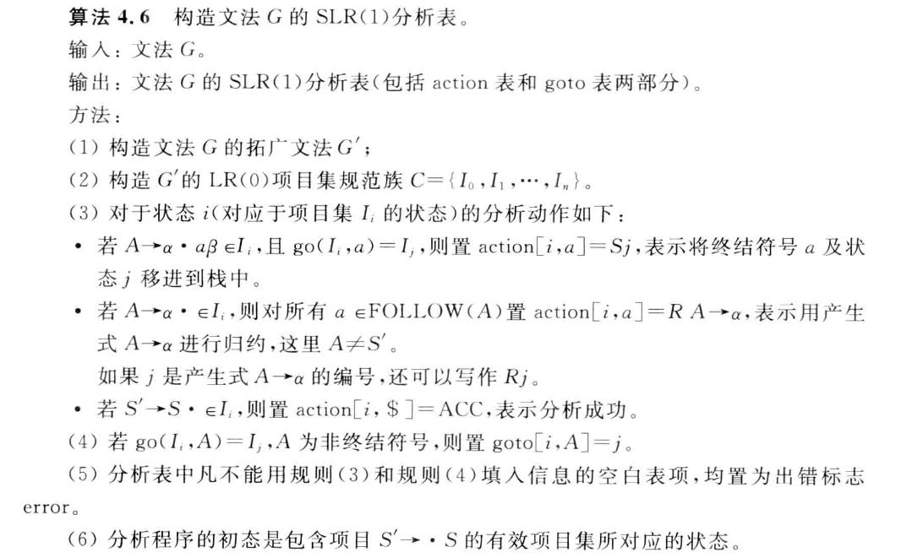

  - LR(1) 分析表

  - LALR(1) 分析表

    - 同心集的合并只可能产生**归约-归约**冲突

## 语法制导的翻译技术

### 概述

1. 语法制导翻译技术是目前大多数编译程序采用的一种技术，他不是一种形式系统，但比较接近形式化

2. 语法制导定义

   1. 首先根据翻译目标的要求确定每个**产生式**包含的语义，进而分析每个**文法符号**的语义，把这些语义以属性的形式附加到相应的文法符号上(即把语义和语言结构联系起来)，然后根据产生式的语义，给出符号间属性的求值规则(即语义规则)，从而形成语法制导定义

3. 翻译方案

   1. 进一步，根据产生式的**语义规则**(一般是一个赋值语句，或一个过程调用语句，或一段程序代码)，把这些规则插入到产生式右部的适当位置(位置决定了它的执行时机)，就形成了翻译方案

4. 综合属性(synthesized attribute)

   1. 分析树中一个结点的综合属性是从其子结点的属性值计算出来的

5. 继承属性(inherited attribute)

   1. 继承属性是从其兄弟结点和/或父结点的属性值计算出来的；则可以推断出，顶点节点(即开始符号)没有继承属性

6. 依赖图：

   1. 用于描述节点的继承属性和综合属性之间的相互依赖关系。

   2. 输入是分析树及其语法制导定义，输出是分析树对应的依赖图

   3. 分析树**并不是**依赖图的一部分

   4. 依赖图长这样：

      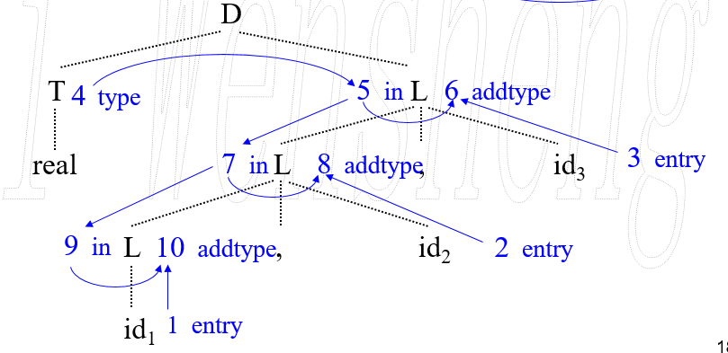
   
7. 计算次序：

   依赖图的任意一种拓补排序就是一个有效的计算顺序

8. 语法制导定义的翻译是很**精确**的，但是效率不高，一般步骤为：

   1. 对输入符号串建立分析树
   2. 对分析树构造依赖图
   3. 对依赖图进行拓扑排序得到计算次序
   4. 按照顺序执行语义规则对属性进行求值

### S属性定义

1. 定义：仅使用综合属性的语法制导定义称为S属性定义

#### S属性定义的自底向上翻译

- 类比于LR分析程序
- 很简单

### L属性定义

1. 定义：对于每一个产生式 A -> X1X2...Xn，若计算文法符号 Xj 的属性值，应仅依赖于其左边的符号的属性值
2. S属性定义是L属性定义的子集

#### L属性定义的自顶向下翻译

- 类比于预测分析程序

#### L属性定义的自底向上翻译

- n可以实现任何基于LL(1)文法的L属性定义
- n可以实现许多(不是全部)基于LR(1)文法的L属性定义

## 语义分析

### 概述

1. 语义和上下文 (context) 有关
2. 语义分析的主要任务：符号表的建立与管理、类型检查

### 符号表

#### 符号表的建立和访问时机

1. 多遍编译：

   符号表在词法分析阶段创建，变量在符号表中的位置作为词法分析器所产生的记号的属性，标识符的属性在语义分析阶段相继填入符号表

   适用于非块结构语言的编译，不适用像 C 语言这样块结构语言的编译

   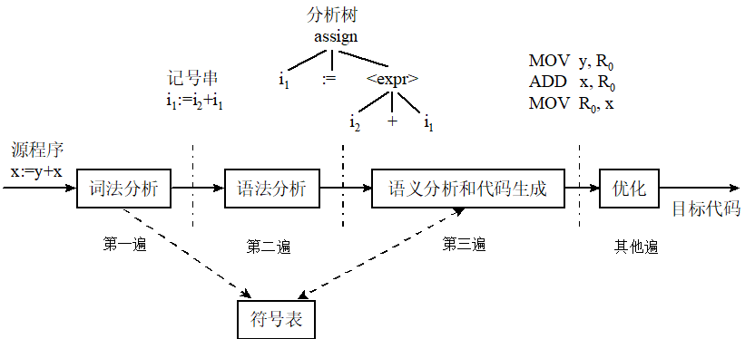

2. 合并遍编译：

   以语法分析程序作为主控程序。当需要记号时就调用词法分析器，当识别出一个语法结构时，就调用语义分析器和代码生成程序。所以与符号表交互的只有语义分析和代码生成程序

   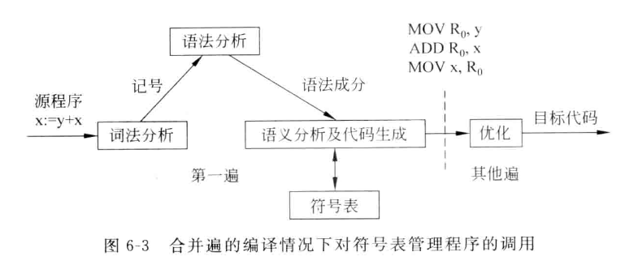

#### 符号表的内容

1. 名字：存在标识符长度是否可变的问题，可变的话，就存储标识符的开始位置和长度
2. 类型
3. 存储地址
4. 维数或参数个数：数组的维数、函数的参数个数
5. 声明行
6. 引用行
7. 链域（指针）

#### 符号表操作

1. 插入
2. 检索
3. 定位：建立一个新的子表
4. 重定位：”删除“该块的子表

#### 符号表组织

- 非块结构语言符号表组织

  - 特点：不包含子块的单一模块
  - 组织形式：
    - 无序线性符号表
    - 有序线性符号表
      - 线性查找
      - 二分查找
    - 散列表

- 块结构语言符号表组织

  - 栈式符号表：包含两部分，栈式符号表和块索引表

    - 插入操作：将新标识符压入栈顶；查重操作只在当前正在编译的块的符号表中进行检查
    - 检索：当遇到标识符引用时，只需从**栈顶到栈底**进行线性搜索即可（最近嵌套作用域）
    - 定位：当识别出一个块的开始时，将栈顶指针 top 的值压入块索引表的栈顶，开始一个新的子块
    - 重定位：遇到块结束时，弹出块索引表顶端的值，并用它设置栈顶指针 top 的值

    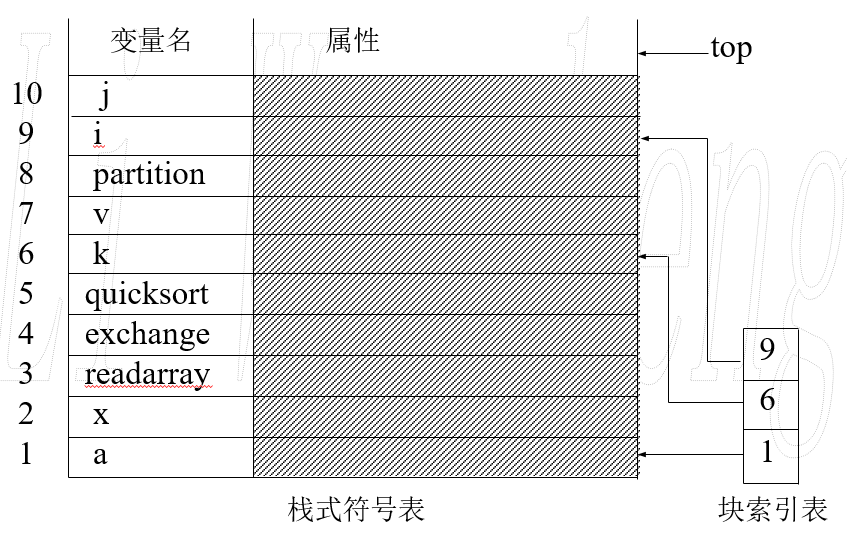

  - 栈式散列符号表

    - 为了提高检索速度，增加一个散列表

### 类型检查

#### 类型表达式

- 类型表达式或者是基本类型，或者是由类型构造器（如typedef）作用于其它类型表达式而形成的

#### 类型等价

##### 结构等价

- 例如：变量 a: recA、b: recB、c: struct{ ... } 的类型是等价的

  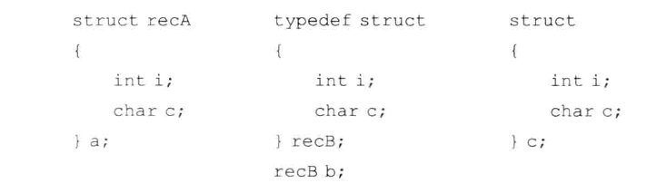

##### 名字等价

- 例如：变量a、b名字等价，变量c、d、e名字等价，但两者名字不等价，而是结构等价

  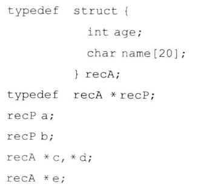

## 运行环境

### 概念

#### 过程与活动

- 过程：
  - 一段代码即为一个过程，函数是过程，一个完整的程序也是过程
  - 过程是静态概念
- 活动：
  - 一个过程的一次执行称为一次活动
  - 活动是动态概念
  - 如果一个过程在执行中，则称此活动是活着的
  - 每个活动都有自己独立的存储空间

#### 名字绑定 binding

- 把名字映射到存储单元的过程

#### 名字的左值与右值

- 左值：存储空间的地址
- 右值：其存储空间上的内容

### 存储分配策略

#### 静态存储分配

- 对于源程序的各种数据对象，要求能在编译时确定他们所需的存储空间的大小

#### 栈式存储分配

#### 堆式存储分配

### 参数传递机制

#### 传值调用

- 将右值传递给被调用过程

#### 引用调用

- 将左值传递给被调用过程

#### 复制恢复

- 过程调用时，将实参的右值”复制入“，控制返回时，将形参的值”复制出“到实参的左值

#### 传名调用

## 中间代码生成

### 输入输出

- 输入：经过分析阶段获得的源程序的中间表示

- 输出：中间代码

- 位置如图：

  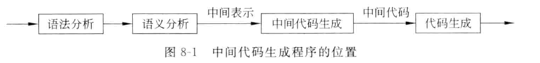

### 三地址代码

- 中间代码的表示：通常有后缀表示、语法树、dag、三地址代码

- 三地址代码的含义：语句中最多出现三个地址（或者说三个变量）

- 三地址代码的表示形式：

  - 四元式

    - 例如：
      - (op, y, z, x)，x = y op z
      - (=, y, , x) ，x = y
      - (param, x, , )，param x
      - (goto, , , L)，goto L
      - (relop, x, y, L)，if x relop y goto L
    - 要求所有的名字都存入符号表，需要利用较多的临时变量

  - 三元式

    - 为了不引入临时变量，用计算中间结果的语句的指针代替存放中间结果的临时变量，例如：
      - 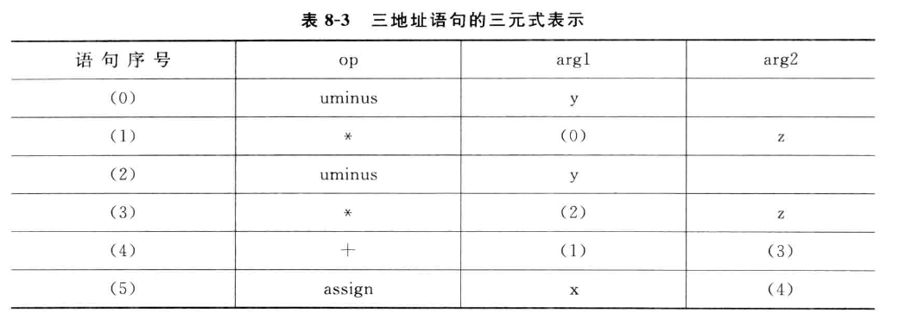
      - 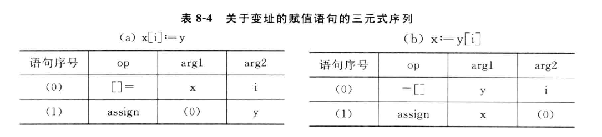

  - 间接三元式

    - 如果删除或改动任何一个三元式，则会引起一系列三元式的相应改动

    - 引入间接三元式：为三元式序列建立的一个指针数组，其每个元素依次指向三元式序列中的一项，例如

      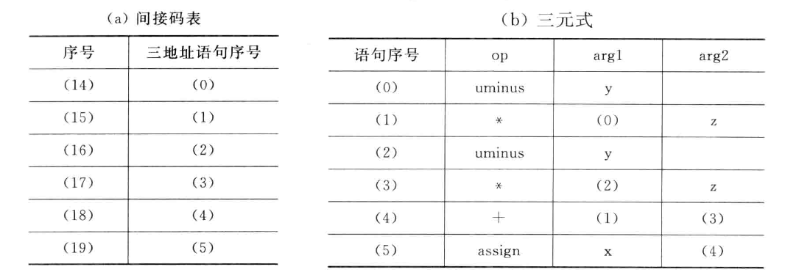

## 目标代码生成

- 任务

  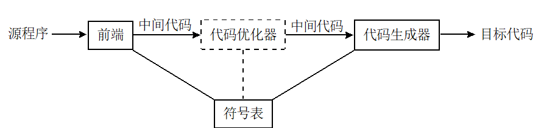

- 

