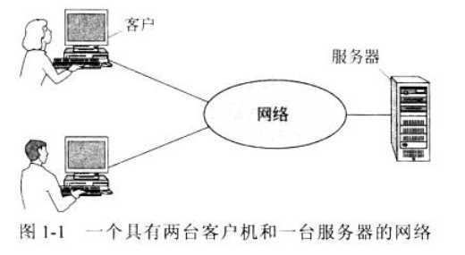
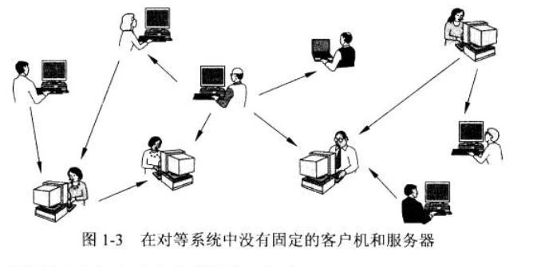
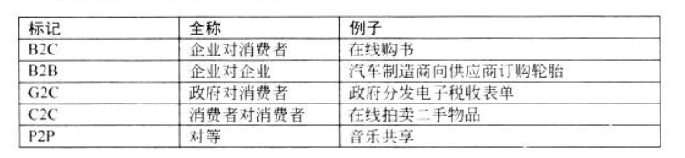
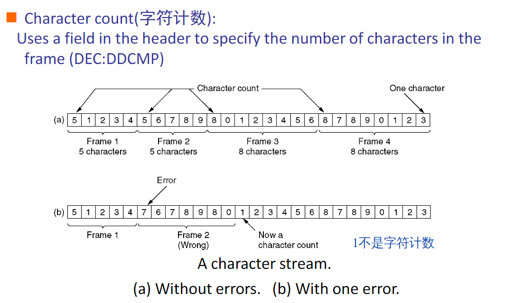
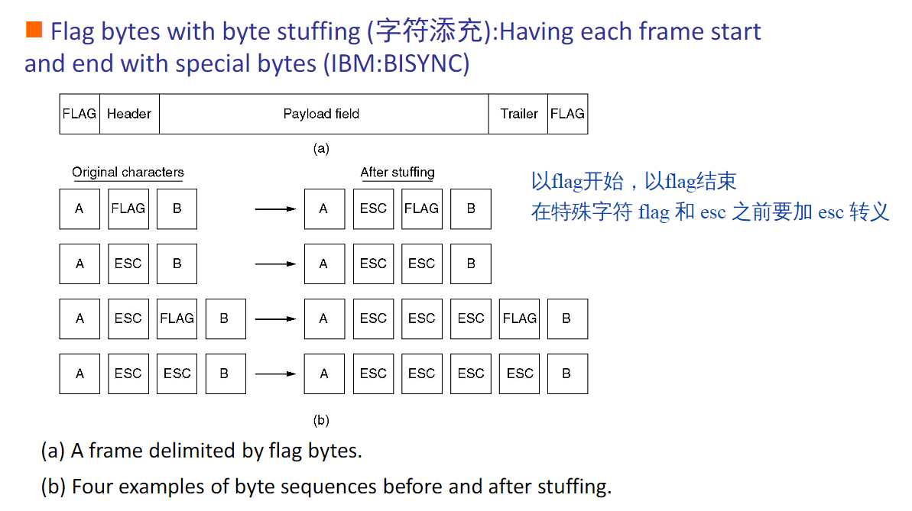
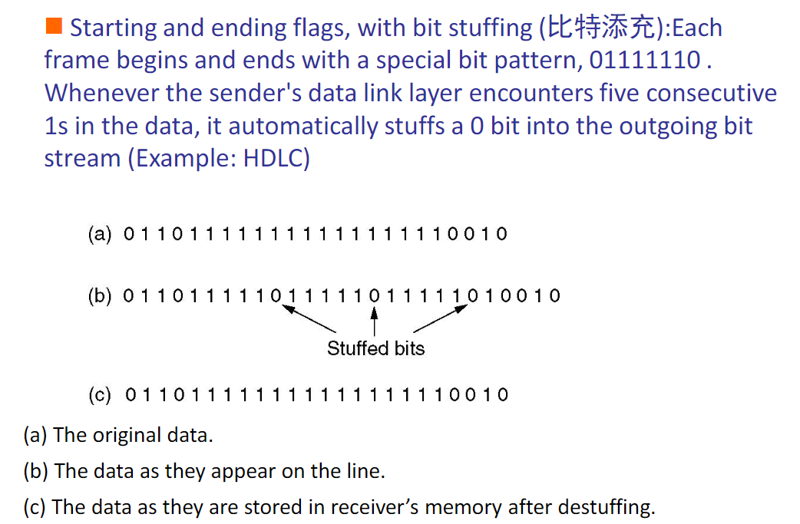
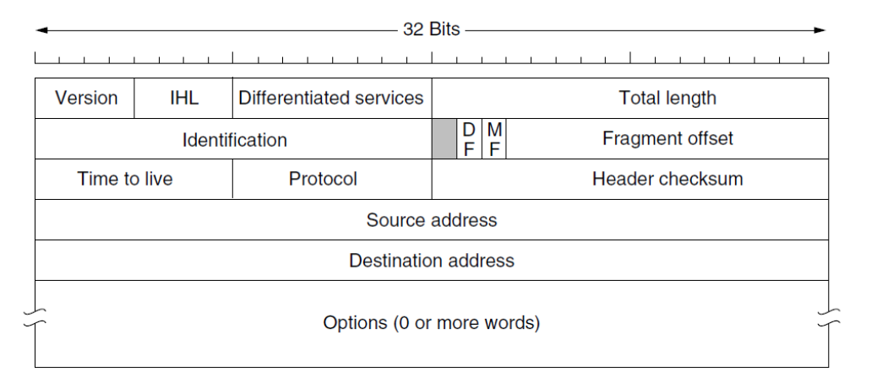

[TOC]

## 第一章-引言

### 概念

1. VPN：Virtual Private Networks 虚拟专用网络

2. IP telephony（IP电话）或者VoIP（Voice over IP 即IP语音）：通过计算机网络打电话，而不通过电话公司

3. Communicate with others，两种方法：

   1. 客户机-服务器模型 client-server model

      
      
   2. Peer-to-peer 对等通信技术：没有中央数据库
   
      
   
4. 以太网：Ethernet，应用最普遍的局域网技术

5. Instant messaging：即时通讯，简称 IM，是一种透过网络进行**实时通信**的系统，允许两人或多人使用网络即时的传递文字消息、文件、语音与视频交流

6. 普适计算：ubiquitous computing，计算可以使用任何设备，随时随地以任何格式进行

7. RFID：无线射频识别技术，Radio Frequency Identification

   - 贴在商品上，可以取代条形码，但有点成本，没有推广
   - 可能使物联网变成现实

8. 电子商务的几种形式：

   

9. IoT：Internet of Things，物联网

10. CNNIC：中国互联网络信息中心（China Internet Network Information Center）

11. ARP：Address Resolution Protocol，地址解析协议

12. 底层向上层提供两种类型的服务

    1. 面向连接的服务
       1. 类比于 telephone system
       2. 有三个过程
          1. 建立连接
          2. 使用连接
          3. 释放连接
    2. 面向无连接的服务
       1. 类比于 postal system
       2. 每个 message 自身携带着完整的目的地地址，且各自的路由都独立于其他 message

#### The network edge

- end systems (hosts): run application programs at "edge of network"
- client / server model

#### The network core

- mesh of interconnected routers
- How is data transferred through net ?
  - circuit swithing: eg. telephone net
  - packet-switching

## 物理层

### 概念

- 通带传输：调幅、调频、调相
- 多路复用 multiplexing
  - 频分复用
  - 时分复用
  - 码分复用（CDMA）

## 数据链路层

### Framing

- A 发给 B 一组位序列，B 应当能够分辨出 frame 从哪里开始，从哪里结束

### 编码技术

- 字符计数：Character Count

  

- 字节填充：Byte Stuffing

  

- 位填充：Bit Stuffing

  

### Flow Control

- Stop and wait：一次发一帧
- Sliding window：一次发多个帧

### Error Control

- 错误类型
  - lost frames：Owing to noise burst or dropped from a queue
  - damaged frames：some bits are in error
- 纠错
  - FEC：前向纠错，Forward Error Correction
- 检错
  - Parity check：奇偶校验，检查一位错误
  - CRC：循环冗余校验，又叫多项式编码，detecting some burst errors

### IEEE 802.11

- 无线网有两种模式
  - 有基站：接入点（access point），所有通信都要经过基站
  - 无基站：直接发送给另一个，ad hoc networking

## 网络层

- Store-and-Forward Packet Switching
- 网络层的设计目的
  - 传输层应该与路由器的数量、类型和拓扑结构隔离
  - 传输层可用的网络地址应该使用统一的编号计划，甚至在 lan 和 wan 之间也是如此
- 提供两种服务
  - 无连接的服务：Datagram
  - 面向连接：Virtual Circuit

### 路由算法

- 路由算法是网络层软件的一部分，负责决定传入包应在哪条输出线上传输
  - 如果子网在内部使用datagrams，则必须为每个到达的数据包做出一个新的决策，因为最佳路由可能自上次以来已经更改
  - 如果子网内部使用虚拟电路，则只有在建立新的虚拟电路时才会做出路由决定。此后，数据包只遵循以前建立的路由(会话路由)
- 转发和路由
  - Forwarding: handles each packet as it arrives, looking up the outgoing line to use for it in the routing tables
  - Routing: making the decision which routes to use
- 路由算法分类
  - 静态路由：非适应性算法
    - 路由决策不基于当前流量和拓扑的测量
    - 使用的路由的选择是预先计算的，脱机的，在网络启动时下载到路由器
  - 动态路由：自适应算法
    - Change their routing decisions to reflect changes in the topology, and usually the traffic as well
- 距离矢量路由
  - RIP
  - 周期性的向领居发送路由信息
  - 接受到更好的路由则更新已有的路由表
  - 存在无穷计算问题，当X告诉Y它在某处有一条路径时，Y无法知道它自己是否在这条路径上
- 链路状态路由
  - OSPF

### QoS

- Quality of Service
- 四个因素
  - Reliability：丢包率来衡量
  - Delay：时延，越小越稳定
  - Jitter：抖动
  - Bandwidth：带宽

### IPv4

- 

## 传输层

### TCP

- 专门设计用来在不可靠的网络上提供一个可靠的端到端的字节流传输