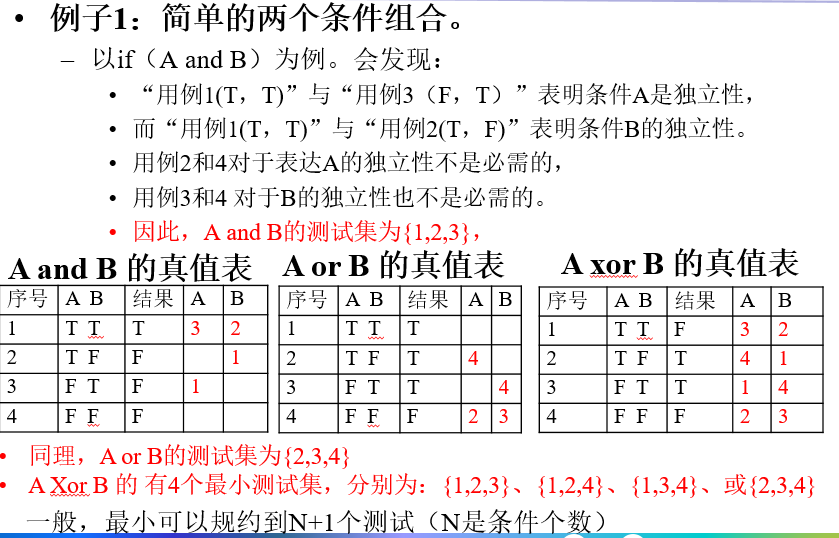

[TOC]

## 软件工程序论

- 软件工程被提出的会议召开的时间：1968年
- 软件测试不能证明软件是正确的

### ISO 9126 的产品质量定义

## 需求工程

- 软件项目失败的最主要原因并不是软件设计和代码编写等方面的技术原因，很大程度上是对用户的需求分析不够等方面非技术的原因。
- 利益相关方：所涉及到的群体包括 用户、客户方、开发方、软件销售人员、购买者
- 将需求条款分为三种价值：M(mandatory)：强制性要求，给出要求的下限或上线；D(desirable)：期望的要求；B(best)：最好的要求。例如：系统应当支持(M:50、D:100、B:200)个并发用户

## 建模与图示化表示

### 周境图

- 例如

  

### 数据流图

- DFD：Data Flow Diagram

- 例如

  

### 第二层数据流图

- 例如

  

### 功能结构图

- 例如

  

### 实体关系图

- 即 ER 图

### 用例图

### 泳道图

- 每个泳道是一个角色，角色之间信息按流程在交换。

  

### 部署图

### 对象和类图

## 体系结构设计

- 性能和可修改性可能是互相矛盾的

- 体系结构视角，4 + 1 视图模型：

  

- ATAM：体系结构折中分析方法

## 体系结构模式与应用

- 体系结构分级
  - 概念级体系结构
  - 模块级体系结构
  - 运行级体系结构
  - 代码级体系结构
- ADL：Architecture Description Language，体系结构描述语言
- AADL：Architecture Analysis & Design Language，体系结构分析和描述语言

## 代码工程

- 运行错误分类
  - A级：致命错误
  - B级：严重错误
  - C级：影响功能的错误
  - D级：造成不方便的错误
  - E级：无关紧要的错误

### 结构化编程

- 顺序语句
- 判断语句
- 循环语句

### 复杂度度量

#### McCabe复杂度

- V(G) = e - n + 2p
- V(G)只取决于图 G 中的判断结构

### 代码审查方式

- 桌面检查
- 代码审查和走查
- 同行评审

## 软件测试理论与技术

### 语句覆盖准则

### 分支覆盖准则

- 程序中是否有不可达到的分支是不可判定问题

### 圈复杂数覆盖准则

- V = e - n + 2
- 一个测试用例，可以走过一个独立路径的话，测试是有效的
- 当V个独立路径被测试后，圈复杂度为100%

### 多条件覆盖准则

- N个子条件，组合情况为2^N

### MC/DC

- 修改后的条件/判断覆盖

  

### 全用法(all-uses)测试

- 测试了变量的全部用法和路径

### 变异测试

## 软件测试工程

- **成功的测试是让系统出现错误**

- MtSS：方法序列规格说明
- MgSS：消息序列规格说明