[TOC]

# 云计算技术

## 概述

### 基础概念

#### pv

- page view：衡量网站负载

#### scale up

- 垂直扩展

#### scale out

- 水平扩展

#### CDM 云交付模型

- Cloud Delivery Model
- 三种基本交付模型：IaaS、PaaS、SaaS

#### Gartner Hype Cycle

### 5个基本特征

- 按需自助服务，on-demand
- 资源池化，a shared pool
- 快速伸缩
- 按使用量收费的服务
- 广泛的网络访问，ubiquitous

### 3种服务模型

- SaaS，软件即服务，以云服务的形式提供软件程序的功能
- PaaS，平台即服务，提供应用程序的开发运行环境
- IaaS，基础设施即服务，按需提供的虚拟化资源（计算、存储和通信），裸机

### 4种部署模型

- 公有云
- 私有云
- 社区云
- 混合云

------

## 云计算的架构

### 系统软件

- 一般来讲，系统软件包括**操作系统**和一系列基本的工具（比如编译器，数据库管理，存储器格式化，文件系统管理，用户身份验证，驱动管理，网络连接等方面的工具）
- 一般认为，数据库管理系统（DBMS）属于系统软件，（并且DBS = DB + DBMS + DBA）

### 网络管理的基本功能：FCAPS

1. Fault，故障管理
2. Configuration，配置管理
3. Account，账户管理
4. Performance，性能管理
5. Security，安全管理

### 云计算的3种交付模式

#### SaaS

- 软件交付的模式
- 多租赁，Multitenant，通常是通过浏览器将程序传给成千上万的用户

#### PaaS

- 平台交付的模式
- 把开发、部署环境作为服务来提供

#### IaaS

- computer交付的模式
- 硬件及服务
- 效用计算（Utility computing）：提供客户需要的计算资源和基础设施管理，并根据应用**所占用的资源情况**进行计费，而不是仅仅按照速率进行收费
- 将最基本的**计算资源**、**存贮资源**、**网络资源**，用虚拟化的方法以**租用**方式提供给客户

### 云计算服务的构建架构

- 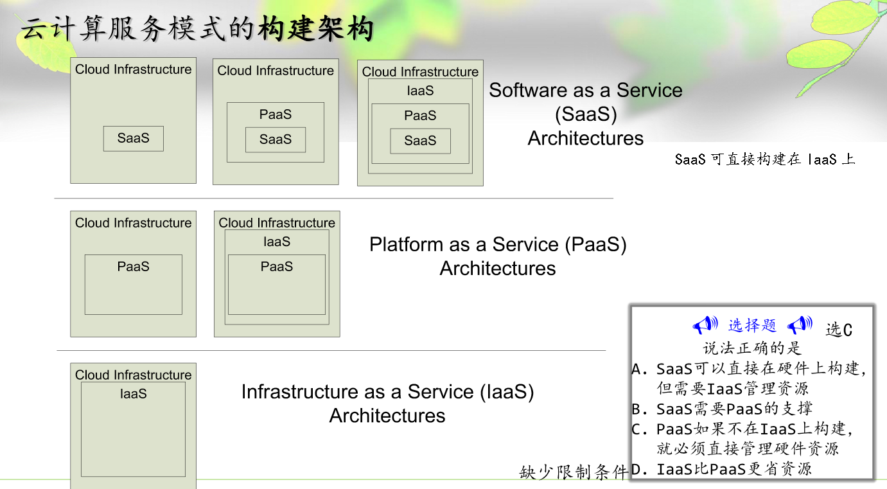

### 云计算服务模式的七层映射

### IaaS架构

1. 定义：将IT基础设施（计算、存储等能力）通过网络提供给用户使用，并能够按照用户占用的资源进行计费的一种服务
2. IaaS的两种不同作用：
   1. 使一个资源通过虚拟化看似多个资源
   2. 是多个资源通过虚拟化看似一个资源
3. 例子：OpenStack

#### 虚拟化

##### hypervisor

- hypervisor，即虚拟机管理器，又叫VM Manager

##### 虚拟化的四个特征

- 分区、隔离、封装、硬件独立

### PaaS架构

1. 例子：Cloud Foundry、Hadoop

### SaaS架构

1. 多租户功能主要由接入调度器实现
2. SLA概念：service level agreement，服务水平协议

------

## IaaS

### 两种虚拟化架构

1. 寄居架构（hosted），多了一个宿主操作系统
2. 裸金属架构/原生架构（Native/bare-metal），一般性能比hosted好
   1. **Bare-metal架构的VMM中往往包含一个经过修改的Host OS**
3. 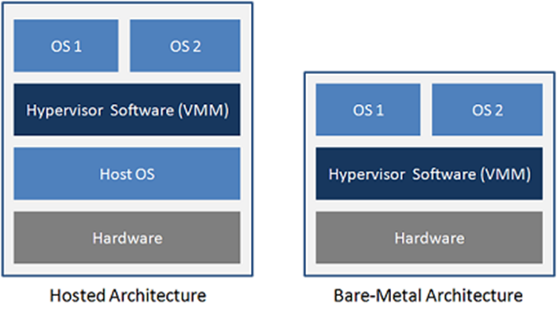

### 三种虚拟化关键技术

#### CPU虚拟化

1. 定义：将单个物理CPU虚拟成多个VCPU供虚拟机使用。虚拟CPU**分时复用**物理CPU

2. CPU两种工作状态：

   1. 内核态（kernel mode）
   2. 用户态（user mode），只能运行非特权指令，而用户程序要陷入内核态的话，需要系统调用（System call）

3. 包含三种CPU虚拟化技术：

   1. Hypervisor模拟执行Guest OS的0级指令
   2. 操作系统辅助（Guest OS）
   3. 硬件辅助

4. 包含三种虚拟化程度

   1. 全虚拟化

      1. 模拟执行流程：

         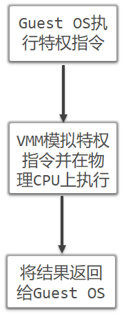

      2. 模拟执行的两种方法：

         1. 解释执行，执行开销大

            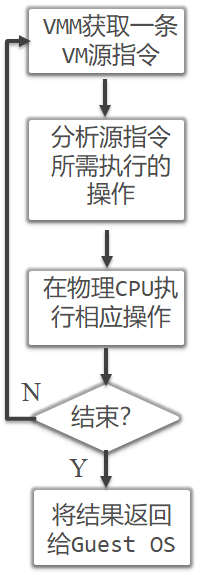

         2. 二进制翻译，初始开销大

            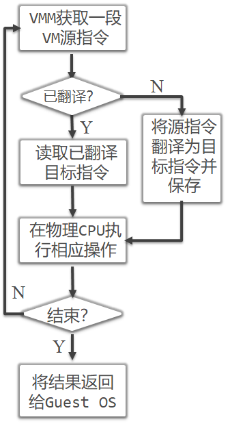

      3. 全虚拟化涉及到的技术

         1. 优先级压缩（ring compression）
         2. 二进制代码翻译（binary translation）

      4. 全虚拟化图示（陷入-模拟机制）

         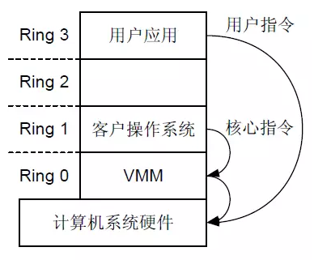

   2. 半虚拟化

      1. 需要修改 Guest OS

      2. Guest OS执行的特权指令，以HyperCall的形式与VMM通信，并在其管理下执行特权指令

      3. 图示

         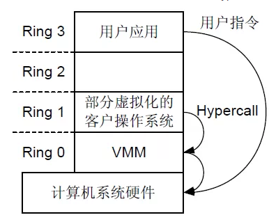

   3. 硬件辅助虚拟化

      1. 需要记住例子 Intel VT-x
      2. VMX有两种状态
         1. VMX root operation
         2. VMX non-root operation

5. 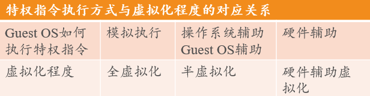

#### 内存虚拟化

1. 目的：使虚拟机看到的内存是**从0开始**的连续的物理地址
2. 涉及到三种地址
   1. 机器地址
   2. 虚拟机物理地址：由Hypervisor抽象后虚拟机看到的伪物理地址
   3. 虚拟地址：Guest OS为应用程序提供的线性地址空间
3. 两种映射关系
   1. （映射f）虚拟地址 -> 虚拟机物理地址，由Guest OS维护
   2. （映射g）虚拟机物理地址 -> 机器地址，由Hypervisor维护
4. 存在的问题：CPU的内存管理单元MMU只能完成1次地址映射
   1. 解决办法：由VMM根据f和g生成复合映射h = f.g，直接写入MMU。实现方法包括
      1. MMU半虚拟化
      2. 影子页表

#### IO虚拟化

1. 含义：通过截获Guest OS对I/O设备的访问请求，用软件模拟真实的IO硬件，**复用外设资源**
2. 方法：
   1. 全虚拟化
      1. 含义：VMM模拟外设，形成一组统一的虚拟I/O设备，Guest OS对虚拟I/O设备的操作都陷入到VMM中，由VMM处理
      2. 性能好，对Guest OS完全透明，但VMM是设计很复杂
   2. 半虚拟化，又叫前端/后端模拟
      1. 含义：在Guest OS中为虚拟I/O设备安装特殊驱动（Front-end Driver），VMM中提供简化驱动（Back-end Driver），前后端驱动协作
      2. 简化了VMM的设计，但Guest OS中要安装驱动程序
   3. 直接分配（硬件辅助）
      1. 含义：将物理I/O设备分配给指定的虚拟机，Guest OS可不经过VMM直接访问设备
      2. 例如 intel vt-d

### 存储虚拟化

### 网络虚拟化

------

## OpenStack

### 概念

1. 搭建IaaS的开源软件平台（亚马逊公司）
2. 三个核心组件：
   - Swift：
     - 对象存储，为 Nova 提供虚机镜像存储服务，
     - 构建在便宜的硬件存储基础设施上，**无需**采用RAID
   - Glance（OpenStack Image Service）：提供发现，注册，和下载镜像的服务
   - （最核心组件）Nova：管理虚拟机实例（类似于云服务器）
3. 其他主要组件：
   - Horizon：Web控制面板
   - Keystone：为所有的OpenStack组件提供认证和访问策略服务
   - Cinder：提供数据块存储服务（卷管理）

## PaaS

1. 定义：在云计算基础设施上为用户提供应用软件部署和运行环境的服务。

### PaaS的特征

1. 自动伸缩（Automatic Scale）
2. 方便维护管理：用户无需关心平台的可靠性、性能和安全，平台运行由提供商统一维护监控
3. 按需计费
4. 方便应用部署
5. 平台绑定（属于缺点）：用户程序的开发和执行依赖平台提供的编程接口，换了平台就无法使用

### PaaS的组成部分

- 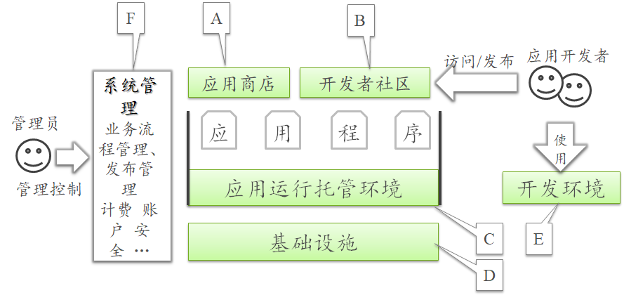
- 五大组成部分：
  - 基础设施：可以以IaaS作为基础设施
  - 应用运行托管环境：
    - 托管环境的核心：***应用隔离***
    - 支持技术：**沙箱技术**（SandBox）
  - 开发者社区
  - 应用商店
  - 开发环境：PaaS一般**默认**用户的接入终端方式是**Web**

### PaaS与IaaS的比较

- 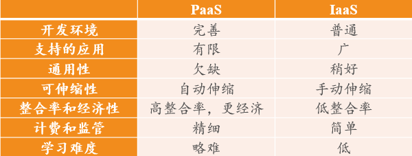

### PaaS解决的架构问题

- 问题：多个应用共享底层基础设施资源的效率问题
- 技术：
  - 沙箱技术（应用隔离）：多个应用同时运行在一台服务器上
  - 虚拟机技术：不同应用运行在不同虚拟机上
- 适用范围
  - 沙箱：适合大中小多种粒度的应用
  - 虚拟机：适合比较大的应用

### PaaS设计思想

- 以Google APP Engine为例：

  1. 应用运行时的扩展：应用状态与物理服务器分离

     GAE的设计：不支持对应用所在服务器写入文件、创建Thread和Socket操作

  2. 应用隔离：多个开发者应用在同一台服务器上运行时的隔离问题（包括安全性和性能）

     沙箱技术（不同语言有不同的沙箱技术）

     如：Java沙箱

  3. 多应用海量数据持久化存储的性能和扩展性问题

     BigTable （NoSQL数据库）

     DataStore（分布式文件系统）

### PaaS关键技术

#### 沙箱技术

- 沙箱技术类型：

  1. **平台重构**（隔离非法访问）

     **Java环境下的应用隔离：SecurityManager**

  2. 修改操作系统（改善性能隔离）

     例如OpenVZ

  3. 指令嗅探和截获（隔离非法访问）

     典型实现方法：硬件仿真器

  4. 伪造环境（隔离数据）

     实例：Sandboxie、360浏览器

#### 请求调度技术

1. 目的：提高应用的性能
2. 表现：将应用（无状态的）复制到更多服务器，将接入的用户分散到不同服务器
3. 实例：使用Apache 反向代理 + 2个apache web服务器
4. 请求调度技术分类
   1. 基于DNS调度（常见）：1个域名 -> 多个IP（例如某站点x.a.b有两个IP：移动的ip和联通的ip，那么，移动的用户请求x.a.b站点时，就会将移动的IP返回）
   2. 基于虚拟IP调度：1个IP -> 多台服务器
   3. 基于应用的调度：在应用中嵌入请求调度功能

#### 分布式缓存

1. 应用场景：
   - 耗时的DB查询
   - 文件读取操作
2. 实例：
   - memcached：数据库的缓存，是高性能的**分布式*内存*对象**缓存系统
   - web缓存：静态文件
     - 常用Squid，专门的cache服务器，而且可以做集群
     - Apache和nginx都是web服务器，都可以做反向代理，同时nginx可以做cache

### 分布式计算的CAP原则

1. C，Consistency，一致性
   - 强一致性，如银行账户
   - 弱一致性，如DNS
2. A，Availability，可用性
3. P，Partition-Tolerance，分区容错性
   - Partition：构成的分布式系统的多节点需要通信，通信断开称为Partition
   - 系统中部分节点不可用，而系统仍能为用户提供服务称为容错性
4. CAP三种之中只能满足2种
   1. 一般来说，分区容错无法避免，因此可以认为 CAP 的 P 总是成立
   2. **云系统由大量节点构成，节点失效是常态，要优先保证P**

## Docker

### Docker容器和虚拟机的区别

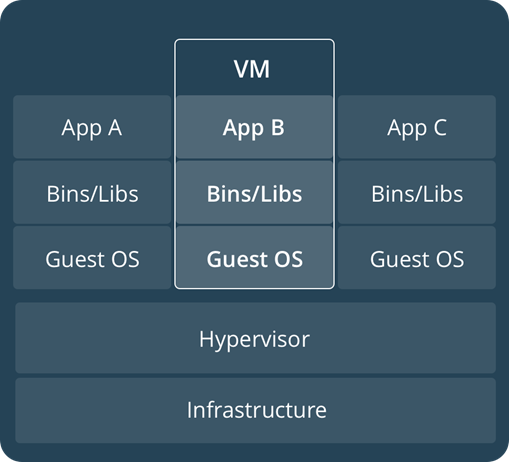 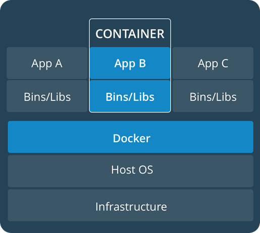

1. 所使用的操作系统不同

   虚拟机需要Guest OS，启动时需要重新加载操作系统内核；

   而Docker引擎中的应用共享宿主操作系统，启动时无需重新加载操作系统内核

2. 使用硬件资源的方式不同

3. 速度和资源利用率不同

   Docker启动速度比传统的虚拟机快得多（Docker秒级，虚拟机是分钟级）。

   Docker在系统资源利用率上更有优势。Docker容器占用硬盘在MB级，虚拟机（多一个Guest OS）在GB级。

   系统单机可启动上千个Docker容器，而虚拟机一般只有几十个

4. 隔离能力

   Docker只能隔离应用，不能隔离操作系统

   虚拟机可**彻底**隔离整个运行环境 ，包括操作系统

5. 从而Docker和虚拟机二者有不同的使用场景

   例如，云服务提供商通常采用虚拟机技术隔离不同的用户

   而Docker通常用于隔离不同的应用，例如前端、后端以及数据库

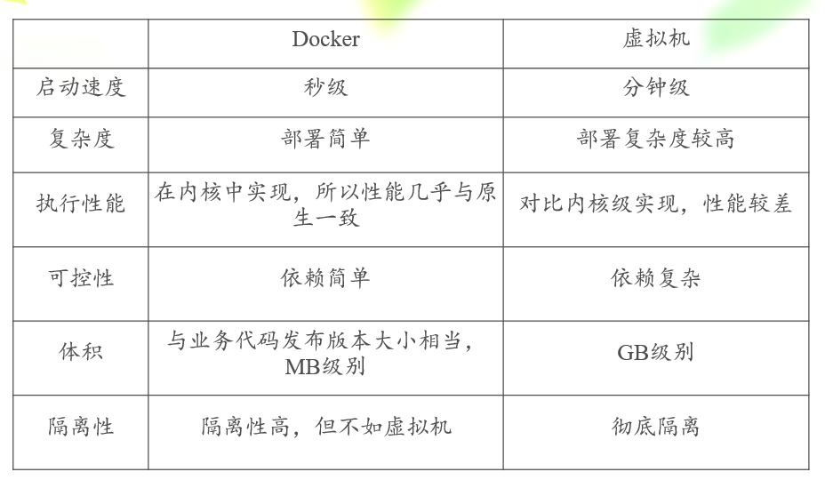

### Docker三大组件

1. 镜像（Image），Docker引擎利用镜像创建Docker容器
2. 容器（Container），Docker引擎利用容器运行、隔离各个应用
3. 仓库（Repository），Docker引擎利用仓库集中存放镜像文件

### Docker两大核心技术

1. Linux Container（LXC）：是一种内核虚拟化技术，可以提供轻量级的虚拟化，以便隔离进程和资源

   - 命名空间（Namespaces）  -- IBM贡献

     每个容器都有自己单独的命名空间

   - 控制组（Control groups） -- Google贡献

     可对容器使用的CPU、内存和网络等资源进行管理控制

2. AUFS文件系统（Advance union file systems）

编写语言：Docker用Go语言编写

### Docker使用场景

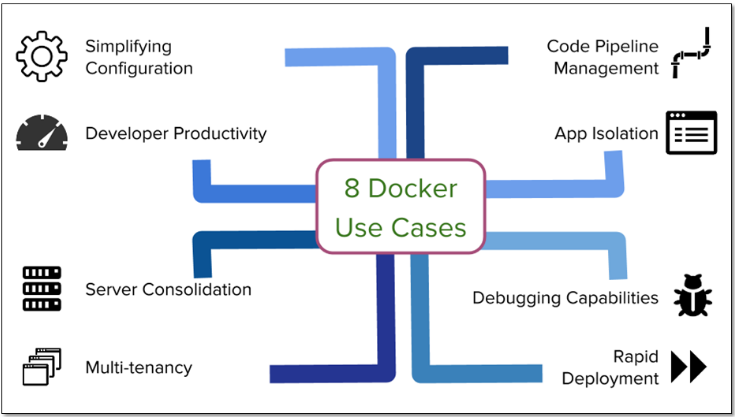

