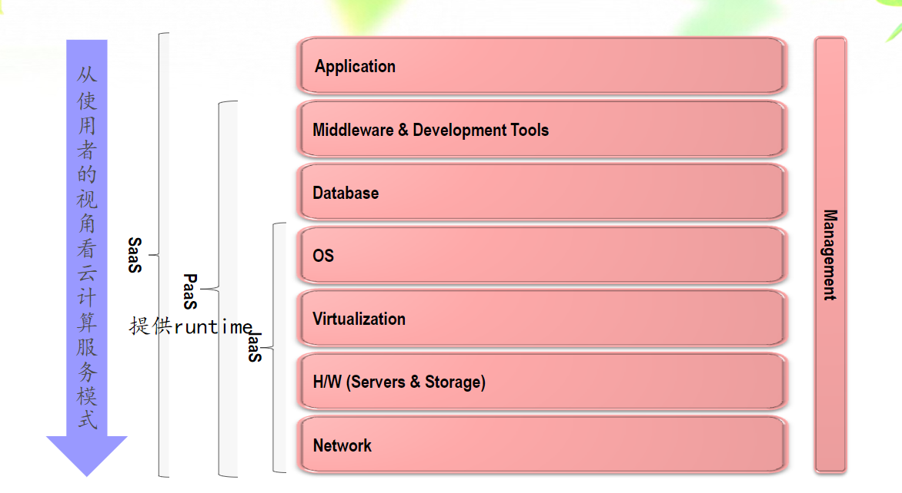

[TOC]

# 云计算技术

## 概述

### 基础概念

#### pv

- page view：衡量网站负载

#### scale up

- 垂直扩展

#### scale out

- 水平扩展

#### CDM 云交付模型

- Cloud Delivery Model
- 三种基本交付模型：IaaS、PaaS、SaaS

#### Gartner Hype Cycle

### 5个基本特征

- 按需自助服务，on-demand
- 资源池化，a shared pool
- 快速伸缩
- 按使用量收费的服务
- 广泛的网络访问，ubiquitous

### 3种服务模型

- SaaS，软件即服务，以云服务的形式提供软件程序的功能
- PaaS，平台即服务，提供应用程序的开发运行环境
- IaaS，基础设施即服务，按需提供的虚拟化资源（计算、存储和通信），裸机

### 4种部署模型

- 公有云
- 私有云
- 社区云
- 混合云

------

## 云计算的架构

### 系统软件

- 一般来讲，系统软件包括**操作系统**和一系列基本的工具（比如编译器，数据库管理，存储器格式化，文件系统管理，用户身份验证，驱动管理，网络连接等方面的工具）
- 一般认为，数据库管理系统（DBMS）属于系统软件，（并且DBS = DB + DBMS + DBA）

### 网络管理的基本功能：FCAPS

1. Fault，故障管理
2. Configuration，配置管理
3. Account，账户管理
4. Performance，性能管理
5. Security，安全管理

### 云计算的3种交付模式

#### SaaS

- 软件交付的模式
- 多租赁，Multitenant，通常是通过浏览器将程序传给成千上万的用户

#### PaaS

- 平台交付的模式
- 把开发、部署环境作为服务来提供

#### IaaS

- computer交付的模式
- 硬件及服务
- 效用计算（Utility computing）：提供客户需要的计算资源和基础设施管理，并根据应用**所占用的资源情况**进行计费，而不是仅仅按照速率进行收费
- 将最基本的**计算资源**、**存贮资源**、**网络资源**，用虚拟化的方法以**租用**方式提供给客户

### 云计算服务的构建架构

- 

### 云计算服务模式的七层映射

### IaaS架构

1. 定义：将IT基础设施（计算、存储等能力）通过网络提供给用户使用，并能够按照用户占用的资源进行计费的一种服务
2. IaaS的两种不同作用：
   1. 使一个资源通过虚拟化看似多个资源
   2. 是多个资源通过虚拟化看似一个资源
3. 例子：OpenStack

#### 虚拟化

##### hypervisor

- hypervisor，即虚拟机管理器，又叫VM Manager

##### 虚拟化的四个特征

- 分区、隔离、封装、硬件独立

### PaaS架构

1. 例子：Cloud Foundry、Hadoop

### SaaS架构

1. 多租户功能主要由接入调度器实现
2. SLA概念：service level agreement，服务水平协议

------

## IaaS

### 两种虚拟化架构

1. 寄居架构（hosted），多了一个宿主操作系统
2. 裸金属架构/原生架构（Native/bare-metal），一般性能比hosted好
   1. **Bare-metal架构的VMM中往往包含一个经过修改的Host OS**
3. 

### 三种虚拟化关键技术

#### CPU虚拟化

1. 定义：将单个物理CPU虚拟成多个VCPU供虚拟机使用。虚拟CPU**分时复用**物理CPU

2. CPU两种工作状态：

   1. 内核态（kernel mode）
   2. 用户态（user mode），只能运行非特权指令，而用户程序要陷入内核态的话，需要系统调用（System call）

3. 包含三种CPU虚拟化技术：

   1. Hypervisor模拟执行Guest OS的0级指令
   2. 操作系统辅助（Guest OS）
   3. 硬件辅助

4. 包含三种虚拟化程度

   1. 全虚拟化

      1. 模拟执行流程：

         

      2. 模拟执行的两种方法：

         1. 解释执行，执行开销大

            

         2. 二进制翻译，初始开销大

            

      3. 全虚拟化涉及到的技术

         1. 优先级压缩（ring compression）
         2. 二进制代码翻译（binary translation）

      4. 全虚拟化图示（陷入-模拟机制）

         

   2. 半虚拟化

      1. 需要修改 Guest OS

      2. Guest OS执行的特权指令，以HyperCall的形式与VMM通信，并在其管理下执行特权指令

      3. 图示

         

   3. 硬件辅助虚拟化

      1. 需要记住例子 Intel VT-x
      2. VMX有两种状态
         1. VMX root operation
         2. VMX non-root operation

5. 

#### 内存虚拟化

1. 目的：使虚拟机看到的内存是**从0开始**的连续的物理地址
2. 涉及到三种地址
   1. 机器地址
   2. 虚拟机物理地址：由Hypervisor抽象后虚拟机看到的伪物理地址
   3. 虚拟地址：Guest OS为应用程序提供的线性地址空间
3. 两种映射关系
   1. （映射f）虚拟地址 -> 虚拟机物理地址，由Guest OS维护
   2. （映射g）虚拟机物理地址 -> 机器地址，由Hypervisor维护
4. 存在的问题：CPU的内存管理单元MMU只能完成1次地址映射
   1. 解决办法：由VMM根据f和g生成复合映射h = f.g，直接写入MMU。实现方法包括
      1. MMU半虚拟化
      2. 影子页表

#### IO虚拟化

1. 含义：通过截获Guest OS对I/O设备的访问请求，用软件模拟真实的IO硬件，**复用外设资源**
2. 方法：
   1. 全虚拟化
      1. 含义：VMM模拟外设，形成一组统一的虚拟I/O设备，Guest OS对虚拟I/O设备的操作都陷入到VMM中，由VMM处理
      2. 性能好，对Guest OS完全透明，但VMM是设计很复杂
   2. 半虚拟化，又叫前端/后端模拟
      1. 含义：在Guest OS中为虚拟I/O设备安装特殊驱动（Front-end Driver），VMM中提供简化驱动（Back-end Driver），前后端驱动协作
      2. 简化了VMM的设计，但Guest OS中要安装驱动程序
   3. 直接分配（硬件辅助）
      1. 含义：将物理I/O设备分配给指定的虚拟机，Guest OS可不经过VMM直接访问设备
      2. 例如 intel vt-d

### 存储虚拟化

### 网络虚拟化

