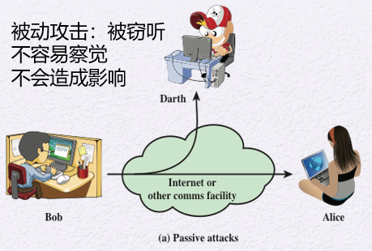
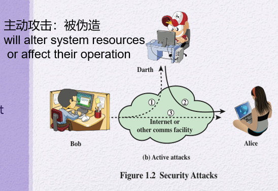
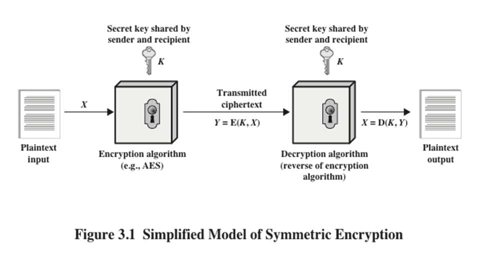
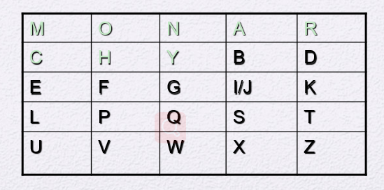
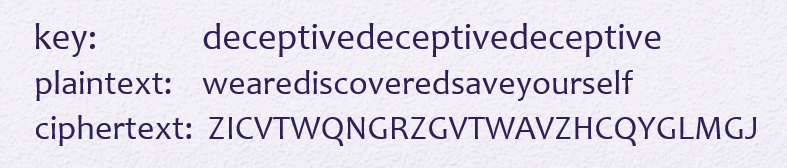
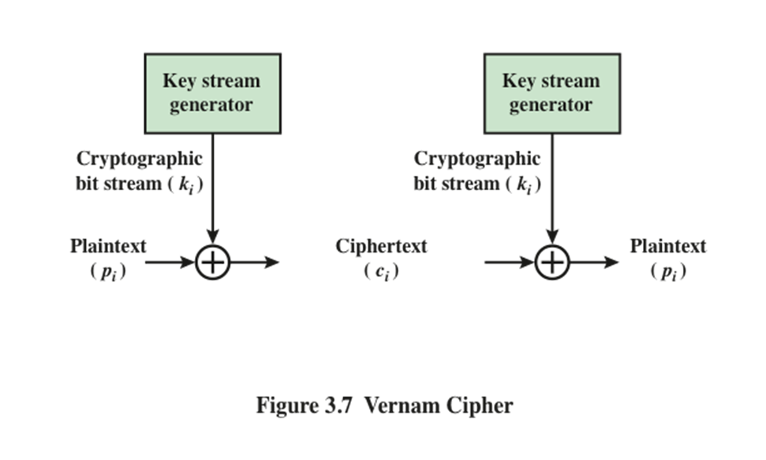
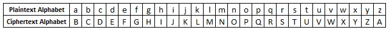
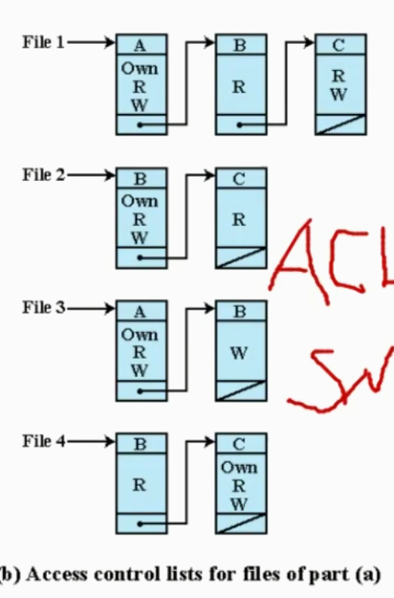

[TOC]

# 网络安全

## 0、概述

- symmetric encryption：对称加密

- asymmetric encryption：非对称加密

- data integrity algorithm：保证信息不被修改

- authentication protocol：验证实体（entity）的身份

- CIA，分别指
  - confidentiality：机密性，未授权的用户不可见
    - data confidentiality，数据机密性，针对被动攻击，针对通讯流分析
    - privacy
  - integrity：完整性，不被修改
    - data integrity
    - system integrity
  - availability：可用性，有效性
  
- security attack，分为

  - passive attack，包括两种类型的攻击：

    - The release of message content
  - Traffic analysis，通讯流分析
  
  
  
  - active attack，会对data stream造成更改，包括一下几种类型：
  
    - masquerade，伪造
    - replay，重放攻击，例如银行取钱时重复提交，与之相关的是nonrepudiation，不可抵赖性，不可否认性
    - modification of messages
    - denial of service，拒绝服务，例如短时间大量访问使得服务器垮掉
    
    

1. authentication，认证，数据来源是真实的，通讯双方是真实的，X.800中定义了两种认证服务
   1. peer entity authentication
   2. data origin authentication
2. access control，访问控制
3. availability service，针对的是拒绝服务攻击
4. 安全设计原则，
   1. open design，开放原则
   2. separation of privilege，职权分离
   3. least privilege，最小特权原则
5. attack surfaces，攻击面，其种类可分为
   1. network attack surface
   2. software attack surface
   3. human attack surface
6. attack tree，攻击树

## 1、经典加密技术

### 名次解释

#### 明文 Plaintext

#### 密文 Ciphertext

#### 加密 Encription

#### 解密 Decription

#### 密码编码学 Cryptography

- 如何编码加密

#### 密码分析学 Cryptanalysis

- 在不知道密钥时，如何去破解密码

#### 密码学 Cryptology

- 一般说密码学都指密码编码学，但密码学包括密码编码学和密码分析学

### 对称加密的经典模型

1. 图示：

   

2. 关于安全的两个需求

   1. 需要一个强有力的加密算法
   2. 发送方和接收方如何安全的获得和保存密钥

### 明文->密文的两种操作类型

#### 代换 Substitution

1. 典型例子
   1. 凯撒密码
   
   2. 单表密码 Monoalphabetic Cipher
   
   3. Playfair Cipher
   
      
   
   4. Hill Cipher
   
   5. 多表密码 Polyalphabetic Ciphers，例如
   
      1. Vigenère Cipher
   
         
   
   6. Vernam Cipher
   
      
   
   7. 一次一密 One-Time Pad
   
      1. 方法：对Vernam Cipher的改进，每次加密使用一个随机的密钥
   
      2. 一次一密是绝对安全的（现<2020年>唯一绝对安全的密码系统）
   
      3. 一次一密的难题：
   
         1. 如何产生巨量的随机数密钥
   
         2. Mammoth key distribution problem：
   
            对于每个要发送的信息，接收方和发送方都需要一个等长的密钥
   
      4. 主要应用于低带宽且需要高安全的场景

##### 凯撒密码 Caesar Cipher

1. 方法：用英文字母的后三个来替换，例如 a -> d；即 f(m) = (m + 3) mod 26
2. 实际上，密钥是映射关系

##### 单表密码 Monoalphabetic Cipher

1. 方法：简单将一个字母映射为另一个字母，这样我们就有 26! 种映射方法

2. 简单例子：

   

#### 置换 Transposition

### 按明文被处理的方式分

#### 分组密码

1. 英文：block cipher

#### 流密码

1. 英文：stream cipher
2. 方式：逐bit，或逐byte加密

### 加密方案的安全性分类

#### 绝对安全 Unconditionally secure

#### 计算安全 Computationally secure

1. 包含两种情况
   1. 破解所需要的花费远超过破解所获得信息的价值
   2. 利用现有的计算资源无法在有效的时间内破解

### 暴力攻击 Brute-Force Attack

1. 平均而言，必须尝试所有可能的密钥的一半才能成功

## 2、分组密码 & DES

1. DES: Data Encryption Standard

网络安全与网络管理

- NIST：美国国家标准技术研究院，National     Institute of Standards and Technology

- DES、AES、加密算法

- Access Control 访问控制           主体对客体的访问有哪些权限

- - DAC 自主访问控制
  - MAC 强制访问控制
  - RBAC 基于角色的访问控制
  - ABAC 基于属性的访问控制

- ACL 访问控制列表，Access     Control Lists

- 

- 恶意软件     malicious software

- - 高级持续威胁 APTs      Advanced Persistent Threats

- 入侵检测 IDS

- - 入侵检测的类型

  - - 异常检测

    - - 存在 误报

    - 特征检测 / 启发式的检测 / 基于规则的检测

    - - 提取特征码，匹配上，则是恶意攻击，没匹配上，可能也会是恶意代码，存在 漏报

    - 异常检测和特征检测互为补充

  - 基于主机的入侵检测 HIDS

  - 基于网络的入侵检测 NIDS （主流）

  - 基于行为的入侵检测 （新话题）

  - payload      载荷

  - 蜜罐 蜜网

- 防火墙

- 缓冲区溢出攻击

- - 攻击方法的主流之一
  - 不好解决
  - 冯洛伊曼体系结构的计算机存在这个问题

- Privacy Enhancing     Technology 匿名通讯， PET 技术， 隐私计算

- - P2P 技术， 实体对等， 没有服务器
  - 边缘计算， 利用终端的计算能力
  - C/S 架构， 单失效点的问题
  - Napster
  - DHT， 分布式的哈希表
  - Overlay networks
  - 复杂网络
  - IP 追踪
  - Mix-NET

 

 

