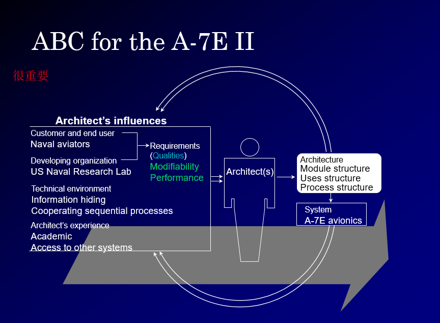
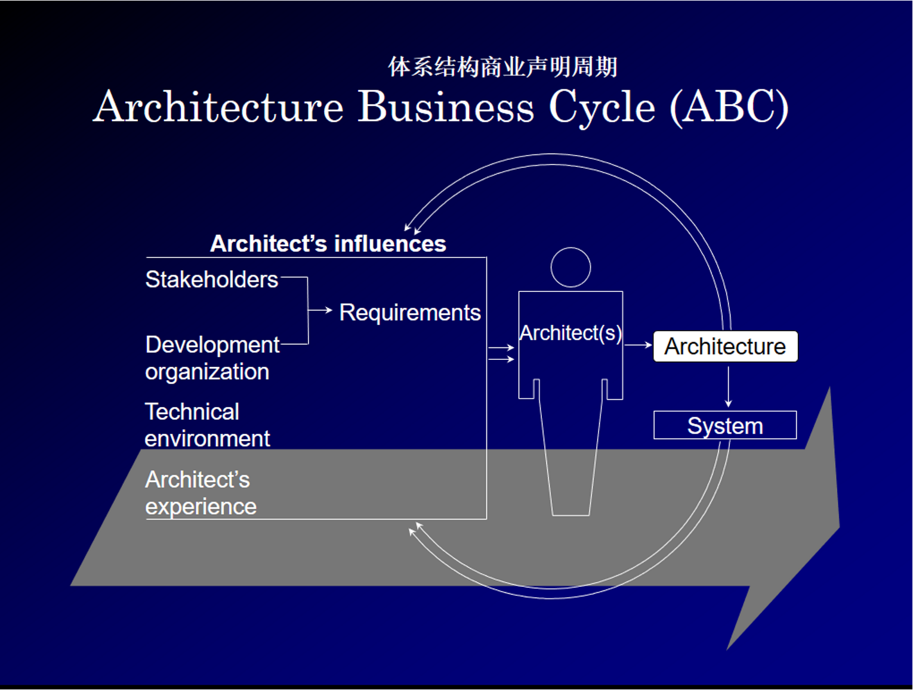

# 软件体系结构

## 概述

1. software product line的定义
2. 体系结构会影响到组织的**业务**和**技术**两个层面
3. 体系结构的影响因素
   1. 系统的干系人
   2. 技术因素和组织因素
   3. 架构师的背景知识
4. Stakeholders，包括
   1. Customers，为系统开发买单的
      1. 客户关心的方面
         1. 系统的成本
         2. 系统的可用性和使用寿命
         3. 与其他系统的互操作性
         4. 上市的时间
         5. 平台可移植性
   2. 最终用户（End Users，使用系统的）
      1. 包含三类人
         1. “regular” users
         2. system administrators
         3. members of the development organization（二次开发人员）
      2. 最终用户关心的方面
         1. 易于使用
         2. 功能可用
   3. 开发组织
      1. 开发组织关心的方面
         1. 直接的商业问题
            1. 分摊基础设施的费用
            2. 降低安装成本
            3. 可使用的人力资源
         2. 长期的商业问题
            1. 投资基础设施以实现战略目标
            2. 人力资源的投资
         3. Organizational structure issues，(开发小组配备结构)
   4. marketers（市场销售人员）
   5. Maintenance organization（维护组织）
5. ABC: Architecture Business Cycle 

### 什么叫软件体系结构

1. 定义：软件体系结构包含**软件部件**、**外在特征**（the externally visible properties of those components）、以及部件之间的（信息交流）**关系**（Relationships）
   - 体系结构是**多个**系统的抽象
     - 体系结构定义了部件和部件之间的交互关系
     - 体系结构要隐藏局部和太细节的信息
   - 系统包含多种软件结构
     - 肯定不止一种结构
   - 外在特征包含：
     - provided services (functionality)
     - required services
     - performance characteristics
     - fault handling
     - shared resource usage 
   - relationships包含：
     - runtime：运行时，动态发生的信息交流关系
       - send data to
       - invoke
     - non-runtime：非运行时存在的（信息交流）关系
       - is a submodule of
       - encapsulates
       - inherits from

### 软件体系结构对项目开发带来什么价值

- 从技术层面看
  - 提供共利方交流的平台
    - 与用户协商需求
    - 让客户了解进展和成本
    - 执行管理决策和分配
  - 是早期设计决策的依据
    - 实现必须符合体系结构
    - (全局)资源分配决策约束各个组件的实现
    - 系统权衡（trade-offs）是在体系结构的范畴
  - 是系统移交、复用的**抽象**
    - a one-to-many mapping，一个体系结构可以对应出多个系统

### 软件体系结构的组成

- Module structure
- Process structure
- Uses structure
- Calls structure
- Data flow structure
- Class structure
- Physical structure

### 体系结构举例

- 

## 体系结构商业周期 ABC

## 编写体系结构文档

1. 涉众分析：那些人要读懂你的文档
2. 数据流图不写
3. 体系结构设置如何满足质量需求
   1. 体系结构需求：设计体系结构需要满足哪些需求（质量要求）
   2. 那些是性能关键的
4. 约束条件：需要什么系统运行
5. ABC 体系结构商业周期
6. 体系结构如何支持产品线生产， 根据体系结构怎么开发， 如何组织开发队伍
7. 有什么公用的模块
8. 分层的目的：解决可修改性