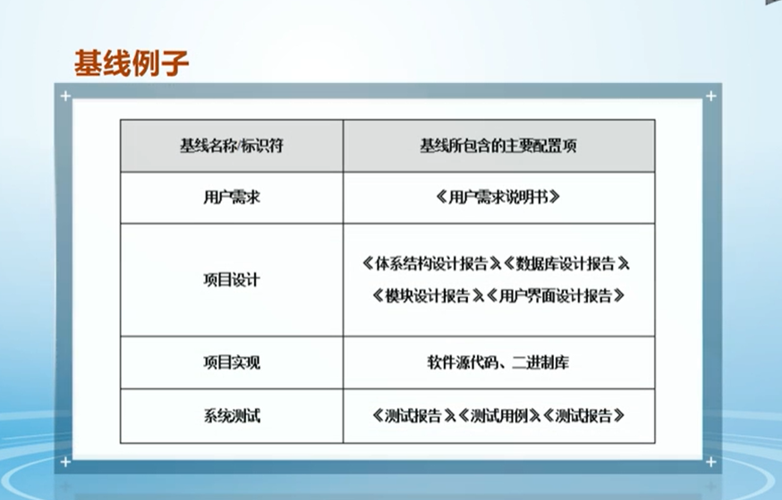

[TOC]

# 软件项目管理

## 1、软件项目管理基本概念

1. 软件项目好的结果依赖于好的过程，而不是个人

### 项目

- 唯一性（一次性）
- 临时性
- 具有重复性的一般不是项目

### PMBOK

- Project Management Body of Knowledge（PMI出版，美国项目管理协会）
- 项目管理知识体系指南
- 五个过程组
  - 启动过程组、规划过程组、执行过程组、监控过程组、结束过程组
  - 
- 十个知识域
  - 范围管理、进度管理、成本管理、质量管理、资源管理、沟通管理、风险管理、采购管理、干系人管理、集成管理
  - 
- **49**个过程（2017版）

### 敏捷项目管理

#### 敏捷宣言

1. 不应该过分依赖和强调过程（个体和互动高于流程和工具）
2. 尽早提交可运行的版本（可工作的软件高于详尽的文档）
3. 合作很重要（客户合作高于合同谈判）
4. 顺应变更，不要墨守成规（响应变化高于遵循计划）

#### 12个敏捷原则

1. 我们最先要做的是通过**尽早地、持续地交付**有价值的软件来使客户满意。
2. 即使到了开发的后期，也**欢迎改变需求**。敏捷过程利用适应变化来为客户创造竞争优势。
3. **经常性地交付**可以工作的软件，交付的间隔可以从几个星期到几个月，交付的时间间隔越短越好。
4. 在整个项目开发期间，**业务人员和开发人员**可以的话尽可能在**一起工作**。
5. 围绕被激励起来的个体组成团队来构建项目。给他们提供所需的环境与支持，并且信任他们能够完成工作。
6. 在团队内部以及团队之间，最有效果并且最有效率的传递信息的方式，就是面对面的交流。
7. 可以工作的软件是首要的进度度量标准。
8. 敏捷过程提倡平稳的开发。发起人、开发者和用户应该能够保持一个长期的、恒定的开发速度。
9. 不断地关注优秀的技能和好的设计会增强敏捷的能力。
10. 简单--使未完成的工作最大化的艺术一-是根本的。
11. 最好的架构、需求和设计出自于自组织的团队。
12. 每隔一定的时间，团队会在如何能更有效地工作方面进行反省，然后相应地调整自己的行为。

#### 敏捷项目领导的3个核心价值观

1. 价值胜过约束
2. 团队胜过任务
3. 适应胜过遵循

#### 核心三角

------

## 2、软件项目确立

### 项目立项	

- 对一个项目**目标**、**时间**、**成本**等要素的认可
- make or buy 决策
  - make：自主研发
  - buy：采购或者外包开发

### 项目招投标流程

1. 甲方招标书定义

2. 乙方项目分析

3. 招标与竞标

   招标方式

   - 公开招标
   - 有限招标
   - 多方洽谈
   - 直接谈判

4. 合同签署

### 项目章程 Project Charter

- 又叫授权书
- 确认项目存在的**文件**，包括**对项目的确认**、**对项目经理的授权**和项目目标的概述等。

#### 敏捷项目章程

- 项目目标
- 完成标准
- 预期的工作流

#### PMI人才三角

1. **技术项目管理**是履行的技术方面能力。
2. **领导力**可帮助组织达成业务目标。
3. **战略和商务管理**有助于提高绩效并取得更好的业务成果。

-------

## 3、生存期模型

### 4大模型

#### 预测型

1. 变化最低。提交频率最低，只提交一次
2. 是没有更改的
3. 目标上，为了管理成本

##### 瀑布模型

1. 项目特征：需求很明确，方案很明确，如短期项目
2. 

##### V-模型

1. 是瀑布模型的变种，强调测试与开发是相互伴随的
2. 项目特征：需求很明确，方案很明确，对系统性能、安全等有严格要求
3. 

#### 迭代型

1. 又叫`原型模型`，通过连续的原型和概念验证来改进产品或结果，每一个新的原型都能带来新的**反馈**和团队见解
2. 选代模型应对产品内部因素的不确定
3. 变化最高，只提交一次
4. 优点是，可以应对需求的变化
5. 目标上，为了获得正确的解决方案
6. 项目特征：需求不明确，项目复杂性高，项目变更频繁
7. 

#### 增量型

1. 提交频率最高，频繁提交小版本
2. 目标是，为了加快速度
3. 分增量开发，每个增量都包括分析，设计，实施，测试，提交等过程，每个增量是一个交付成果
4. 增量模型应对产品外部因素的不确定
5. 优点：可以避免一次性投入太大带来的风险。
6. 

#### 敏捷型

1. 定义：既有迭代，也有增量，便于完善工作，频繁交付。
2. 频繁提交小版本
3. 目标，**频繁交付与反馈**，为了获得用户的肯定

##### Scrum模型

1. 目前2020年使用最多：66%以上
2. 

##### 迭代式开发

1. 

##### XP极限编程模型

1. eXtreme Programming，由**13个**最佳实践组成
2. 

##### 精益（Lean）模型

1. 精益（Lean）模式提倡持续不断地改进，减少流程中的浪费。

##### 持续交付（CI/CD）

1. 包括持续集成、持续部署、持续交付

##### 看板

##### DevOps方法论

1. 全程敏捷思维、开发和运维工作紧密结合

------

## 4、软件需求管理

### 需求管理过程

1. 包含两个部分，共5个过程
   1. 需求确认：最终结果是需求规格完成
      1. 包括需求获取、需求分析、需求规格编写、需求验证
   2. 需求变更
      1. 包括需求变更

### 传统需求建模方法

#### 原型方法

1. 通过不断评价原型来确认需求的方法
2. 

#### 基于数据流建模

1. 是结构化分析方法

##### 主要技术

###### 数据流图（DFD）

1. 
2. 

###### 数据字典（DD）

###### 系统流程图

#### 基于UML建模

##### 用例视图（Use case Diagram）

##### 顺序视图（Sequence Diagram）

##### 状态视图（State Diagram）

##### 活动视图（Activity Diagram）

### 敏捷需求分析方法

1. 敏捷方法认为软件项目需求是 渐进明晰 的，以 User Story 的方式描述需求
2. product backlog：产品待办事项列表
3. Sprint Backlog：待办事项列表的细化
4. User Story 句式：**As a** 'type of user', **I want** 'some goal' **so that** 'some reason'
5. INVEST：一个好的story的6个特征：Independent（独立行）、Negotiable（清楚描述）、Valuable（业务价值）、Estimatable、Small（小到可估算）、Testable（可测试）
6. story cards，story wall
7. story 需要按优先级排序，例如 MoSCoW：Must have, should have, could have, want to have.

## 5、软件项目任务分解

### WBS

1. work breakdown structure：任务分解结构

2. 任务分解的结果是 WBS，WBS是对项目从粗到细的分解过程，WBS真正定义了项目的范围

3. WBS的最低层次（叶子节点）的可交付成果是工作包（work package），工作包应当由唯一主体负责

4. WBS举例：

   

   

   

### 任务分解方法

#### 类比

#### 模版参照

#### 自上而下

1. 最常用，最重要

2. 

3. 任务分解建议：

   

#### 自下而上

### 敏捷任务分解方法

#### Epics

1. 定义：由较大的，不确定的需求组成，不能通过其直接完成迭代开发
2. 

#### Epics break down

#### Acceptance Criteria

1. 用户测试story的依据
2. 

## 6、软件项目成本计划

### 代码行估算方法

1. 软件项目规模定义：即工作量，例如：软件规划、软件管理、需求分析、系统设计、编码、测试，以及后期维护等任务。
2. 软件项目规模度量：
   1. LOC（Loc of Code）：源代码长度的测量
   2. FP（Function Point）：用系统的功能数量来测量
   3. 人月
   4. 人天
   5. 人年

### 功能点估算方法

1. 阿尔布雷克特（Albrecht）提出，适合**信息系统**(有明确的输入输出)

2. 相关与无关

   1. 与实现的语言和技术没有关系（LOC与语言有关）
   2. 用系统的功能数量来测量其规模
   3. 通过评估、加权、量化得出功能点

3. FP = UFC * TCF（技术复杂度因子）

   1. UFC：未调整功能点计数，从五个角度计算得出：

      1. 外部输入（EI），如用户登录表单
      2. 外部输出（EO），有逻辑处理过程
      3. 外部查询（EQ），外部查询是一个输入引出一个即时的简单输出，没有逻辑处理过程。
      4. 外部接口文件（EIF's），
         1. 权重较高
      5. 内部逻辑文件（ILF's），例如数据库中的一个表
         1. 具有最高的权重

   2. TCF：

      

      

4. 其他功能点估算方法

   1. Mark Ⅱ 功能点（主要应用在英国，对Albrecht功能点的修改，适用信息系统）
   2. COSMIC-FFP功能点（适用实时系统或者嵌入式系统）

### 用例点估算方法

1. 基本步骤
   1. 计算未调整的角色权值UAW
   2. 计算未调整的用例权值UUCW
   3. 计算未调整的用例点UUCP，UUCP = UAW + UUCW
   4. 计算技术和环境因子TEF
      1. 技术因子TCF
      2. 环境因子ECF
   5. 计算调整后的用例点UCP，UCP = UUCP * TCF * ECF
   6. 计算工作量（man-hours），如果：PF（生产率）= 20工时/用例点，则：Effort = UCP × PF =88×20=1760h=220人天

### 类比（自顶向下）估算法

1. 类比估算法使用情况：
   1. 信息不足（例如市场招标）的时候
   2. 要求不是非常精确估算的时候
   3. 有类似的历史项目数据

### 自下而上估算法

1. 前提：WBS 完成
2. 含义：利用任务分解图（WBS），对各个具体工作包进行详细的成本估算，然后将结果累加起来得出项目总成本。
3. 特点：
   1. 相对比较准确，它的准确度来源于每个任务的估算情况
   2. 花费时间

### 三点估算法

1. 含义：基于任务成本的三种估算值来计算预期成本的方法。
2. 三种估算值：
   1. 最可能成本（CM）：比较现实的估算成本。
   2. 最乐观成本（CO）：最好情况所得到的估算成本。
   3. 最悲观成本（CP）：最差情况所得到的估算成本。
3. 三点估算结果（CE：与其成本）
   1. 三角分布：CE =（CO + CM + CP）/ 3
   2. 贝塔分布：CE =（CO + 4 CM + CP）/ 6

### 参数估算法

1. 又叫模型估算

2. 

3. Walston-Felix模型

4. COCOMO模型

   1. Constructive Cost model，结构化成本模型，应用最广泛，由Barry Boehm团队开发

   2. COCOMO 81模型

      1. 三个模型级别

         1. 基本COCOMO

            静态单变量模型，用于初始阶段

         2. 中等COCOMO

            在基本模型基础上，需求确定后使用

         3. 高级COCOMO

            在中等模型基础上，在设计完成后使用

      2. 三个项目类型

         1. 有机：Organic

            最常规，简单的项目

            各类应用程序，例如数据处理、科学计算等

            受硬件的约束比较小，程序的规模不是很大

         2. 嵌入式：Embedded

            系统程序，例如实时处理、控制程序等

            紧密联系的硬件、软件和操作的限制条件下运行，软件规模任意

         3. 半嵌入（半嵌入型）：Semidetached

            各类实用程序，介于上述两种软件之间，例如编译器（程序）

            规模和复杂度都属于中等或者更高

   3. COCOMO II模型，改进版，体现了软件工程技术的发展

      1. 早期设计模型
      2. 后体系结构模型

5. 使用条件

   1. 具有良好的项目数据为基础
   2. 存在成熟的项目估算模型

6. 特点

   1. 比较简单，而且也比较准确
   2. 如果模型选择不当或者数据不准，也会导致偏差

### 专家估算法

1. Deiphi专家估算
   1. 这些专家互相不见面。
   2. 专家详细研究软件规格说明后，进行无记名估算。
   3. 每位专家给出三个值：最小值ai，最大值bi，最可能值mi，然后计算期望值 E = (ai + 4 mi + bi) / 6

### 敏捷任务估算

1. 敏捷估算思路

   1. 高层估算：采用轻量级、快速生成
   2. 短期估算：进行详细的估算

2. Story point：即故事点，用来度量实现一个Story需要付出的工作量的相对估算。

3. Story point估算，是相对的估算过程，常用的两个标准

   1. Fibonacci：0，1，2，3，5，8，13，...

      0、1、2、3、5、8、13七个等级

   2. Power of 2：0，1，2，4，8，16，32，64，128 ...

### 成本预算

1. 成本预算是将项目的总成本按照项目的进度分摊到各个工作单元中去。

2. 成本预算的目的是产生成本基线（成本预算随时间的曲线）。

3. 分配项目成本预算：

   1. 给任务分配资源成本

      与资源的费率相关

      1. 标准费率
      2. 加班费率
      3. 每次使用费率

   2. 给任务分配固定资源成本

      一个项目的资源需要固定数量的资金

   3. 给任务分配固定成本

      成本固定不变，不管工期多长，不管使用多少资源

      如外包服务

## 7、软件项目进度计划

### 任务关系

### 项目关系依赖矩阵

### 进度管理图示

#### 网络图

##### PDM网络图

1. Precedence Diagramming Method

2. 例如：

   

##### ADM网络图

1. Arrow Diagramming Method

2. 又叫双代号网络图，两个号唯一确定一个任务，例如

   

3. ADM网络图的虚活动：

   

#### 甘特图

#### 里程碑图

#### 资源图

#### 燃尽图（Burndown Chart）

1. 表示项目还有哪些任务没做

#### 燃起图（Burnup Chart）

1. 表示项目已经做了哪些任务

## 8、软件项目质量计划

### 经典质量模型

1. Boehm 质量模型
2. McCall 质量模型
3. ISO 质量模型（最经典的层次模型）

### 质量的形成

1. 质量是在开发过程当中形成的，*软件项目的质量在需求阶段、设计阶段、编码阶段已经确定了*。后期的检测，修复不能直接提高质量，只是一种打补丁行为或者是一种评估行为。

### 质量成本

1. 预防成本：前期质量成本
2. 缺陷成本：后期质量成本

软件质量管理最主要的两个过程：

### 1、软件质量保证 QA

1. 含义是指：对已完成任务的质量评审
2. 例如对《软件设计说明书》的质量审计就是 QA 活动
3. Is it done right ?
4. QA 本身不能提高本产品的质量
5. 一般由第三方人员（QA 部门人员）实施
6. 主要活动：
   1. 审计，主要包括：
      1. 项目执行过程审计
      2. 项目产品审计

### 2、软件质量控制 QC

1. 例如 DEGUG 的过程就是 QC，再如代码评审，单元测试
2. Is it right done ?
3. QC 可以提高本次产品的质量
4. QC 一般由开发人员实施
5. 质量控制活动：
   1. 测试
   2. 技术评审
   3. 代码检查
   4. 数据分析

质量管理的对象：

1. 过程的质量
2. 产品的质量

### 质量活动

1. QA 是后期质量活动
2. QC 是前期质量活动

### 敏捷项目质量活动

1. 结对编程

2. 测试驱动开发

   1. TDD
   2. JUnit 是实现TDD的很好的框架

3. 持续集成与测试

4. 不同层面自动化测试

   1. 单元测试
   2. 集成测试
   3. 系统测试
   4. 冒烟测试
   5. 回归测试

5. 验收测试驱动开发 ATDD

6. 迭代评审

   一次迭代完成后，展开本次迭代版本的运行情况，得到反馈

7. 迭代回顾会议

   

8. 重构

迭代评审和迭代回顾会议属于 QA

结对编程、测试驱动开发、持续集成与测试、不同层面测试、验收测试驱动开发、重构，属于 QC

## 9、配置管理计划

1. 配置管理核心功能：
   1. 版本管理
   2. 变更管理

### 配置项 SCI

1. 是配置管理的最小单位。每个配置项（相当于文件）需要定义一个标识符（相当于文件名）

### 基线

1. 基线是项目开发中的特定的点（管理变更）

### SCCB 软件配置控制委员会

1. SCCB 是变更管理的决策机构

### 配置管理主要过程

#### 1、配置项标识与跟踪过程

#### 2、配置管理环境建立过程

#### 3、基线变更管理过程

#### 4、配置管理审计过程

1. QA 活动

#### 5、配置状态统计过程

#### 6、配置管理计划过程

### 敏捷配置管理

1. 核心是持续交付，和全面配置管理

## 10、团队计划

### 人员职责计划

#### 组织结构类型

1. 职能型
2. 项目型
3. 矩阵型

#### 责任分配矩阵 RAM

#### 组织分解结构 OBS

### 干系人计划

### 沟通计划

### 敏捷团队计划

#### 敏捷团队角色

1. 产品负责人 PO Product Owner
2. 团队促进者 Team Facilitator （项目经理）
3. 跨职能团队成员 Cross-Functionnal Team Member

#### Scrum 模型团队角色

1. 产品负责人 PO
2. Scrum Master Scrum 主管 （项目经理）
3. 开发团队

敏捷团队一般是 3 ~ 9 人

## 11、风险管理

1. 风险类型
   1. 已知风险：如用户不合作，需求变更
   2. 可预测风险：如人员流动
   3. 不可预测风险
   
2. 风险三要素
   1. 风险事件
   2. 事件概率
   3. 事件影响
   
3. 风险管理过程
   1. 风险识别
      1. 德尔菲方法
      2. 头脑风暴法
      3. 情景分析法
      4. 利用风险条目检查表
      
   2. 风险评估
   
      1. 定性风险评估
      2. 定量风险评估
         1. 盈亏平衡分析
         2. 敏感性分析
         3. 决策树分析
            1. EMV 损益期望值
         4. 模拟（如蒙特卡洛技术）
   
   3. 风险规划
   
      1. 回避风险
   
      2. 转移风险，例如
   
         1. 分包
         2. 开脱责任合同
         3. 保险
   
      3. 损失控制：主动应对策略
   
         1. 损失预防，如项目技术培训，预防技术失败
         2. 损失抑制，如项目人员储备，抑制人员流失的损失
   
      4. 自留风险
   
         由项目组织自己承担风险事故所致损失的措施
   
   4. 风险控制
   
4. 项目都有风险

5. 敏捷项目风险应对方法：损失预防与损失抑制策略

   1. 跨职能项目团队（识别风险）
   2. 选择迭代内容（选择风险小的）
   3. 频繁评审增量产品
   4. 持续测试可以及早发现问题
   5. 客户参与可以减少需求变更的风险

6. 敏捷项目本身的风险

   1. 没有长期计划，识别一些风险比较困难
   2. 没有长期规划，存在变更
   
7. MVP 最小可行产品 Minimum Viable Product

### 决策树分析示例

## 12、合同计划

1. 合同类型
   1. 成本补偿合同
   
      甲方风险高
   
   2. 总价合同
   
      甲方风险低
   
   3. 工料合同

## 13、项目集成计划执行控制

## 14、项目核心计划执行控制

1. 范围管理
   1. 分析技术
      1. 偏差分析
      2. 趋势分析
   2. 范围控制要点
      1. 防止不合理的范围扩张，包括蔓延（Scope Creeping）和镀金（Gold-Plating）
2. 成本进度管理
   1. 图解控制法
   2. 挣值分析法
   3. 网络图分析法
3. 质量计划执行控制
   1. QA 质量审计

### 图解控制法

1. 是偏差分析
2. 甘特图
3. 延迟线
4. 时间线
5. 费用曲线图
6. 资源图

### 挣值分析法

1. 既是偏差分析，也是趋势分析
2. 
3. 
4. 
5. 研究表明：进度进展到 20% 左右的时候，CPI 趋于稳定。

### 网络图分析法

1. 采用贝叶斯网络解决项目中的不确定性问题

### 敏捷方法

1. 交付价值替代预测型衡量指标

## 15、辅助计划执行控制

1. 团队管理
   1. 团队建设
   2. 项目培训
   3. 人员激励
2. 干系人管理
3. 沟通管理
4. 风险控制
5. 合同管理

OKR 目标与关键成果法

## 16、项目结束

1. 项目终止的条件
   1. 项目计划中确定的可交付成果已经出现
   2. 由于相关原因，项目无法继续进行
2. 项目结束过程
   1. 项目验收
   2. 合同终止
   3. **项目最后评审**
   4. 项目总结报告

不是说 3 ~ 9 人吗

