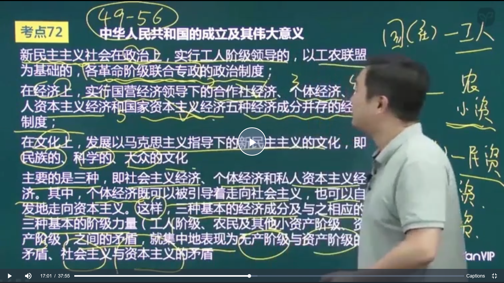

## 马原

经济基础是指由社会一定发展阶段的生产力所决定的生产关系的总和

意识形态又称为观念上层建筑

上层建筑由观念上层建筑和政治上层建筑两部分构成

社会形态是经济基础与上层建筑的统一体

1. 马克思在哲学史上的两大贡献
   1. 创立了唯物史观
   2. 形成了辩证唯物主义
2. 马克思在理论上的两大贡献
   1. 创立了唯物史观
   2. 创立了剩余价值理论

## 政治经济学

- 价值规律的内容：商品的价值由生产商品的社会必要劳动时间决定
- 价值规律的表现形式
  - 简单商品经济时期：价格围绕价值波动
  - 自由竞争的资本主义时期：价格围绕着生产价格波动
  - 垄断资本主义时期：价格围绕着垄断价格波动

生产价格 = 成本价格 + 平均利润

垄断价格 = 成本价格 + 平均利润 + 垄断利润

- 私有制商品经济的基本矛盾：私人劳动和社会劳动的矛盾
- 资本主义的基本矛盾：生产资料的资本主义私人占有和生产社会化之间的矛盾

## 科学社会主义

- 社会主义历史发展的两次飞跃
  - 从空想到科学，从理想到现实

- 科学社会主义产生的标志：《共产党宣言》的发表

## 思想道德修养与法律基础

- 理想是信念所指的对象，信念是理想实现的保障

- 中国精神包括民族精神和时代精神
  - 以爱国主义为核心的民族精神
  - 以改革创新为核心的时代精神

历史的：不同历史时期会不一样

- **总体国家安全观**
  - **以人民安全为宗旨，以政治安全为根本，以经济安全为基础，以军事文化社会安全为保障，以促进国际安全为依托**

- 劳动是道德起源的首要前提

- 公共生活的最低要求：遵纪守法
- 公民生活的最低要求：爱国守法

- 职业道德的最低要求：爱岗敬业
- 职业道德的最高要求：奉献社会
- 家庭美德的核心：夫妻和睦

- 党的领导是中国特色社会主义建设的根本保证，是社会主义法治的根本保证
- 党的领导是中国特色社会主义最本质的特征

- 宪法保持生机活力的根本原因：党的高度重视

- 我国的国体：人民民主专政
- 我国的政体：人民代表大会制度
- 我国的经济制度：公有制为主体，多种所有制共同发展

- 党大还是法大？
  - 法是党的主张和人民意愿的统一体现，党和法、党的领导和依法治国是高度统一的

坚持人民主体地位是依法治国的基本原则

## 近现代史纲要

- 反侵略战争失败的根本原因：社会制度的腐败
- 洋务运动的失败是因为没有意识到中国落后的真正的根本原因

- 1840年：鸦片战争
  - 战争结果
    - 中英签订《南京条约》
    - 中英签订《虎门条约》
    - 中美签订《望厦条约》
    - 中法签订《黄埔条约》
  - 鸦片战争使中国逐步成为半殖民地半封建国家。八国联军侵华，《辛丑条约》的签订使中国正式进入半殖民地半封建国家
  - 先进的中国人开始睁眼看世界（林则徐是第一人），魏源的《海国图志》主张“师夷长技以制夷”
  
- 甲午海战
  - 列强对中国的瓜分到达高潮
  - 中日签订《马关条约》，割让台湾、澎湖列岛、辽东半岛，俄、德、法干涉还辽
  - 中国人的民族意识开始普遍觉醒
  - 标志着洋务运动的失败
  
- 太平天国运动（农民）
  - 《天朝田亩制度》纲领：“耕者有其田”，已解决土地问题为中心
  - 《资政新篇》
  - 失败的根本原因：农民阶级的阶级局限性
  
- 洋务运动（封建地主阶级）
  - 纲领：“中体西用”
  - 目标：自强，求富
  - 内容：废八股，改科举（清末新政正式废除科举）
  - 甲午海战标志着洋务运动的失败
  - 失败的根本原因：洋务运动具有封建性（阶级局限性）
  
- 戊戌维新（资产阶级维新派）
  - 康有为“公车上书”，目的实现君主立宪
  - 第一次大论战：维新派与守旧派（洋务派）
  - 走精英路线
  
- 辛亥革命（资产阶级革命派）
  - 是一场精英运动
  - 孙中山组建第一个革命团体兴中会，中国同盟会是第一个资产阶级全国性政党
  - 革命纲领：三民主义
    - 民族：驱除鞑虏，恢复中华
      - 不反帝，反封不彻底
    - 民权：创立民国
    - 民生：“平均地权”
  - 第二次大辩论：革命派与改良派（维新派）的辩论
  - 1912年，建立中华民国，结束了中国两千多年的封建帝制
  - 护法运动的失败标志着资产阶级领导的旧民主主义革命的终结
  - 民族资本主义具有两面性：革命性和软弱性
  
- 1915年，新文化运动
  - 新文化运动的开始：陈独秀创办《青年》杂志
  - 新文化运动的主要阵地：《新青年》杂志，北京大学
  - 新文化运动的口号：民主和科学
  - 五四运动前的新文化运动仍然是一场精英运动
  - 李大钊发表《我的马克思主义观》，是中国第一个马克思主义者
  
- 1919年，五四运动
  
  - 五四运动的直接导火索：巴黎和会上中国外交的失败
  - 是第一次**彻底的反帝反封建**的**群众路线**运动
  - 五四运动后，马克思主义开始在中国广泛传播
  - 五四运动是新民主主义革命的开端
  
- 1921年，中国共产党的诞生

- 1924年，国名党一大召开，标志第一次国共合作正式成立，并确定**新三民主义**为共同纲领

- 1925~1927，大革命时期
  - 任务：国共合作，讨伐北洋军阀
  - “四一二反革命政变”和“七一五反革命政变”标志大革命的失败
  
- 1927~1937，土地革命时期
  - **南昌起义**，打响了武装反抗国民统治的第一枪（建军）
  - 南昌起义，秋收起义，广州起义，皆以失败告终
  - 中华苏维埃第一次全国工农兵代表大会：共产党从此有了政权
  - 以王明为代表的左倾教条主义错误（第五次反围剿的失败）
  - 遵义会议
  
- 1937~1945，全面抗日战争

  - 1931年9月18日，九一八事变，日本占领东北，抗日战争的起点
  - 1937年7月7日，卢沟桥事变，全面抗战开始
  - 共产党发表《为抗日救国告全国同胞书》，即八一宣言，呼吁全国停止内战一致抗日
  - 一二九学生运动，促进中华民族的觉醒
  - 中共瓦窑堡会议
  - 西安事变，抗日民族统一战线
  - 第二次国共合作
    - 没有正式的共同纲领
  - 战略防御阶段：从卢沟桥事变到广州武汉失守
    - 正面战场：*台儿庄大捷*，其它全部失败
    - 国名党正规战场是主要的，游击战是辅助的
  - 相持阶段：
    - 是抗战胜利最关键的阶段
    - 平型关大捷（敌后战场，林彪），第一次重大胜利，粉碎了日军不可战胜的神话
    - 忻口战役（配合胜利）
    - 游击战是主要的
  - 反攻阶段
  - 1945年9月3日，抗战胜利
    - 抗日战争取得完全胜利的标志：收回台湾及澎湖列岛

- 1945~1949，解放战争时期

  - 重庆谈判：签订双十协定，即《政府与中共代表会谈纪要》

- 1949~1956，社会主义改造

  - 新中国成立

    

  - 中国性质：新民主主义社会

    

  - 抗美援朝，打破了美军不可战胜的神话

- 1956~1976，社会主义探索时期

- 严复
  - 写了《救亡决论》，“救亡”
  - 翻译《天演论》，“物竞天择适者生存”
- 孙中山
  - “振兴中华”

- 土地政策
  - 太平天国，《天朝田亩制度》，“耕者有其田”，否定了封建的土地所有制（说“废除了”错误）
  - 孙中山的民生主义：“平均地权”，并没有将土地分给无地的农民
  - 共产党
    - 土地革命时期：
      - 消灭地主的土地私有制，实行农民的土地私有制
      - 井冈山土地法是共产党第一个土地法
      - 兴国土地法：
        - 将“没收一切土地”改为“没收一切公共土地及地主阶级的土地”
        - 依靠平农，联合中农，**限制富农**，保护中小工商业者，消灭地主阶级，按人口平分土地（耕者有其田）
        - 兴国土地法是中国历史上第一个可以付诸实施的完整的土地革命纲领
    - 抗日战争时期
      - 减租减息政策（没有耕者有其田）
    - 解放战争时期
      - 土地改革：《五四指示》《中国土地法大纲》
        - （有耕者有其田），决不可侵犯中农土地，一般不变动富农土地，斗地主不斗资本家
        - 废除封建剥削制度
    - 新中国成立
      - 《中华人民中和国土地改革法》，“保存富农经济”

- 宪法
  - 清末“新政”，颁布第一部宪法《钦定宪法大纲》
  - 辛亥革命时，临时参议院颁布《中华民国临时约法》
    - “中华民国之主权属于国民全体”
  - 土地革命时期，中华苏维埃第一次全国工农兵代表大会通过《中华苏维埃共和国宪法大纲》
    - 实行**工农兵**代表大会制度
  - 《中国人民政治协商会议共同纲领》临时宪法

### 中共会议

- 1921年7月23日：中共一大（中国共产党第一次全国代表大会）举行，中国共产党成立
- 中共二大：确定反帝反封建的纲领，走群众路线的革命方法
- 中共三大：国共第一次合作，党内合作（全体共产党员以个人名义加入国名党）
- 1927年，**八七会议**
  - 清算陈独秀右倾机会主义错误
  - 提出中国资产阶级民主革命的中心问题是土地革命
  - 毛泽东：“枪杆子里出政权”
  - 在危亡时刻，挽救了党和革命
- **遵义会议**
  - 解决了军事问题和组织问题（瓦窑堡会议解决了政治问题，延安整风运动解决了思想问题）
  - 确立了以毛泽东为代表的马克思主义在中共中央的领导地位
  - 标志着中国共产党在政治上走向成熟
- 瓦窑堡会议：抗日民族统一战线
- 洛川会议：全面抗战路线，即人民抗战路线
- 中国共产党六届六中全会：**毛在《论新阶段》中提出“马克思主义中国化”**
- **中共七大：正式命名为毛泽东思想（写入党章），是马克思主义中国化进程中第一次历史性飞跃**
- 中共七届二中全会：重心由乡村转移到城市
- 中共八大：三个主体三个补充
- **中共十一届三中全会**：重新确立党的思想路线，形成以邓小平为核心的党中央领导集体，是改革开放的起点
- 1981年党的**十一届六中全会**：通过了《中国共产党中央委员会关于建国以来党的若干历史问题的决议》
  1. 会议总结了毛泽东思想活的灵魂
     1. 实事求是
     2. 群众路线：一切为了群众，一切依靠群众，从群众中来，到群众中去
     3. 独立自主
  2. 会议对毛泽东及毛泽东思想作出评价：功绩是第一位的
  3. 第一次使用 “社会主义初级阶段” 这个词语
- 十二大：从十二大开始，“中国特色社会主义”成为我们党的全部理论和实践创新的主题
- 十三大：第一次对“中国特色社会主义理论”进行系统性的概括，这标志着*邓小平理论轮廓的形成*
- 十五大：将邓小平理论写入党章
- 十六大：将三个代表重要思想写入党章
- 十七大：
  - 第一次提出 “中国特色社会主义理论体系”
  - 将科学发展观写入党章
- 十九大：将习近平新时代中特思想写入党章

- 中国革命的首要问题：分清敌友
- 国民革命的中心问题：农民问题
- 中国资产阶级民主革命的中心问题：土地革命
- **革命方法：群众路线**
- **革命道路：农村包围城市，武装夺取政权**
- 中国革命的三大法宝：统一战线，武装斗争，党的建设
- **毛泽东思想达到成熟的标志：新民主主义理论的系统阐明**
- 抗日战争胜利的根本保证：抗日民族统一战线的巩固发展和壮大
- 抗战胜利的决定因素：以爱国主义为核心的名族精神
- *中国共产党的中流砥柱*作用是抗战胜利的关键
- 全民族抗战是抗战胜利的重要法宝
- 社会主义的本质：解放生产力，发展生产力，消灭剥削，消除两极分化，最终达到共同富裕

- 毛泽东
  - 大革命时期
    - 发表《国民革命与农民运动》，指出革命的中心问题是农民问题
  - 土地革命战争时期
    - 《中国的红色政权为什么能够存在？》，《井冈山的斗争》两篇文章提出了工农武装割据的思想
    - 《星星之火，可以燎原》
    - 《反对本本主义》，提出“没有调查，就没有发言权”，提出革命新道路：农村包围城市，武装夺取政权，**革命道路的提出标志着毛泽东思想初步形成**
    - 《矛盾论》《实践论》：批评主观主义尤其是教条主义，马克思主义要与中国实际相结合，阐明马克思主义思想路线（一切从实际出发，理论联系实际，实事求是，在实践中检验和发展真理）
  - 抗日战争时期
    - 发表《论持久战》
  - 解放战争时期
    - 《论人民民主专政》
  - 新中国
    - **《论十大关系》**是开始探索社会主义建设道路的标志，是马克思主义中国化第二次飞跃的起点
    - 《关于正确处理人民内部矛盾的问题》
    - 《一九五七年夏季的形势》：六又政治局面

## 毛泽东思想和中国特色社会主义理论体系概论

毛泽东思想形成的过程

### 毛泽东思想

包括三个理论

#### 新民主主义革命理论

1. 新民主主义革命的*总路线*

   1. 《在晋绥干部会议上的讲话》完整表述了总路线

   2. 总路线的内容：

      无产阶级领导的，人民大众的，反对帝国主义、封建主义和官僚资本主义的革命
      
   3. 新民主主义革命的*动力*

   动力是人民大众，即工人阶级、农民阶级，小资产阶级和民族资产阶级

   1. 新民主主义革命的领导权问题

   

2. 革命的总纲领

   1. 政治纲领
   2. 经济纲领
   3. 文化纲领

3. 革命的总道路

   1. 内容：农村包围城市，武装夺取政权
   2. 形成步骤
      1. 初步形成：土地革命时期（井冈山），《中国的红色政权为什么能够存在？》等文章
      2. 革命道路的确立：抗日战争时期发表的《战争和战略问题》

4. 革命的总经验

   即三大法宝

   1. 统一战线

   2. 武装斗争

   3. 党的建设

      毛：加强党的建设要加强三个方面

      1. 思想建设（首位）
      2. 组织建设
      3. 作风建设

#### 社会主义改造理论

- 新民主主义社会存在的五种经济成分

  

- 党在过渡时期的总路线

  一化三改（社会主义工业化，农业、手工业、资本主义工商业的改造）

#### 社会主义探索理论

### 邓小平理论

> 邓小平理论的形成过程
>
> 1. 党的十一届三中全会，重新确立党的思想路线（一切从实际出发，理论联系实际，实事求是，在实践中检验和发展真理）
>
> 2. 党的十二大，从十二大开始，“中国特色社会主义”成为我们党的全部理论和实践创新的主题
>
> 3. **党的十三大**，
>    
>    1. 第一次论述了社会主义初级阶段理论
>    2. 阐明了“一个中心，两个基本点”的**基本路线**
>    3. 第一次对“中国特色社会主义理论”进行系统性的概括，这标志着*邓小平理论轮廓的形成*
>    
> 4. 1992年，南方谈话
>
>    标志着*邓小平理论逐步走向成熟*
>
> 5. 十四大
>
>    确定了建立社会主义市场经济体制的改革目标
>
> 6. 十五大
>
>    将邓小平理论作为指导思想写入党章

- 邓小平理论的内容

  1. 党的**思想路线**

     一切从实际出发 --- 前提

     理论联系实际 --- 途径 方法

     实事求是 --- 实质 核心

     在实践中检验和发展真理 --- 验证条件 目的

  2. 社会主义初级阶段理论（国情论）

     党的十三大前夕，把 “社会主义初级阶段” 作为事关全局的国情加以把握

     党的十三大，第一次系统的论述了 “社会主义初级阶段” 理论

  3. 党的**基本路线**

     一个中心，两个基本点，即

     领导和团结全国各族人民， --- 领导力量和依靠力量

     以经济建设为中心，坚持四项基本原则，坚持改革开放， --- 是主要内容、是实现目标的基本途径

     自力更生，艰苦创业， --- 根本立足点

     为把我国建设成为富强民主文明的社会主义现代化国家而奋斗 --- 奋斗目标

     <党的基本路线，是党和国家的生命线，是人民的幸福线>

     <十七大加入和谐，十九大加入美丽，改为现代化强国>

  4. 社会主义的根本任务

     **根本任务**是解放发展生产力

  5. “三步走” 战略

     

  6. 改革开放理论

     对外开放的格局：全方位，宽领域，多层次

  7. 社会主义市场经济理论

     我国**经济体制改革的核心问题**：正确认识和处理计划与市场的关系

  8. “两手抓，两手都要硬”

  9. 一国两制

  10. 中国问题的关键在于党

### 三个代表重要思想

### 科学发展观

### 新时代中国特色社会主义理论体系

党的十九大指出，社会的主要矛盾：人民日益增长的美好生活需要同不平衡不充分发展之间的矛盾

习近平新时代中国特色社会主义思想的*核心要义*：坚持和发展**中国特色社会主义**（简称为**中特**）

#### 八个明确

| 坚持和发展中特的**总任务**                                 | 实现社会主义现代化和中华民族伟大复兴                         |
| ---------------------------------------------------------- | ------------------------------------------------------------ |
| 我国的**社会主要矛盾**                                     | 人民日益增长的美好生活需要同不平衡不充分发展之间的矛盾       |
| 中特事业的**总体布局** **战略布局** **四个自信** | 五位一体 四个全面 道路自信，理论自信，制度自信，*文化自信*（最根本） |
| *全面深化改革的总目标*                                     | *完善和发展中特制度，推进国家治理体系和治理能力现代化*       |
| 全面依法治国的总目标                                       | 建设中特法制体系，建设社会主义法治国家                       |
| 党的强军目标                                               | 建设一支听党指挥，能打胜仗，作风优良的人民军队，把人民军队建设成为世界一流军队 |
| 中国特色大国外交                                           | 构建合作共赢的新型国际关系，构建人类命运共同体               |
| 中特**最本质的特征**和最大优势                             | 中国共产党的领导                                             |

#### 十四个坚持

1. 坚持党对一切工作的领导
2. 坚持以人民为中心
3. 坚持全面深化改革
4. 坚持新发展理念
5. 坚持人民当家作主
6. 坚持全面依法治国。全面依法治国是中特的**本质要求**和**重要保障**
7. 坚持社会主义核心价值体系
8. 坚持在发展中保障和改善民生
9. 坚持人与自然和谐共生
10. 坚持总体国家安全观
11. 坚持党对人民军队的绝对领导。国防军队是实现中华民族伟大复兴的**战略支撑**
12. 坚持 “一国两制” 推进祖国统一
13. 坚持构建人类命运共同体
14. 坚持全面从严治党

**社会主义基本经济制度**：

1. 公有制为主体、多种所有制经济共同发展
2. 按劳分配为主体、多种分配方式并存
3. 社会主义市场经济体制

#### 五位一体

1. 经济

   1. 新发展理念
      1. 创新：*创新是引领发展的第一动力*
      2. 协调：协调是持续健康发展的内在要求
      3. 绿色：绿色是永续发展的必要条件
      4. 开放：开放是国家繁荣发展的必由之路
      5. 共享：共享是中国特色社会主义的本质要求
   2. 深化供给侧结构性改革
   3. 建设现代化经济体系
      1. 大力发展实体经济
      2. 加快实施创新驱动发展战略
      3. 激发各类市场主体活力
      4. 积极推动城乡区域协调发展
      5. 着力发展开放型经济
      6. 加快完善社会主义市场经济体制

2. 政治

   1. 国体：人民民主专政

      我国是工人阶级领导的、以工农联盟为基础的人民民主专政的社会主义国家，国家一切权力属于人民

      *我国人民民主专政，其本质是：无产阶级专政*

   2. 政体：人民代表大会制度（属于间接民主）

      人民代表大会制度是我国**根本政治制度**

   3. 基本政治制度

      1. 政协制度（中国共产党领导的多党合作和政治协商制度）

         人民政协的两大主题：团结和民主

      2. 民族区域自治制度

      3. 基层群众自治制度（属于直接民主）

         我国的基层自治组织：村委会，居委会，职代会（企业职工代表大会）

   4. 协商民主

      **协商民主**是中国社会主义民主政治的**特有形式**和**独特优势**

3. 文化

4. 民生社会

   1. 提高保障和改善民生水平

   

   2. 社会治理格局：共建共治共享

      全球治理观：共商共建共享（一带一路）

5. 生态文明

   1. 生态文明的核心：坚持人与自然和谐共生
   2. 生态文明理念：尊重自然、顺应自然、保护自然

#### 四个全面

1. 全面建成社会主义现代化国家（战略目标、引领性地位）

2. 全面深化改革（战略举措，突破性环节，动力）

   基本国策：一国两制、对外开放、节约资源、保护环境

   *全面开放是实现国家繁荣富强的根本出路*

   对外开放的格局：陆海内外联动、东西双向互济

3. 全面依法治国（战略举措）

4. 全面从严治党（战略举措）

   根本性建设：政治建设

   基础性建设：思想建设

1. 军民融合深度发展格局：全要素、宽领域、高效益

   对外开放的格局：全方位，宽领域，多层次

2. 独立自主和平外交

3. 新型国际关系：合作共赢

4. 人类命运共同体

5. 中国的三大历史任务：祖国统一，社会主义现代化，世界和平

   中国的历史使命：统领四个伟大，伟大斗争、伟大工程（决定性作用）、伟大事业、伟大梦想

### 表格1

|               问               |                              答                              |
| :----------------------------: | :----------------------------------------------------------: |
|       毛泽东思想活的灵魂       |                 实事求是，群众路线，独立自主                 |
| 毛泽东思想的精髓 | 实事求是 |
| 邓小平理论活的灵魂 | 解放思想，实事求是 |
| 邓小平理论的精髓 | 解放思想，实事求是 |
|       中国革命的三大法宝       |                 统一战线，武装斗争，党的建设                 |
| 工农割据要处理好的三个方面 | 土地革命，武装斗争，根据地的建设 |
| 党的三大优良作风 | 理论联系实际，密切联系群众，批评与自我批评 |
|                                |                                                              |
|       中国革命的首要问题       |                           分清敌友                           |
|       中国革命的基本问题       |                           农民问题                           |
|       中国革命的中心问题       |                     无产阶级的领导权问题                     |
|       国民革命的中心问题       |                           农民问题                           |
| 中国资产阶级民主革命的中心问题 |                           土地问题                           |
|                                |                                                              |
|            革命方法            |                           群众路线                           |
|            革命道路            |                  农村包围城市，武装夺取政权                  |
|  |  |
| 民主主义革命时期的基本路线（总路线） | 无产阶级领导的，人民大众的，反帝、反封、反官僚的革命 |
| 社会主义改造的过渡时期的基本路线 | 一化三改 |
|  |  |
|                                |                                                              |
|     中国革命胜利的根本保证     |                       中国共产党的领导                       |
|抗日战争胜利的根本保证|抗日民族统一战线的巩固、发展和壮大|
|抗战胜利的决定因素|以爱国主义为核心的名族精神|
|                                |                                                              |
|                                |                                                              |
|    毛泽东思想初步形成的标志    |                        革命道路的提出                        |
|    毛泽东思想达到成熟的标志    |                   新民主主义理论的系统阐明                   |
| 毛泽东思想回答了 | 什么是马克思主义？怎样对待马克思主义 |
| 邓小平理论回答了 | 什么是社会主义？怎样建设社会主义？ |
| 江泽民三个代表重要思想回答了 | 建设什么样的党？怎样建设党？ |
| 胡锦涛科学发展观回答了 | 实现什么样的发展？怎样发展？ |
| 习近平新时代中国特色社会主义理论体系回答了 | 新时代，坚持和发展什么样的中国特色社会主义？怎样坚持和发展中国特色社会主义？ |
|                                |                                                              |
|         社会主义的本质         | 解放生产力，发展生产力，消灭剥削，消除两极分化，最终达到共同富裕 |
|      中国共产党的**根本宗旨**      |                      **全心全意为人民服务**                      |
| 我们党区别于其他政党的根本标志 |                      全心全意为人民服务                      |
|      我们党的根本思想路线      |                           实事求是                           |
|      我们党的根本工作路线      |                           群众路线                           |
|      我们党的根本政治原则      |                           独立自主                           |

