### 关系代数

1. 选择 selection

   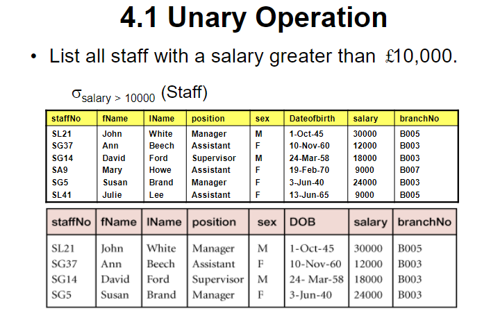

2. 投影 projection（需要去重）

   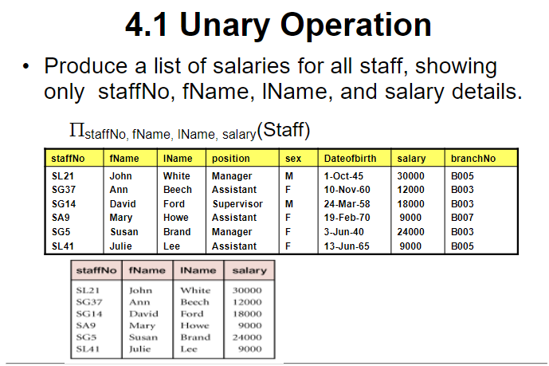

3. 并 union

   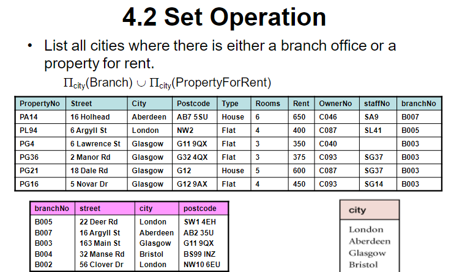

4. 差 set difference

   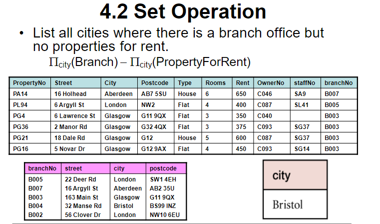

5. 笛卡尔积 Cartesian product

   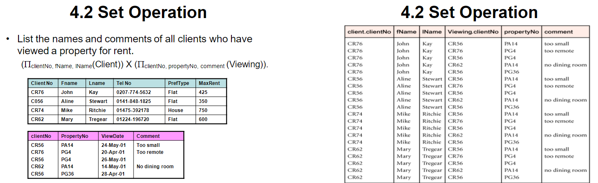

   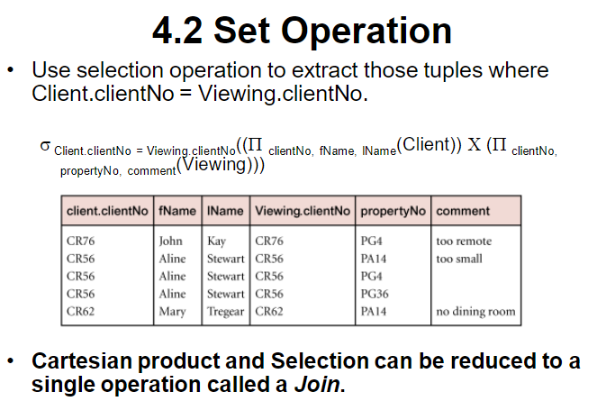

6. 重命名 rename

   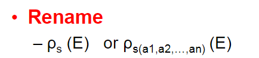

7. 交 intersection

   R ∩ S = R - (R - S)

   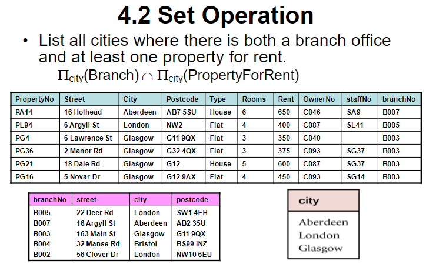

8. 连接 join

   1.  θ 链接 Theta join

       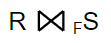  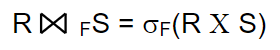

      

      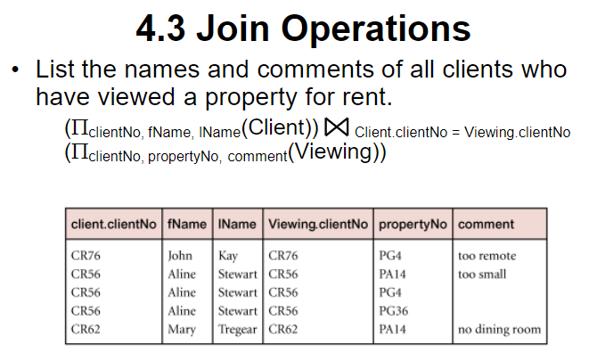

   2. 等值连接 equijoin

      在限制条件 F 中，仅使用 = 的 θ 连接叫等值连接

   3. 自然链接 natural join

      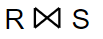

      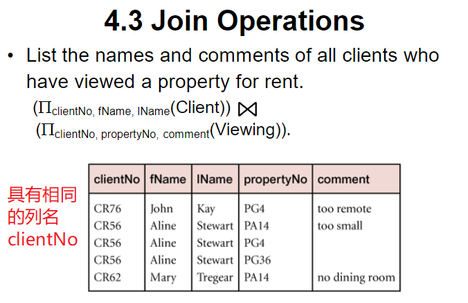

   4. 外连接 outer join

      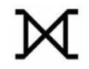

      1. 左外连接 left outer join

         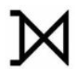

         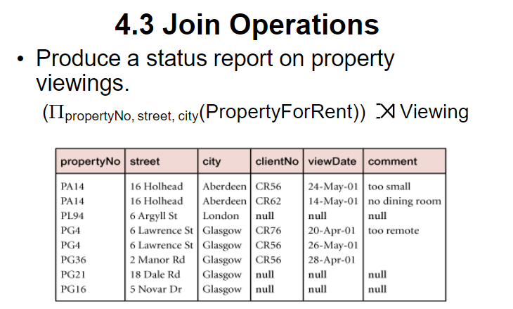

      2. 右外连接 right outer join

         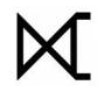

   5. 半连接 semijoin

      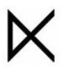

      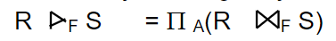  A 为 R 中的所有属性

      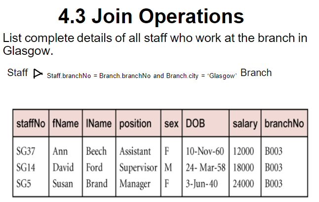

9. 除法 division

   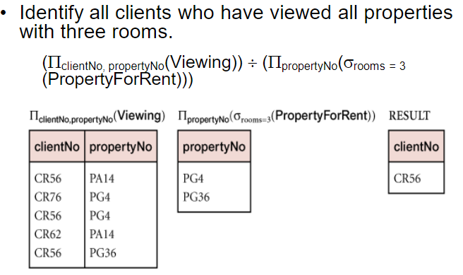


### 概念解释

> SQL 的四大特点
>
> 1. DDL，DML，DCL 综合统一
> 2. 高度非过程
> 3. 面向集合的操作（游标 cursor）
> 4. 交互式、嵌入式语法一致


> 聚集函数不能出现在 where 子句中
>
> 理由：where 子句是对数据行的过滤，而聚集函数是基于整列数据的计算。换句话说，聚集函数在使用时需要有确定的结果集，而 where 子句的执行还正处于确定结果集的过程中。
>
> 要对聚集函数作用后的结果进行过滤应使用 having
>
> 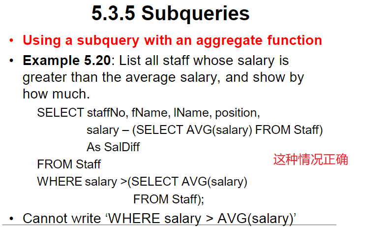


> 不相关子查询与相关子查询
>
> - 不相关子查询
>
>   子查询的执行不依赖于外部查询，子查询只执行一次
>
>   ```sql
>   SElECT 图书名，作者，出版社，价格
>     FROM Books
>     WHERE 价格 >
>     (
>       SELECT AVG(价格)
>       FROM Books
>     )
>   ```
>
> - 相关子查询
>
>   子查询的执行依赖于外部查询。多数情况下是子查询的 WHERE 子句中引用了外部查询的表
>
>   外部查询每执行一次，子查询就执行一次
>
>   ```sql
>   SELECT FROM Books As a
>     WHERE 价格 >
>     (
>       SELECT AVG(价格)
>       FROM Books AS b
>       WHERE a.类编号=b.类编号
>     )
>   ```

> 数据库四大特性（ACID）
>
> 1. Atomicity 原子性，事务是操作DB的最小单位
> 2. Consistency 一致性
> 3. Isolation 隔离性，事务与事务之间互不干扰
> 4. Durability 持久性，commit了的数据会持久存在


### any some all 的使用

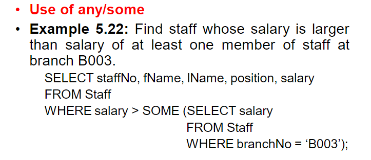

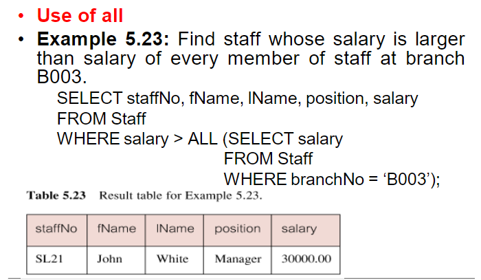


### exists 的使用

EXISTS 运算符用于判断查询子句是否有记录，如果有一条或多条记录存在返回 True，否则返回 False。


### 规范化

UNF -> 1NF

1NF -> 2NF

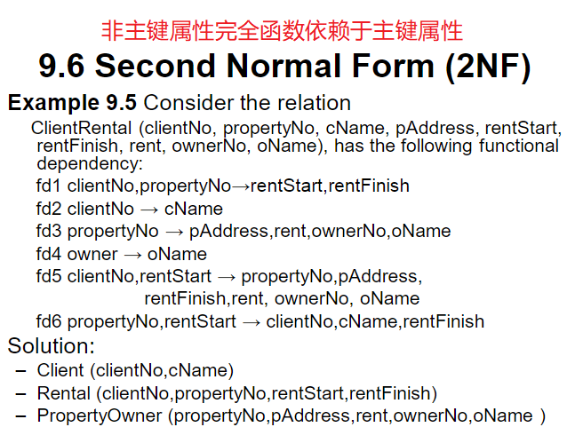

2NF -> 3NF

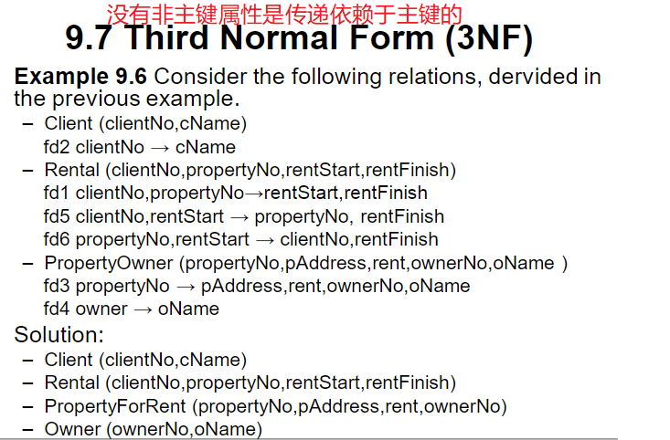

3NF -> BCNF


