[TOC]

### 数据结构复习

#### 基础概念

1. Data
2. Data Element：数据集合中的一个数据
3. Data Object：相同属性的 Data Element 的集合
4. Data Item：一个 Data Element 的多个属性，就像一个桌子有长宽高一样
5. Data Structure：A set of data elements with structure
6. Structure：Relationships between data elements
7. DS = (D, R)：D 代表数据元素的集合，R 代表关系的集合
8. ADT（Abstract Data Type）：包含对 Data Structure 的描述和对数据的操作的描述
9. ADT = DS + operations
10. ADT 的特征：Abstraction（抽象性），Encapsulation（封装性）

#### 概念题目

1. 数据的存储结构被分为**顺序结构**、**链式结构**、**索引结构**、**散列结构**四种。
2. 邻接矩阵遍历算法的时间复杂度为：**O(n^2)**，邻接表为： **O(n + e)**。
3. 一棵B-树的所有叶子节点均在**同一层**上。故B-树总是平衡树。

------

#### B-树

- 特点：（对于 m 阶B-树）
  - 根节点要么是叶子节点，要么至少有两个儿子。
  - 除了根节点和叶子节点外，所有节点的儿子个数介于 m/2 向上取整和 m 之间。
  - 所有叶子节点均在同一层。且叶子节点不带信息。
  - B-树总是平衡树。


### 考研复习

- 顺序表
  
  - 初始化时开辟一块固定内存
  - 插入：插入的后面元素向后挪一格
  - 删除：删除的后面元素向前进一格
  - 查找第 i 号元素在常数级别，插入和删除在 O(n)
  
- 链表

  - 插入和删除：O(1)
  - 查找：O(n)

- 串的模式匹配

  - 暴力算法
  - KMP 算法

- 栈和队列

  - 栈：后进先出

    - 括号匹配：一次读一个括号，左括号压栈，右括号弹出一个，若匹配则继续，不匹配则错误，直到结束

    - 计算后缀表达式：一次读入一个，遇到数字则压栈，遇到符号则弹出两项计算，并将结果压栈，直到结束

    - 十进制转换：除 k 取余法

      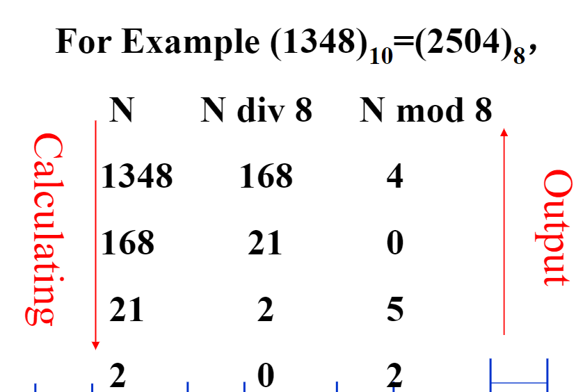

    - 中缀转后缀：一次读入一个，遇到数字则输出，遇到符号则分情况，若是 `+` `*` 则将栈中比它优先级高或一样的符号弹出输出，然后将它压栈，若是 `(` 则将它压栈，若是 `)` 则将栈中符号弹出直到 `(`

  - 队列：先进先出

    - 循环队列：少用一个单元，即当队头在队尾的下一个时判断队列满（队头指向头元素，队尾指向尾元素的下一个）
  
- 树

  - 结点的双亲：结点的子树的根称为该结点的孩子，该结点称为孩子的双亲
  - 结点的度：结点拥有的子树的个数
  - 树的度：是树的各节点的度的最大值
  - 节点的层次：基1，根是第1层
  - 树的深度（或者高度）：基1，节点的最大层次
  
- 二叉树

  - 左子树右子树，左右有分别，是有序树

  - 对于任意一棵二叉树，都有 n[0] = n[2] + 1 （n[0]代表终端结点数，n[2]为度为2的结点数）

    ```txt
    推倒：
    设 n 为总结点数，n[1] 为度为 1 的结点数
    易知，n = n[0] + n[1] + n[2]
    由总入度=总出度得，n - 1 = n[1] + 2*n[2]
    联立可得结论
    ```

  - 完全二叉树的性质：（完全二叉树，根节点从 1 开始编号，从左至右）

    对于编号为 i 的节点（非根结点），其双亲结点的编号是 `i / 2 向下取整` 

    ```txt
        i
      /   \
     2i   2i+1
    ```

  - 线索二叉树：

    n 个结点的二叉链表中含有 n + 1 个空指针域，若让没有左孩子的节点的左指针指向其直接前趋，让没有右孩子的结点的右指针指向其直接后继，则可构成线索二叉树

  - 赫夫曼树

    题目：用5个权值{3, 2, 4, 5, 1}构造的哈夫曼（Huffman）树的带权路径长度是？。

    

- 图

  - 邻接矩阵表示
  
  - 邻接表
  
  - 深度优先搜索与广度优先搜索的时间复杂度相同：（n为结点数，e为边数）
  
    - 邻接矩阵 O(n^2)
    - 邻接表 O(n+e)
  
  - 最小生成树
  
    - Prim算法（普里姆算法）
  
      每次从已加入所有节点出发，寻求到剩余节点的最短的一条边
  
      复杂度：O(n^2)，与e（边的数目）无关，因此适用于求边**稠密**的网的最小生成树
  
      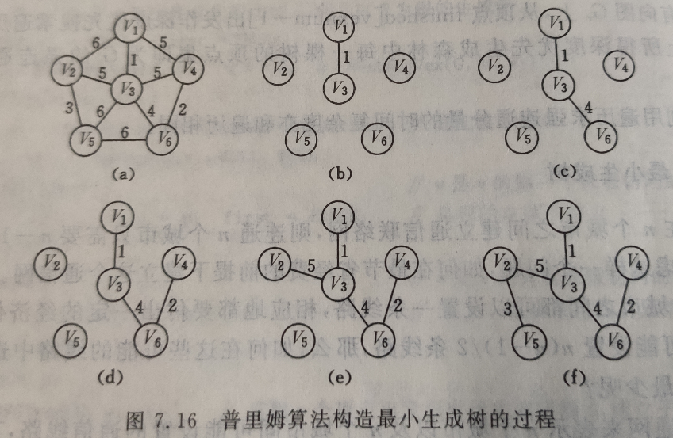
  
    - Kruskal算法（克鲁斯卡尔算法）
  
      每次找到最小代价的一条边加入，该边的顶点属于两个不同的连通分量
  
      复杂度：O(eloge)，适用于求边**稀疏**的网的最小生成树
  
      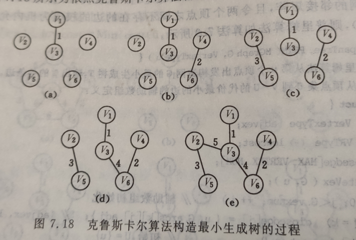
  
  - 求连通图的关节点：深度优先搜索
  
  - 有向无环图（DAG图）
  
    例如可以用于描述含有公共子式的表达式
  
    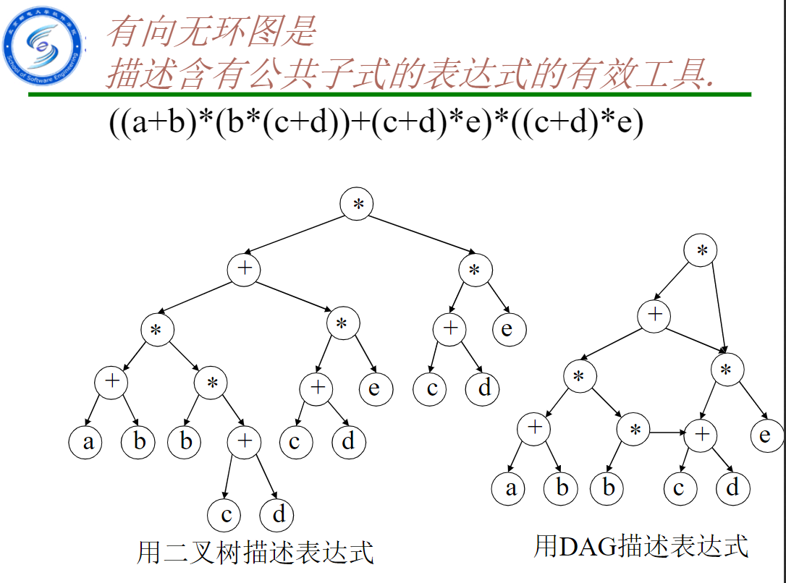
  
  - 拓扑排序（AOV网，顶点表示活动）
  
    算法：选择一个没有前驱的节点输出，并删除该节点及其射出的边，重复该操作
  
    复杂度：邻接表实现 O(n+e)
  
    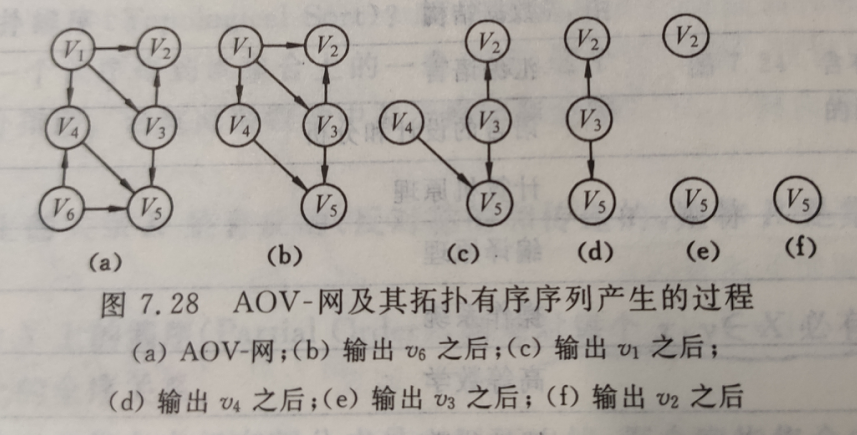
  
  - 关键路径（AOE网，边表示活动）
  
    记：
  
    e[i]表示活动a[i]的最早开始时间
  
    l[i]表示活动a[i]的最晚开始时间
  
    ve[j]表示事件v[j]的最早发生时间
  
    vl[j]表示事件v[j]的最晚发生时间
  
    路径长度最长的路径叫关键路径
  
    l[i]==e[i]的活动叫关键活动
  
    关键路径上的所有活动都是关键活动
  
    复杂度：邻接表实现 O(n+e)
  
    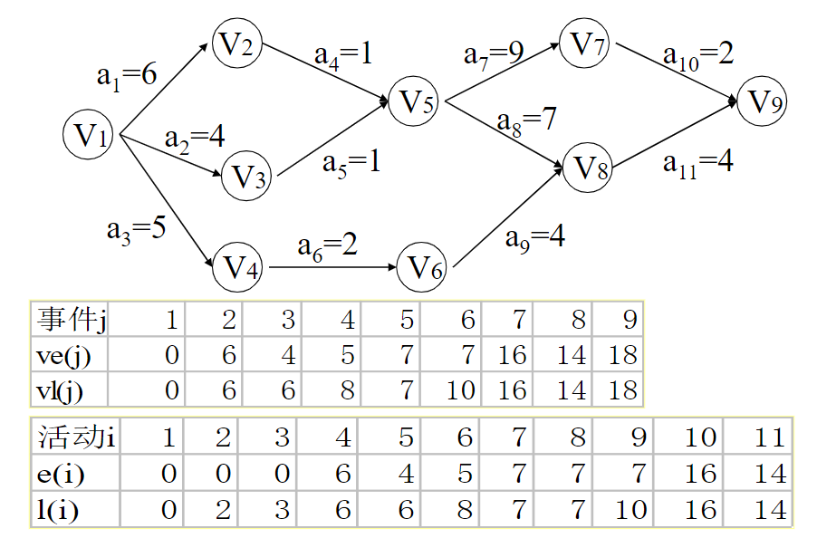
  
  - 最短路径
  
    - 迪杰斯特拉算法：计算从某个源点到其余各顶点的最短路径
  
      复杂度：O(n^2)
  
      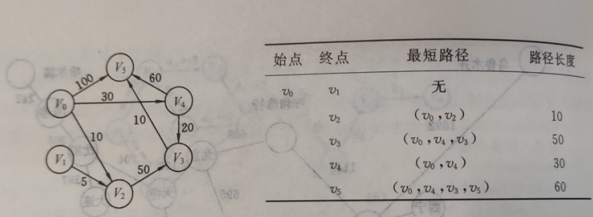
  
      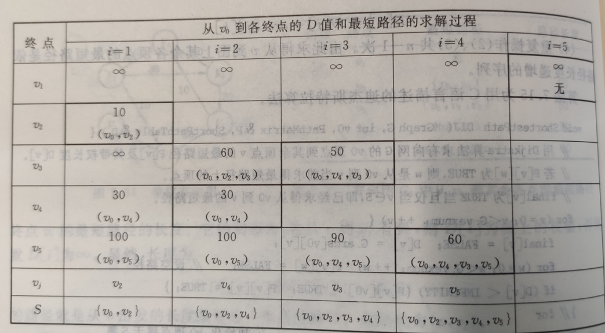
  
    - 弗洛伊德算法：计算每一对顶点之间的最短路径
  
      复杂度：O(n^3)
  
      注：重复n次迪杰斯特拉算法也可解决，复杂度也是O(n^3)
  
      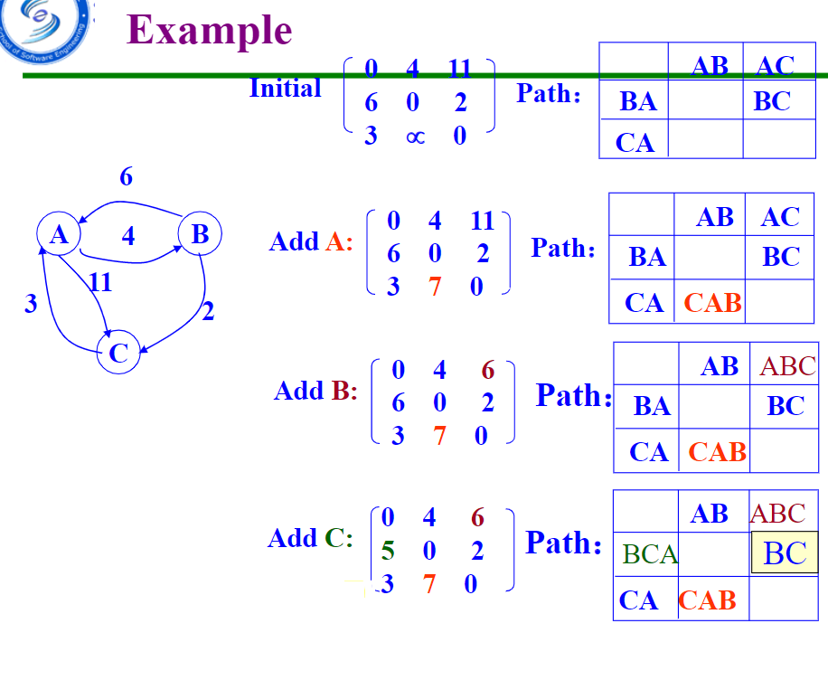
  
- 查找

  1. 顺序查找：

     成功的平均查找长度：(n+1)/2

  2. 折半查找（有序表）

     最多查找次数：[log2(n)] + 1 （向下取整）

     复杂度：log(n)

  3. 二叉排序树

     1. 插入节点

     2. 删除节点

        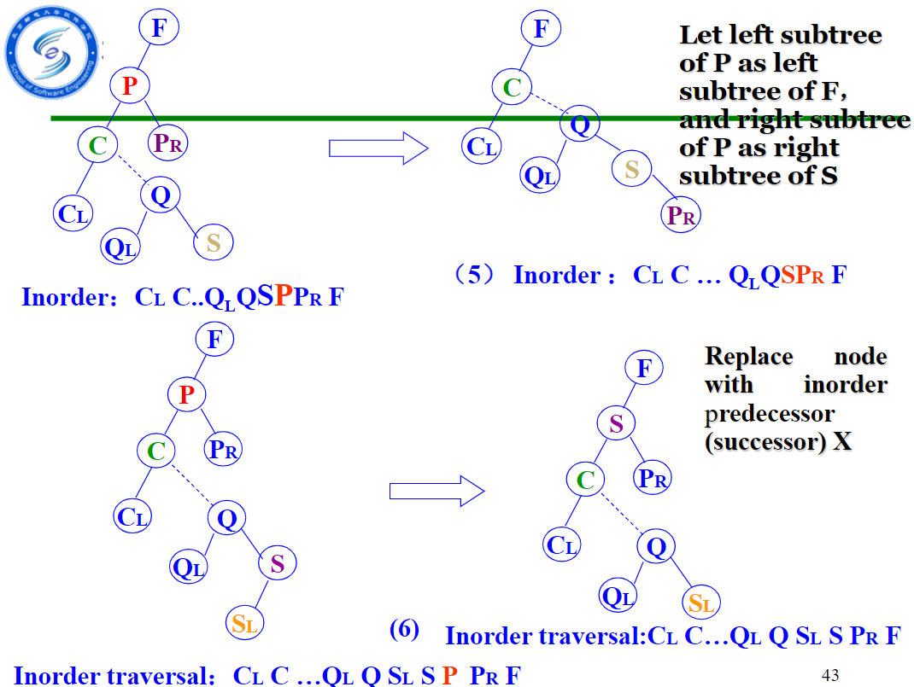

  4. 平衡二叉树（AVL树）

     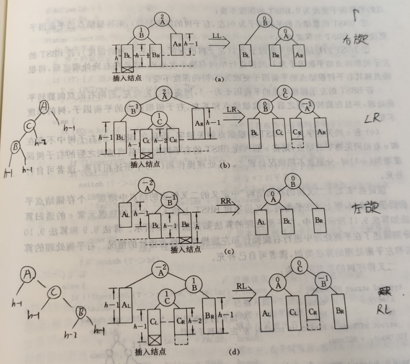

  5. B-树

     1. 性质，对于 m 阶B-树

        根节点要么是叶子节点，要么至少有 2 个孩子

        除了叶子节点和根节点外（即所有非终端节点），他的孩子个数在 `m / 2 向上取整` 和 `m` 之间

        所有的叶子节点均在同一层

        例如

        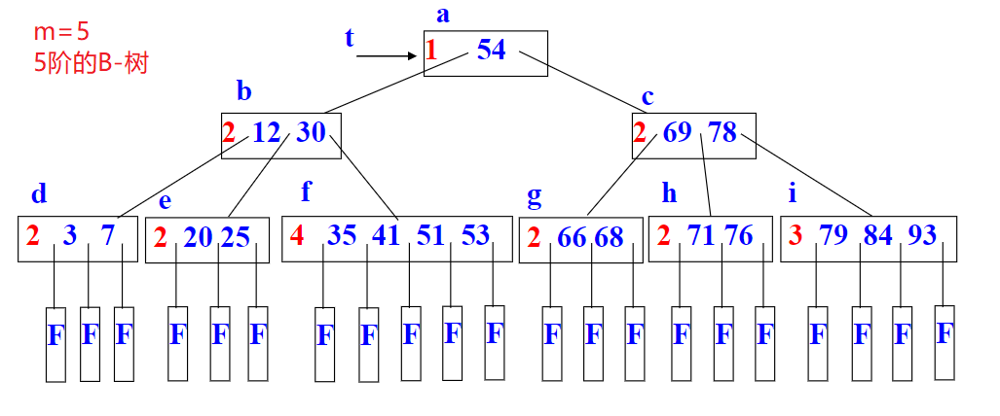

  6. 哈希表

     1. 哈希函数的构造方法

        1. 直接定址法
        2. 数字分析法
        3. 平方取中法
        4. 除留余数法

     2. 处理冲突的方法

        1. 开放定址法

           1. 线性探测再散列：会引入非同义词的冲突（称作二次聚集），但可保证表未满时总能找到一个地址
           2. 二次探测再散列：一般会导致表未满也找不到可用地址，但当表长为 **4j+3**（j为整数） 的素数时例外
           3. 伪随机探测再散列

        2. 再哈希法

           同义词产生冲突时，计算另一个哈希函数地址

        3. 链地址法

- 排序

  1. 插入排序

     1. 直接插入排序

        O(n^2) 稳定 额外需要一个纪录的存储空间

     2. 折半插入排序

        减少了关键字的比较次数，而没有改变记录的移动次数

        O(n^2) 稳定

     3. 希尔排序

        O(n^1.25) ~ O(1.6 * n^1.25) 不稳定 额外需要一个纪录的存储空间

  2. 交换排序

     1. 冒泡排序

        O(n^2) 稳定

     2. 快速排序

        平均：O(nlogn)    需设一个栈来实现递归 不稳定

  3. 选择排序

     1. 简单选择排序

        O(n^2) 不稳定

     2. 堆排序

        O(nlogn) 额外需要一个纪录的存储空间 不稳定   

  4. 归并排序

     O(nlogn)  稳定 空间上O(n)


### 串的模式匹配

#### 改进的暴力算法

```c
int index(MyString str, MyString subStr, int pos) { 
    int i = pos; 
    int	j = 1; 
    while (i <= str[0] && j <= subStr[0]) 
    { 
        if (str[i] == subStr[j]) { i++; j++; } 
        else { i = i - j + 2; j = 1; } 
    } 
    if (j > subStr[0]) return i - subStr[0]; 
    else return 0; 
}
```

#### KMP 算法

```c
int index_KMP(MyString str, MyString subStr, int pos) { 
    getNext(subStr); 
    int i = pos; 
    int	j = 1; 
    while (i <= str[0] && j <= subStr[0]) 
    { 
        if (str[i] == subStr[j] 	|| j == 0) { i++; j++; } 
        else { j = next[j]; } 
    } 
    if (j > subStr[0]) return i - subStr[0]; 
    else return 0; 
}

int next[MAXSTRSIZE]; 
void getNext(MyString str) { 
    int i = 1; 
    int j = 0; 
    next[i] = j; 
    while (i < str[0]) 
    { 
        if (j == 0 || str[i] == str[j]) 
        { 
            i++; 
            j++; 
            if (str[i] != str[j]) next[i] = j;		//修正 
            else next[i] = next[j]; 
        } 
        else j = next[j]; 
    } 
}
```

