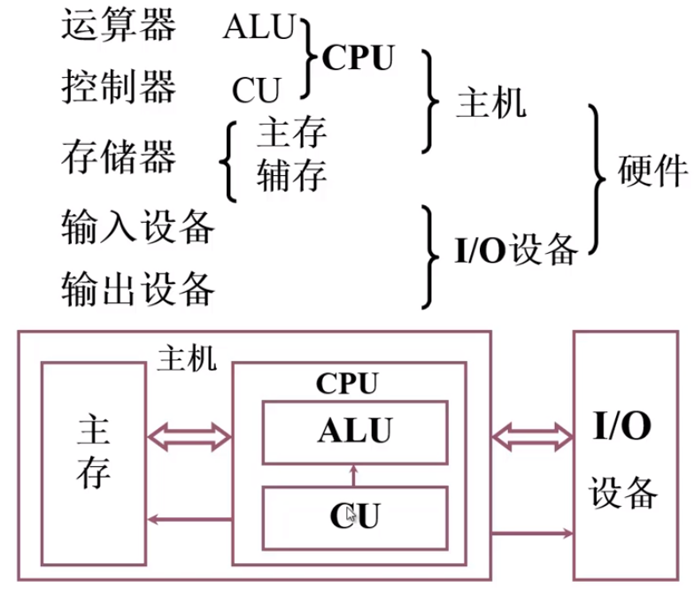

[TOC]

#### Explicit deallocation

Explicit memory deallocation presents several problems:

- memory can **be freed too early**, which leads to **dangling pointers** — and then to data corruption, crashes, security issues, etc.
- memory can **be freed too late** — or never — which leads to **space leaks**

#### CPS

- Cyber-Physical Systems
- 信息物理系统

#### HPC

- 高性能计算集群
- High Performance Computing
- High Power/Price Computing

#### 计算机系统由两大部分组成

- 硬件
- 软件

#### 冯 · 诺依曼计算机特点

- 计算机由五大部件组成
  - 运算器 —— 算术运算和逻辑运算
  - 控制器
  - 存储器
  - 输入设备 —— 将信息转换成机器能识别的形式
  - 输出设备 —— 将处理结果转换成人类熟悉的形式
  - 
- 指令和数据以同等地位存于存储器，可按地址寻访
- 指令和数据用二进制表示
- 指令由操作码和地址码组成
  - 操作码决定什么操作
  - 地址码决定操作数在哪
- **存储程序**
- 以运算器为中心

#### 现代计算机硬件结构

-  

#### 系统复杂性管理的方法（3Y）

- 层次化（Hierarchy）：将被设计的系统划分为多个模块
- 模块化（Modularity）：有明确定义（well-defined）的功能和接口
- 规则性（regularity）：模块更容易被重用

#### 存储器的基本组成

- 存储体：由多个存储单元构成，每个存储单元由多个存储元件构成

  - 存储字：存储单元中存储的二进制代码
  - 存储字长：存储单元中二进制代码的位数
  - 每个存储单元都有一个地址，存储单元按地址寻访

- MAR（Memory Address Register - 存储器地址寄存器）保存了存储单元的地址

  MAR的位数反映了存储单元的个数

- MDR（Memory Data Register - 存储器数据寄存器）保存了要读出或写入存储器的数据

  MDR的位数反映了存储字长

