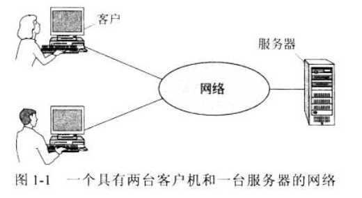
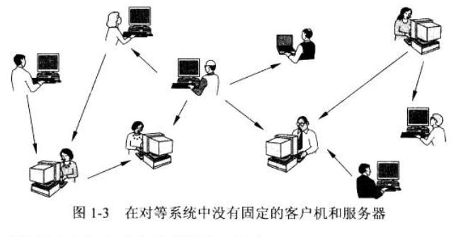
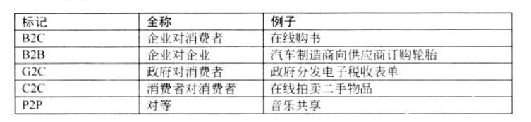

[TOC]

## 第一章-引言

### 概念

1. VPN：Virtual Private Networks 虚拟专用网络

2. IP telephony（IP电话）或者VoIP（Voice over IP 即IP语音）：通过计算机网络打电话，而不通过电话公司

3. Communicate with others，两种方法：

   1. 客户机-服务器模型 client-server model

      
      
   2. Peer-to-peer 对等通信技术：没有中央数据库
   
      
   
4. 以太网：Ethernet，应用最普遍的局域网技术

5. Instant messaging：即时通讯，简称 IM，是一种透过网络进行**实时通信**的系统，允许两人或多人使用网络即时的传递文字消息、文件、语音与视频交流

6. 普适计算：ubiquitous computing，计算可以使用任何设备，随时随地以任何格式进行

7. RFID：无线射频识别技术，Radio Frequency Identification

   - 贴在商品上，可以取代条形码，但有点成本，没有推广
   - 可能使物联网变成现实

8. 电子商务的几种形式：

   

9. IoT：Internet of Things，物联网

10. CNNIC：中国互联网络信息中心（China Internet Network Information Center）